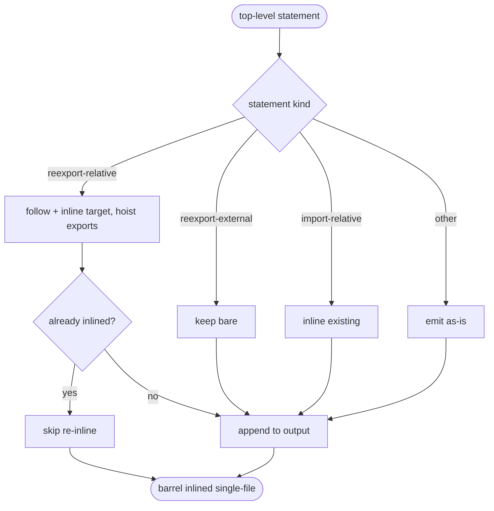

# jet build --lib: inline barrel re-exports in single-file mode

## Logic
<!-- type: logic lang: mermaid -->

```mermaid
---
id: jet-lib-barrel-inline
entry: stmt
nodes:
  stmt:   { kind: start,    label: "bundle_library_entry sees a top-level statement" }
  cls:    { kind: decision, label: "statement kind" }
  rxrel:  { kind: process,  label: "export * / export {..} from './rel': follow + inline target, hoist its exports" }
  rxext:  { kind: process,  label: "export .. from 'pkg': keep bare (external)" }
  imprel: { kind: process,  label: "relative import: inline (existing)" }
  other:  { kind: process,  label: "other statement: emit as-is" }
  cyc:    { kind: decision, label: "target already inlined (cycle)?" }
  skip:   { kind: process,  label: "skip re-inline (visited guard)" }
  emit:   { kind: process,  label: "append to single-file output" }
  done:   { kind: terminal, label: "single-file bundle with barrel re-exports inlined" }
edges:
  - { from: stmt,   to: cls }
  - { from: cls,    to: rxrel,  label: "reexport-relative" }
  - { from: cls,    to: rxext,  label: "reexport-external" }
  - { from: cls,    to: imprel, label: "import-relative" }
  - { from: cls,    to: other,  label: "other" }
  - { from: rxrel,  to: cyc }
  - { from: cyc,    to: skip,   label: "yes" }
  - { from: cyc,    to: emit,   label: "no" }
  - { from: rxext,  to: emit }
  - { from: imprel, to: emit }
  - { from: other,  to: emit }
  - { from: skip,   to: done }
  - { from: emit,   to: done }
---
flowchart TD
    stmt([top-level statement]) --> cls{statement kind}
    cls -->|reexport-relative| rxrel[follow + inline target, hoist exports]
    cls -->|reexport-external| rxext[keep bare]
    cls -->|import-relative| imprel[inline existing]
    cls -->|other| other[emit as-is]
    rxrel --> cyc{already inlined?}
    cyc -->|yes| skip[skip re-inline]
    cyc -->|no| emit[append to output]
    rxext --> emit
    imprel --> emit
    other --> emit
    skip --> done([barrel inlined single-file])
    emit --> done
```
