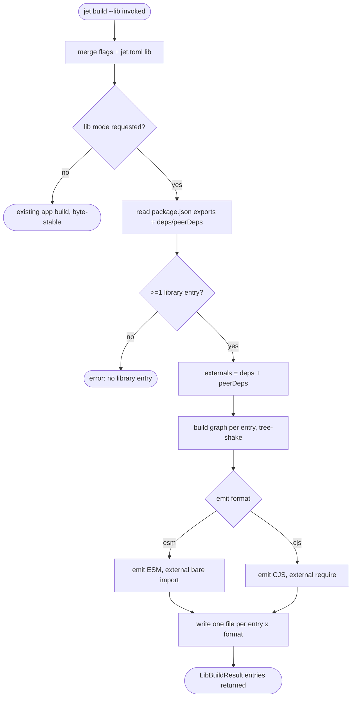

# jet build --lib: Library Build Mode

## Logic
<!-- type: logic lang: mermaid -->

# Reviews

### Review 1
**Verdict:** approved

- [logic] Contract logic is a valid Mermaid Plus block (id jet-build-lib-flow). The flow is complete and deterministic: parse the `jet build --lib` invocation, merge `--lib`/`--format`/`--out-dir` flags with `jet.toml [lib]`, branch on lib-mode (absent -> existing app build path stays byte-stable; present -> proceed). In lib mode it reads package.json (entries from exports/module/main; externals from dependencies+peerDependencies), validates >=1 entry (else a terminal no-entry error), externalizes deps via the resolver, builds+tree-shakes per entry, emits per format (ESM keeps external specifiers as bare `import`, CJS as `require()`), writes one output file per (entry x format) under out_dir, and returns LibBuildResult. Every node is reachable, both decisions (is_lib, entries) and the format branch carry labeled edges, and all three terminals (app_mode, no_entry, result) are real ends. Scope is correct: `.d.ts` emission (A2 #171) and publish/registry (A3 #172) are downstream and out of scope here.
