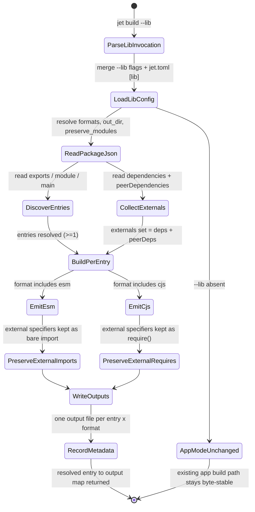

# jet build --lib: Library Build Mode

## Logic
<!-- type: logic lang: mermaid -->

# Reviews

### Review 1
**Verdict:** approved

- [logic] The logic state diagram correctly scopes the library build flow: config merge, package.json read (entries from exports/module/main, externals from dependencies+peerDependencies), per-entry build, ESM/CJS emission preserving external imports/requires, and the `--lib`-absent branch that leaves the existing app build byte-stable. Applicability is sound for this TD.
