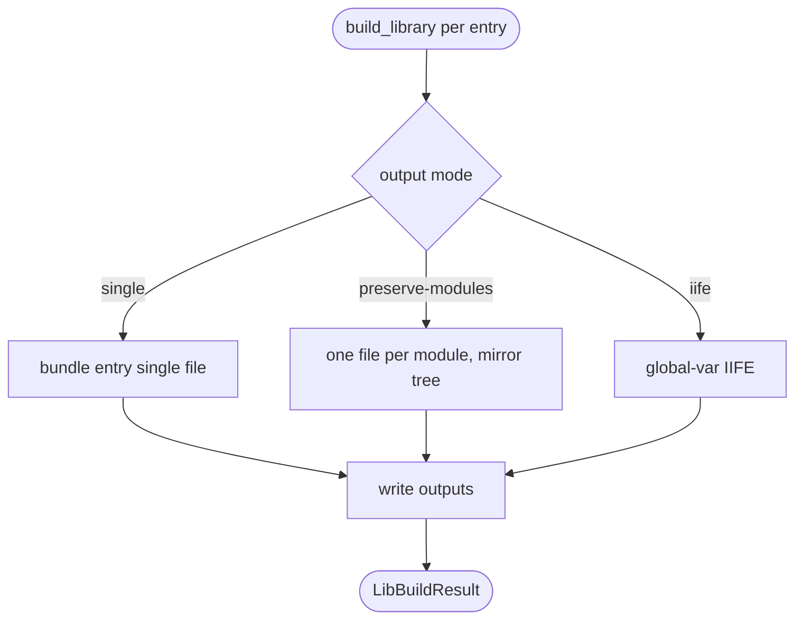

# jet build --lib: preserve_modules + IIFE Output Modes

## Logic
<!-- type: logic lang: mermaid -->



## Changes
<!-- type: changes lang: yaml -->

```yaml
coverage_kind: semantic
changes:
  - path: "projects/jet/src/bundler/lib_build.rs"
    action: modify
    section: logic
    description: |
      Implement preserve_modules (emit one output file per source module mirroring
      the source tree, externals externalized, entry re-exports) and IIFE library
      output (global-var wrapper, configurable global name), replacing the typed
      TODO bails. Return per-output entries in LibBuildResult.
    impl_mode: hand-written
  - path: "projects/jet/src/bundler/types.rs"
    action: modify
    section: logic
    description: |
      Support OutputFormat::Iife in library emission + a library_global_name
      option; preserve_modules already on BundleOptions.
    impl_mode: hand-written
  - path: "projects/jet/src/cli.rs"
    action: modify
    section: cli
    description: |
      Accept iife in --format and a --global-name flag (and [lib] config) for
      jet build --lib; thread preserve_modules through.
    impl_mode: hand-written
  - path: "projects/jet/tests/build/library_build.rs"
    action: modify
    section: unit-test
    description: |
      Tests: preserve_modules emits one file per module (consumer imports a deep
      module); --format iife emits a loadable global IIFE; single-file default
      and app-mode unchanged.
    impl_mode: hand-written
```

# Reviews

### Review 1
**Verdict:** approved

- [logic] Contract logic (jet-lib-output-modes) complete + deterministic: start -> mode decision (single/preserve-modules/iife, all labeled) -> respective emit -> write -> terminal LibBuildResult. All nodes reachable; terminal real. Builds on A1.
