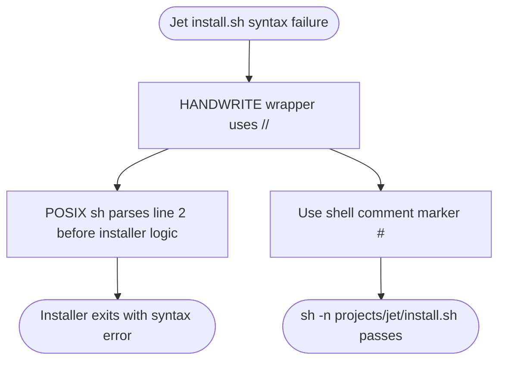

# jet install.sh: published installer marker syntax

## Logic
<!-- type: logic lang: mermaid -->



## Unit Test
<!-- type: unit-test lang: mermaid -->

```mermaid
---
id: jet-install-sh-marker-syntax-verification
requirements:
  repo_install_scripts:
    id: R2
    text: "Every install.sh in the repository remains parseable by POSIX sh after the Jet marker repair."
    kind: regression
    risk: medium
    verify: find . -name install.sh -exec sh -n {} ; -print
  shell_syntax:
    id: R1
    text: "projects/jet/install.sh uses shell-comment HANDWRITE markers so POSIX sh can parse the installer before executing any bootstrap logic."
    kind: regression
    risk: high
    verify: sh -n projects/jet/install.sh
---
flowchart TD
    r1[R1 shell syntax] --> sh_n_projects_jet_install_sh[sh -n projects/jet/install.sh]
    r2[R2 repo install scripts] --> find_name_install_sh_exec_sh_n_print[find . -name install.sh -exec sh -n {} ; -print]
```
