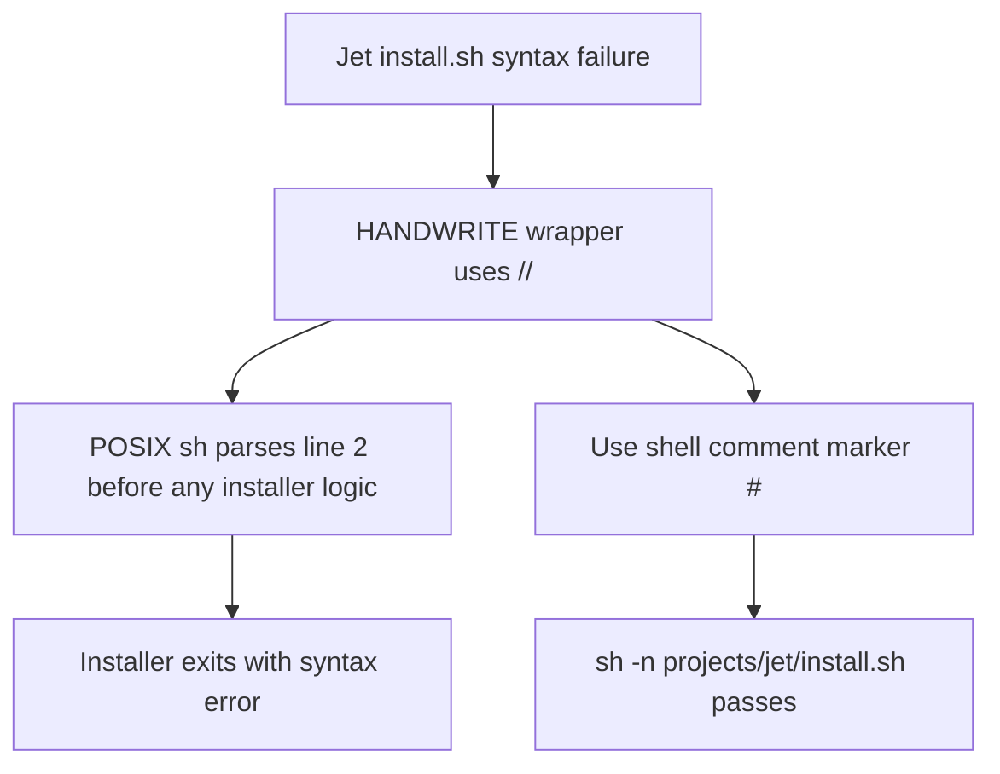

# jet install.sh: published installer marker syntax

## Logic
<!-- type: logic lang: mermaid -->

```mermaid
flowchart TD
    issue[Jet install.sh syntax failure] --> marker[HANDWRITE wrapper uses //]
    marker --> parser[POSIX sh parses line 2 before any installer logic]
    parser --> fail[Installer exits with syntax error]
    marker --> fix[Use shell comment marker #]
    fix --> valid[sh -n projects/jet/install.sh passes]
```
