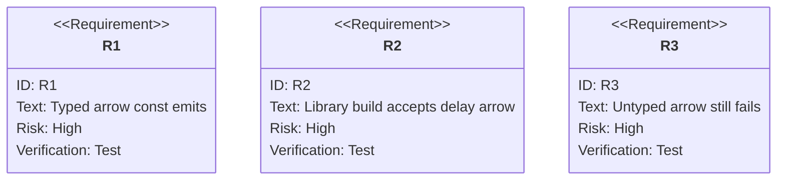

# jet --lib --dts: Const Arrow Function Declaration Type Synthesis

## Logic
<!-- type: logic lang: mermaid -->

```mermaid
(fill)
```
## Changes
<!-- type: changes lang: yaml -->

```yaml
coverage_kind: semantic
changes:
  - path: "projects/jet/src/bundler/dts.rs"
    action: modify
    section: logic
    description: |
      Teach infer_variable_declarator_type to recognize arrow_function
      initializers with explicit parameter types and a return_type, then
      synthesize the exported const declaration type as `(params) => Return`.
    impl_mode: hand-written
  - path: "projects/jet/src/bundler/dts.rs"
    action: modify
    section: unit-test
    description: |
      Add emitter-level coverage for exported const arrow functions with
      explicit return annotations and for untyped arrow params remaining
      fail-loud.
    impl_mode: hand-written
  - path: "projects/jet/tests/build/library_dts.rs"
    action: modify
    section: unit-test
    description: |
      Add library-build regression coverage matching the reported delay
      function shape and asserting the emitted .d.ts matches TypeScript's
      isolatedDeclarations output.
    impl_mode: hand-written
```
## Unit Test
<!-- type: unit-test lang: mermaid -->


