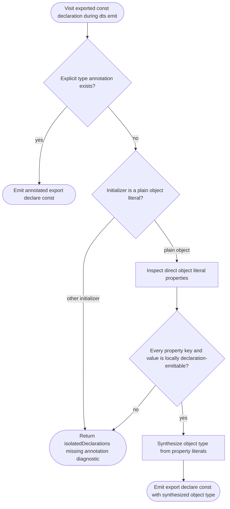

# jet --lib --dts isolatedDeclarations: Plain Object Literal Parity

## Logic
<!-- type: logic lang: mermaid -->

```mermaid
---
id: jet-lib-dts-object-literal-isolated-declarations-parity
entry: start
nodes:
  start: { kind: start, label: "Visit exported const declaration during .d.ts emit" }
  has_annotation: { kind: decision, label: "Explicit type annotation exists?" }
  emit_annotated: { kind: terminal, label: "Emit annotated export declare const" }
  initializer_kind: { kind: decision, label: "Initializer is a plain object literal?" }
  inspect_properties: { kind: process, label: "Inspect direct object literal properties" }
  every_property_supported: { kind: decision, label: "Every property key and value is locally declaration-emittable?" }
  synthesize_type: { kind: process, label: "Synthesize object type from property literals" }
  emit_synthesized: { kind: terminal, label: "Emit export declare const with synthesized object type" }
  isolated_error: { kind: terminal, label: "Return isolatedDeclarations missing annotation diagnostic" }
edges:
  - { from: start, to: has_annotation }
  - { from: has_annotation, to: emit_annotated, label: "yes" }
  - { from: has_annotation, to: initializer_kind, label: "no" }
  - { from: initializer_kind, to: inspect_properties, label: "plain object" }
  - { from: initializer_kind, to: isolated_error, label: "other initializer" }
  - { from: inspect_properties, to: every_property_supported }
  - { from: every_property_supported, to: synthesize_type, label: "yes" }
  - { from: every_property_supported, to: isolated_error, label: "no" }
  - { from: synthesize_type, to: emit_synthesized }
---
flowchart TD
    start([Visit exported const declaration during dts emit]) --> has_annotation{Explicit type annotation exists?}
    has_annotation -->|yes| emit_annotated([Emit annotated export declare const])
    has_annotation -->|no| initializer_kind{Initializer is a plain object literal?}
    initializer_kind -->|plain object| inspect_properties[Inspect direct object literal properties]
    initializer_kind -->|other initializer| isolated_error([Return isolatedDeclarations missing annotation diagnostic])
    inspect_properties --> every_property_supported{Every property key and value is locally declaration-emittable?}
    every_property_supported -->|yes| synthesize_type[Synthesize object type from property literals]
    every_property_supported -->|no| isolated_error
    synthesize_type --> emit_synthesized([Emit export declare const with synthesized object type])
```
