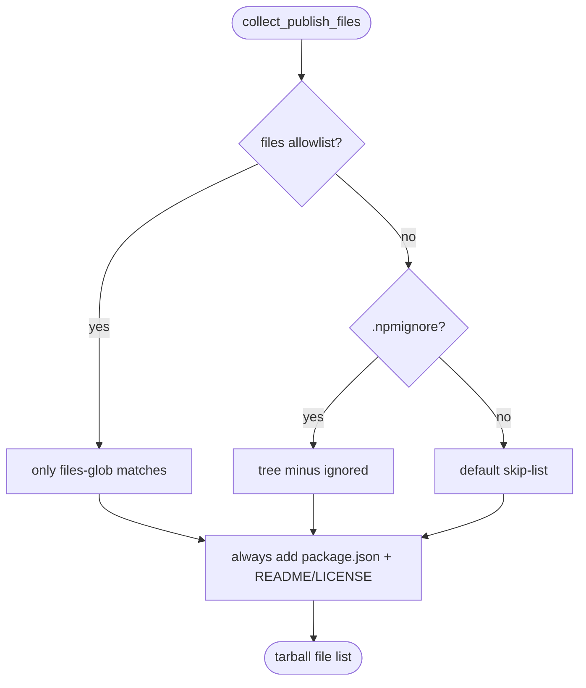

# jet pack/publish honors package.json files allowlist

## Logic
<!-- type: logic lang: mermaid -->

```mermaid
---
id: jet-pack-files
entry: collect
nodes:
  collect: { kind: start,    label: collect_publish_files gathers tarball entries }
  hasfiles: { kind: decision, label: package.json files allowlist present? }
  filesonly: { kind: process,  label: include ONLY files-glob matches }
  npmignore: { kind: decision, label: .npmignore present? }
  ignore: { kind: process,  label: default tree minus .npmignore patterns }
  deflist: { kind: process,  label: default skip-list (node_modules/.git/...) }
  always: { kind: process,  label: always add package.json + README/LICENSE }
  done: { kind: terminal, label: final tarball file list }
edges:
  - { from: collect,   to: hasfiles }
  - { from: hasfiles,  to: filesonly, label: yes }
  - { from: hasfiles,  to: npmignore, label: no }
  - { from: npmignore, to: ignore,    label: yes }
  - { from: npmignore, to: deflist,   label: no }
  - { from: filesonly, to: always }
  - { from: ignore,    to: always }
  - { from: deflist,   to: always }
  - { from: always,    to: done }
---
flowchart TD
    collect([collect_publish_files]) --> hasfiles{files allowlist?}
    hasfiles -->|yes| filesonly[only files-glob matches]
    hasfiles -->|no| npmignore{.npmignore?}
    npmignore -->|yes| ignore[tree minus ignored]
    npmignore -->|no| deflist[default skip-list]
    filesonly --> always[always add package.json + README/LICENSE]
    ignore --> always
    deflist --> always
    always --> done([tarball file list])
```
