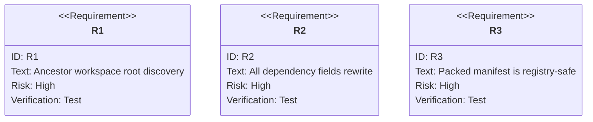

# jet pack/publish: Workspace Dependencies Rewrite Before Packaging

## Logic
<!-- type: logic lang: mermaid -->


## Unit Test
<!-- type: unit-test lang: mermaid -->



## Changes
<!-- type: changes lang: yaml -->

```yaml
coverage_kind: semantic
changes:
  - path: "projects/jet/src/pkg_manager/publish.rs"
    action: modify
    section: logic
    description: |
      Discover workspace context by walking ancestors from the publishing
      package directory, then rewrite workspace protocol ranges in
      dependencies, devDependencies, peerDependencies, and
      optionalDependencies before package.json is written into the tarball or
      publish body.
    impl_mode: hand-written
  - path: "projects/jet/tests/publish/library_publish_e2e.rs"
    action: modify
    section: unit-test
    description: |
      Add a pack regression with a package nested under a pnpm workspace root.
      Assert the packed package.json rewrites workspace:*, workspace:^, and
      workspace:~ ranges across publish-relevant dependency fields and contains
      no workspace: protocol literals.
    impl_mode: hand-written
```
