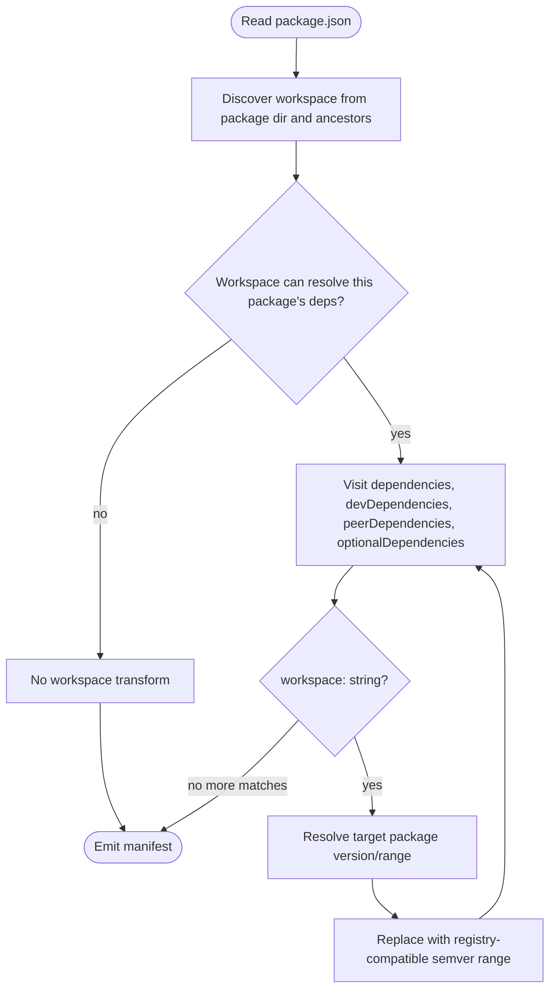
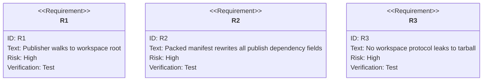

# jet pack/publish: Workspace Dependencies Rewrite Before Packaging

## Logic
<!-- type: logic lang: mermaid -->


## Unit Test
<!-- type: unit-test lang: mermaid -->


## Changes
<!-- type: changes lang: yaml -->

```yaml
coverage_kind: semantic
changes:
  - path: "projects/jet/src/pkg_manager/publish.rs"
    action: modify
    section: logic
    description: |
      Add a small workspace-discovery helper for publish packaging that checks
      the package root and each ancestor until WorkspaceManager can load a
      workspace containing the published package. Reuse the existing
      resolve_workspace_protocol semantics and extend field rewriting to
      peerDependencies and optionalDependencies.
    impl_mode: hand-written
  - path: "projects/jet/tests/publish/library_publish_e2e.rs"
    action: modify
    section: unit-test
    description: |
      Add tarball inspection for a nested workspace package. The fixture packs
      one package with workspace:*, workspace:^, and workspace:~ dependencies
      on sibling packages, then asserts package/package.json contains exact,
      caret, and tilde semver ranges with no workspace: literals.
    impl_mode: hand-written
```
