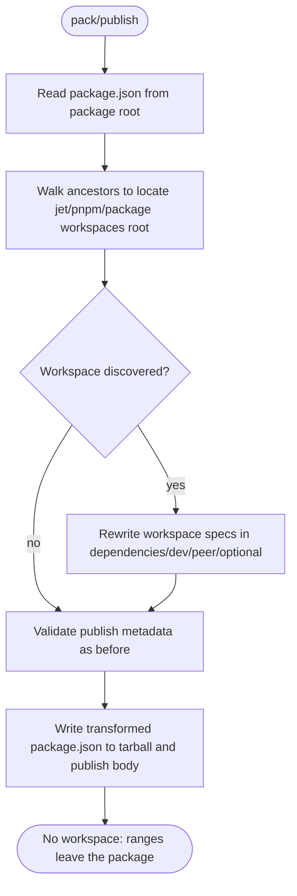
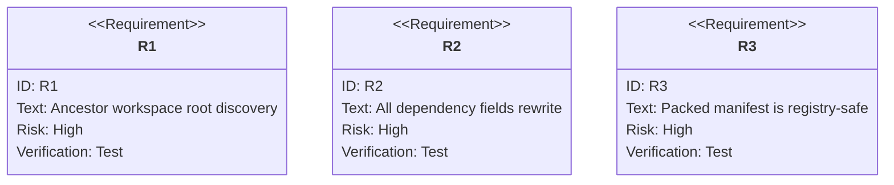

# jet pack/publish: Workspace Dependencies Rewrite Before Packaging

## Logic
<!-- type: logic lang: mermaid -->

```mermaid
---
id: jet-pack-publish-workspace-deps-flow
entry: start
nodes:
  start: { kind: start, label: "Start pack/publish manifest transform" }
  read_pkg: { kind: process, label: "Read package.json from package root" }
  find_root: { kind: process, label: "Walk ancestors to find workspace root" }
  workspace_found: { kind: decision, label: "Workspace discovered?" }
  rewrite_fields: { kind: process, label: "Rewrite workspace: specs in dependency fields" }
  validate: { kind: process, label: "Validate package metadata before tarball/publish" }
  pack: { kind: process, label: "Write transformed package.json into tarball/publish body" }
  done: { kind: terminal, label: "Published package has registry-safe dependency ranges" }
edges:
  - { from: start, to: read_pkg }
  - { from: read_pkg, to: find_root }
  - { from: find_root, to: workspace_found }
  - { from: workspace_found, to: rewrite_fields, label: "yes" }
  - { from: workspace_found, to: validate, label: "no" }
  - { from: rewrite_fields, to: validate }
  - { from: validate, to: pack }
  - { from: pack, to: done }
---
flowchart TD
    start([pack/publish]) --> read_pkg[Read package.json from package root]
    read_pkg --> find_root[Walk ancestors to locate jet/pnpm/package workspaces root]
    find_root --> workspace_found{Workspace discovered?}
    workspace_found -->|yes| rewrite_fields[Rewrite workspace specs in dependencies/dev/peer/optional]
    workspace_found -->|no| validate[Validate publish metadata as before]
    rewrite_fields --> validate
    validate --> pack[Write transformed package.json to tarball and publish body]
    pack --> done([No workspace: ranges leave the package])
```

## Unit Test
<!-- type: unit-test lang: mermaid -->

```mermaid
---
id: jet-pack-publish-workspace-deps-tests
requirements:
  R1:
    text: "pack/publish discovers the workspace root when invoked from a package directory."
    risk: high
    verify: unit
  R2:
    text: "dependencies, devDependencies, peerDependencies, and optionalDependencies rewrite workspace:* / workspace:^ / workspace:~ to package versions."
    risk: high
    verify: unit
  R3:
    text: "The package.json written into the tarball contains no workspace: protocol ranges."
    risk: high
    verify: unit
---
requirementDiagram
requirement R1 {
  id: R1
  text: "Ancestor workspace root discovery"
  risk: High
  verifymethod: Test
}
requirement R2 {
  id: R2
  text: "All dependency fields rewrite"
  risk: High
  verifymethod: Test
}
requirement R3 {
  id: R3
  text: "Packed manifest is registry-safe"
  risk: High
  verifymethod: Test
}
```
