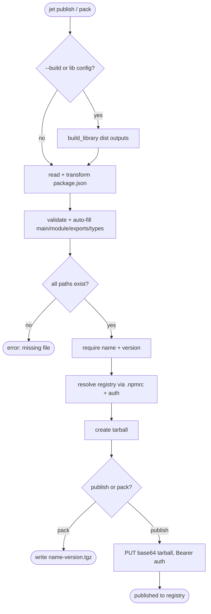

# jet publish: Build, Validate, and Publish to Public/Private Registries

## Logic
<!-- type: logic lang: mermaid -->



## Changes
<!-- type: changes lang: yaml -->

```yaml
coverage_kind: semantic
changes:
  - path: "projects/jet/src/pkg_manager/publish.rs"
    action: modify
    section: logic
    description: |
      Add an optional build-library step before packing (when --build or a [lib]
      config is present, call bundler::build_library); add metadata validation
      that resolves main/module/exports/types against real files in the tarball
      (reusing resolver::library_entries / get_package_main), auto-fills them
      from the build output, and errors on a missing target.
    impl_mode: hand-written
  - path: "projects/jet/src/cli.rs"
    action: modify
    section: cli
    description: |
      Add a `--build` flag to `jet publish` / `jet pack` that runs the library
      build before packing; thread it into Publisher.
    impl_mode: hand-written
  - path: "projects/jet/tests/publish/library_publish_e2e.rs"
    action: create
    section: unit-test
    description: |
      In-process mock npm registry (axum) e2e: jet publish a built library to the
      mock registry, then resolve+download it back (install round-trip), asserting
      the tarball contains the built JS/.d.ts and that scoped private-registry
      routing + Bearer auth are exercised. Plus metadata-validation unit tests
      (missing main/exports path -> error; auto-fill from build output).
    impl_mode: hand-written
  - path: "projects/jet/docs/library-publishing.md"
    action: create
    section: doc
    description: |
      Document the library publish + private-registry workflow: `.npmrc` scoped
      registry + auth token (GitLab/Verdaccio/Nexus), `jet build --lib`, `jet
      publish --build --access --tag`, and the metadata fields jet validates.
    impl_mode: hand-written
```

# Reviews

### Review 1
**Verdict:** approved

- [logic] Contract logic (id jet-publish-lib-flow) is complete and deterministic: optional build_library, read+transform package.json, validate+auto-fill main/module/exports/types (terminal val_err on missing), require identity, resolve registry via .npmrc scope+auth, pack, then branch pack-only (.tgz) vs publish (PUT base64 Bearer). All nodes reachable; decisions (build_q, val_ok, pack_only) carry labeled branches; terminals (val_err, write_tgz, done) are real ends. Private-registry routing reuses the hardened npmrc path; scope correct (build is A1/A2).
