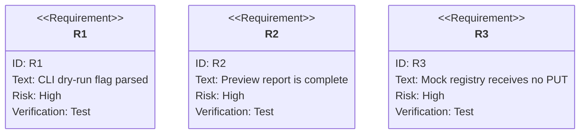

# jet publish: Dry-Run Preview Without Registry Upload

## Logic
<!-- type: logic lang: mermaid -->


## Unit Test
<!-- type: unit-test lang: mermaid -->


## Changes
<!-- type: changes lang: yaml -->

```yaml
coverage_kind: semantic
changes:
  - path: "projects/jet/src/cli.rs"
    action: modify
    section: logic
    description: |
      Register `publish --dry-run`, parse it with existing publish options, and
      print the publisher preview report instead of awaiting the upload method
      when the flag is set.
    impl_mode: hand-written
  - path: "projects/jet/src/pkg_manager/publish.rs"
    action: modify
    section: logic
    description: |
      Factor common publish preparation into a dry-run-capable path that reads
      and transforms package.json, runs optional build/metadata validation,
      resolves registry/auth, creates tarball bytes, lists tarball entries, and
      formats a deterministic preview without sending an HTTP PUT.
    impl_mode: hand-written
  - path: "projects/jet/tests/publish/library_publish_e2e.rs"
    action: modify
    section: unit-test
    description: |
      Add mock-registry dry-run coverage: preview fields are populated and the
      mock registry store remains empty, proving no upload occurred.
    impl_mode: hand-written
  - path: "projects/jet/src/cli.rs"
    action: modify
    section: unit-test
    description: |
      Add parser-level coverage for `jet publish --dry-run --tag beta --access restricted`.
    impl_mode: hand-written
```
