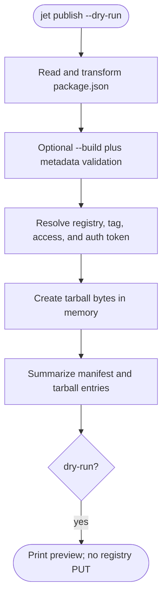
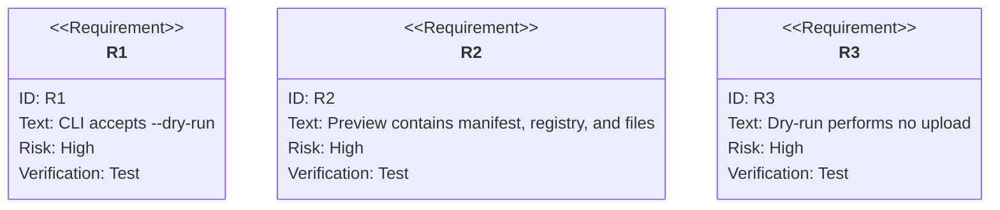

# jet publish: Dry-Run Preview Without Registry Upload

## Logic
<!-- type: logic lang: mermaid -->

```mermaid
---
id: jet-publish-dry-run-flow
entry: start
nodes:
  start: { kind: start, label: "jet publish --dry-run" }
  read_pkg: { kind: process, label: "Read and transform package.json" }
  prepare: { kind: process, label: "Run optional --build and metadata validation" }
  registry: { kind: process, label: "Resolve registry, tag, access, and local auth token" }
  pack_memory: { kind: process, label: "Create tarball bytes in memory" }
  summarize: { kind: process, label: "Summarize transformed manifest and tarball entries" }
  upload: { kind: decision, label: "dry-run?" }
  done: { kind: terminal, label: "Print preview without PUT upload" }
edges:
  - { from: start, to: read_pkg }
  - { from: read_pkg, to: prepare }
  - { from: prepare, to: registry }
  - { from: registry, to: pack_memory }
  - { from: pack_memory, to: summarize }
  - { from: summarize, to: upload }
  - { from: upload, to: done, label: "yes" }
---
flowchart TD
    start([jet publish --dry-run]) --> read_pkg[Read and transform package.json]
    read_pkg --> prepare[Optional --build plus metadata validation]
    prepare --> registry[Resolve registry, tag, access, and auth token]
    registry --> pack_memory[Create tarball bytes in memory]
    pack_memory --> summarize[Summarize manifest and tarball entries]
    summarize --> upload{dry-run?}
    upload -->|yes| done([Print preview; no registry PUT])
```

## Unit Test
<!-- type: unit-test lang: mermaid -->

```mermaid
---
id: jet-publish-dry-run-tests
requirements:
  R1:
    text: "publish command accepts --dry-run with existing --tag, --access, and --build flags."
    risk: high
    verify: unit
  R2:
    text: "Publisher dry-run returns transformed package.json, target registry/tag/access, tarball file name, and tarball entry list."
    risk: high
    verify: unit
  R3:
    text: "Dry-run does not execute the registry PUT upload path."
    risk: high
    verify: unit
---
requirementDiagram
requirement R1 {
  id: R1
  text: "CLI accepts --dry-run"
  risk: High
  verifymethod: Test
}
requirement R2 {
  id: R2
  text: "Preview contains manifest, registry, and files"
  risk: High
  verifymethod: Test
}
requirement R3 {
  id: R3
  text: "Dry-run performs no upload"
  risk: High
  verifymethod: Test
}
```
