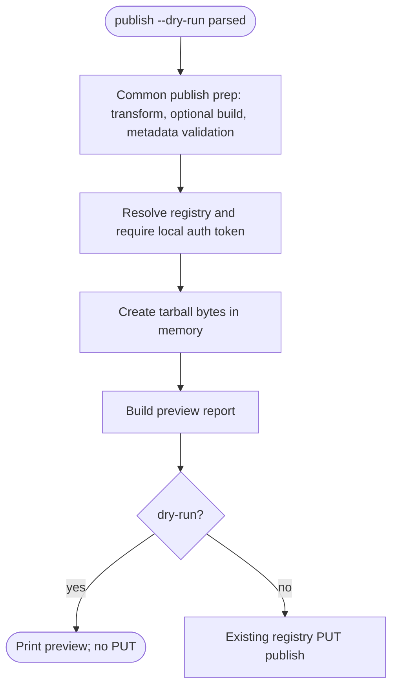
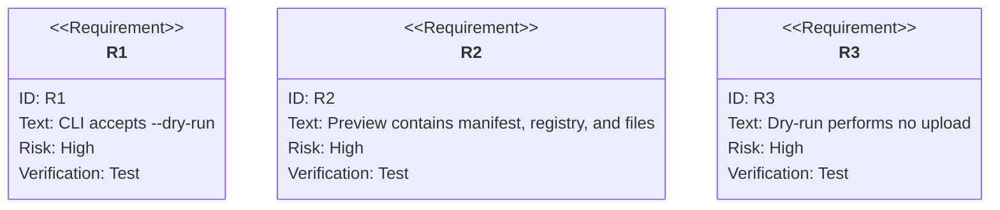

# jet publish: Dry-Run Preview Without Registry Upload

## Logic
<!-- type: logic lang: mermaid -->


## Unit Test
<!-- type: unit-test lang: mermaid -->



## Changes
<!-- type: changes lang: yaml -->

```yaml
coverage_kind: semantic
changes:
  - path: "projects/jet/src/cli.rs"
    action: modify
    section: logic
    description: |
      Add `jet publish --dry-run` to the CLI and route it to the publisher
      dry-run preview path instead of the registry upload path.
    impl_mode: hand-written
  - path: "projects/jet/src/pkg_manager/publish.rs"
    action: modify
    section: logic
    description: |
      Add a publish dry-run preview that performs the existing package
      transformation, optional build, metadata validation, registry/auth
      lookup, and in-memory tarball creation, then returns a printable preview
      without issuing the registry PUT request.
    impl_mode: hand-written
  - path: "projects/jet/tests/publish/library_publish_e2e.rs"
    action: modify
    section: unit-test
    description: |
      Add a dry-run regression that points publish at the in-process mock
      registry, asserts the preview shape, and verifies the mock store remains
      empty because no upload happened.
    impl_mode: hand-written
  - path: "projects/jet/src/cli.rs"
    action: modify
    section: unit-test
    description: |
      Add command parser coverage proving `publish --dry-run --tag --access`
      is accepted and sets the dry-run flag.
    impl_mode: hand-written
```
