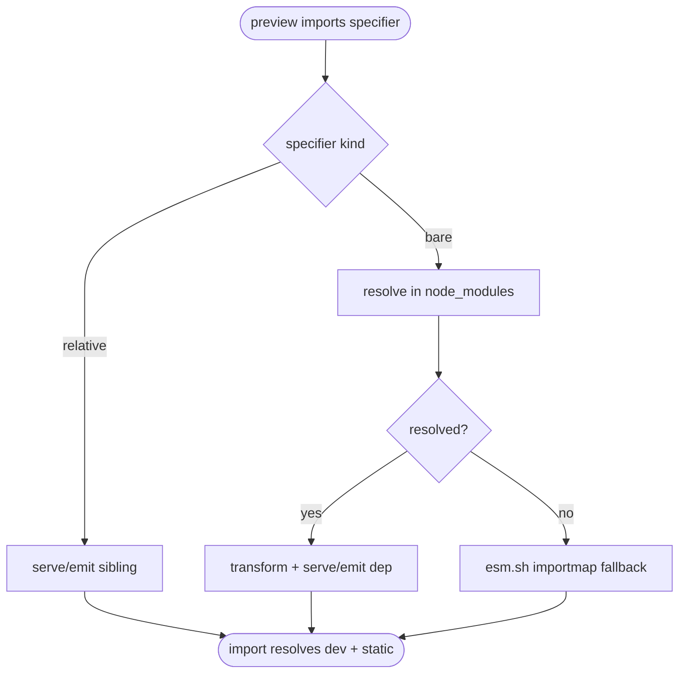

# jet stories: Bare-Import (node_modules) Resolution for Dev Preview + Static Build

## Logic
<!-- type: logic lang: mermaid -->



## E2E Test
<!-- type: e2e-test lang: yaml -->

```yaml
e2e_tests:
  - id: stories_bare_import_resolution
    capability_id: component-workbench
    claim_id: stories-bare-import-resolution
    name: "Stories bare-import resolution"
    command: "cargo test -p jet --test manager -- --nocapture"
    proves: "node_modules bare imports resolve for stories dev preview and static export."
```

## Changes
<!-- type: changes lang: yaml -->

```yaml
coverage_kind: semantic
changes:
  - path: "projects/jet/src/stories/server.rs"
    action: modify
    section: logic
    description: |
      Dev module route: when a served module imports a bare specifier, resolve it
      in the project node_modules via the existing resolver / pkg_manager, then
      transform + serve the resolved dependency module(s) transitively (rewriting
      bare imports to the served paths). Unresolved/CDN-only deps fall back to the
      esm.sh importmap. React-class deps keep working.
    impl_mode: hand-written
  - path: "projects/jet/src/stories/build.rs"
    action: modify
    section: logic
    description: |
      Static build: emit the resolved node_modules dependency modules into the
      out dir with relative URLs (same resolution as dev), so the static preview
      loads them without a server / without esm.sh for resolved deps.
    impl_mode: hand-written
  - path: "projects/jet/tests/stories/manager.rs"
    action: modify
    section: unit-test
    description: |
      Dev test: a fixture component importing a small node_modules package resolves
      + serves the dependency through the module route.
    impl_mode: hand-written
  - path: "projects/jet/tests/stories/stories_build.rs"
    action: modify
    section: unit-test
    description: |
      Static test: jet stories build emits the resolved dependency module(s) and
      the static preview references them via relative URLs.
    impl_mode: hand-written
```

# Reviews

### Review 1
**Verdict:** approved

- [logic] Contract logic (jet-stories-bare-import) complete + deterministic: import -> specifier-kind decision -> relative(existing) / bare->resolve->resolved decision -> serve/emit dep vs esm.sh fallback -> terminal resolves in dev+static. All nodes reachable; both decisions labeled; terminal real. Builds on B2/B4.
