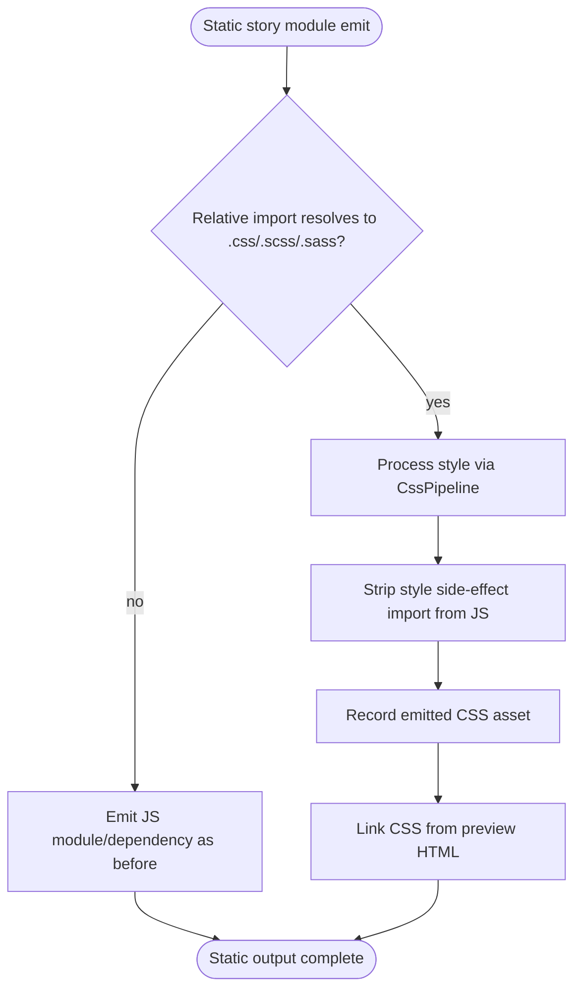
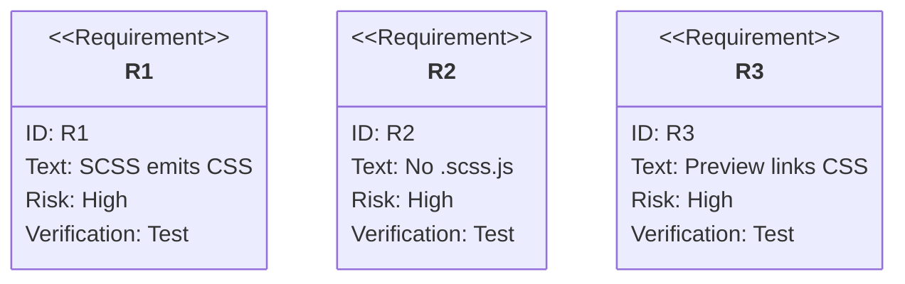

# jet stories build: SCSS Static Style Asset Emission

## Logic
<!-- type: logic lang: mermaid -->


## Changes
<!-- type: changes lang: yaml -->

```yaml
coverage_kind: semantic
changes:
  - path: "projects/jet/src/stories/build.rs"
    action: modify
    section: logic
    description: |
      Teach the static stories emitter to classify relative .css/.scss/.sass
      imports as style assets, compile them through the existing CssPipeline,
      emit deterministic .css files under the static output, remove side-effect
      style imports from emitted JS modules, and link emitted CSS from previews.
    impl_mode: hand-written
  - path: "projects/jet/tests/stories/stories_build.rs"
    action: modify
    section: unit-test
    description: |
      Add a static stories regression where a component imports SCSS with
      nesting/variables; assert the build emits a real CSS asset, does not emit
      .scss.js, removes the JS style import, and links the CSS from previews.
    impl_mode: hand-written
```

## Unit Test
<!-- type: unit-test lang: mermaid -->


