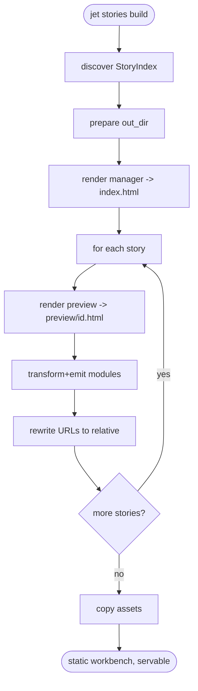

# jet stories build: Static Export of the Component Workbench

## Logic
<!-- type: logic lang: mermaid -->



## Changes
<!-- type: changes lang: yaml -->

```yaml
coverage_kind: semantic
changes:
  - path: "projects/jet/src/stories/build.rs"
    action: create
    section: logic
    description: |
      Static exporter: build_stories_static(root, out_dir) -> discover StoryIndex,
      clean out_dir, write manager index.html (reuse manager::render_manager_html),
      and per story write preview/{id}.html (render_preview_html) + transform and
      emit each imported module to out_dir with relative URLs; copy referenced
      assets. Output is servable by any static host with no jet process.
    impl_mode: hand-written
  - path: "projects/jet/src/stories/manager.rs"
    action: modify
    section: logic
    description: |
      Allow the manager/preview renderers to emit relative (static) URLs in
      addition to the dev-server absolute routes, so the same HTML works in the
      static build.
    impl_mode: hand-written
  - path: "projects/jet/src/cli.rs"
    action: modify
    section: cli
    description: |
      Add  subcommand dispatching to
      stories::build_stories_static; dev  unchanged.
    impl_mode: hand-written
  - path: "projects/jet/src/stories/mod.rs"
    action: modify
    section: logic
    description: |
      Register  and re-export build_stories_static.
    impl_mode: hand-written
  - path: "projects/jet/tests/stories/stories_build.rs"
    action: create
    section: unit-test
    description: |
      Tests: build to a temp out_dir emits index.html + one preview per story +
      the transformed modules they import; emitted URLs are relative and resolve
      to files present in the output; dev jet stories behavior unaffected.
    impl_mode: hand-written
```

# Reviews

### Review 1
**Verdict:** approved

- [logic] Contract logic (id jet-stories-build) is complete and deterministic: cmd -> discover -> clean out_dir -> render manager -> per-story loop (preview HTML + emit transformed modules + rewrite to relative URLs) -> decision more -> copy assets -> terminal static workbench. All nodes reachable; the more decision carries both labeled branches; terminal done is a real end. Reuses B2 render fns; dev-only HMR excluded. Scope correct.
