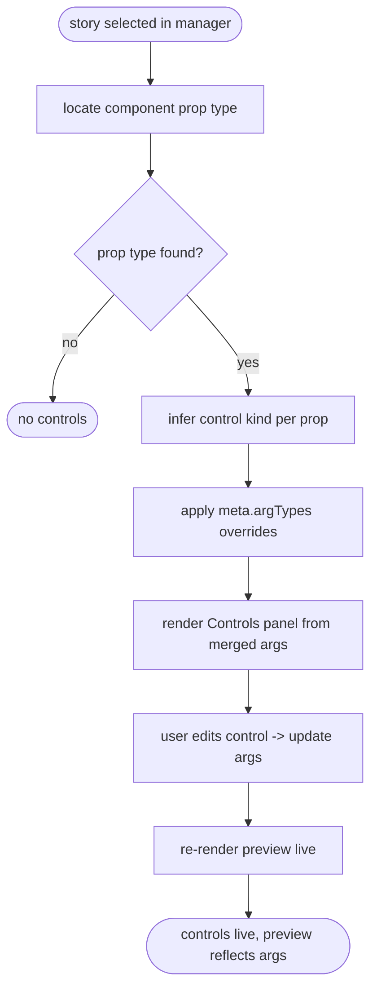

# jet stories: Controls Panel Derived from Prop Types + argTypes

## Logic
<!-- type: logic lang: mermaid -->

```mermaid
---
id: jet-stories-controls
entry: start
nodes:
  start:    { kind: start,    label: "manager renders a selected story (B2)" }
  locate:   { kind: process,  label: "locate the story component prop type (interface/type alias)" }
  found:    { kind: decision, label: "prop type found?" }
  no_ctrl:  { kind: terminal, label: "no controls (component props untyped)" }
  infer:    { kind: process,  label: "per prop infer control: bool->toggle, string->text, number->number, union->select" }
  override: { kind: process,  label: "apply meta.argTypes overrides (control type/options/disable)" }
  panel:    { kind: process,  label: "render Controls panel seeded from merged story args" }
  edit:     { kind: process,  label: "user edits a control -> update args" }
  rerender: { kind: process,  label: "re-render preview with new args (live)" }
  done:     { kind: terminal, label: "controls live; preview reflects edited args" }
edges:
  - { from: start,    to: locate }
  - { from: locate,   to: found }
  - { from: found,    to: no_ctrl,  label: "no" }
  - { from: found,    to: infer,    label: "yes" }
  - { from: infer,    to: override }
  - { from: override, to: panel }
  - { from: panel,    to: edit }
  - { from: edit,     to: rerender }
  - { from: rerender, to: done }
---
flowchart TD
    start([story selected in manager]) --> locate[locate component prop type]
    locate --> found{prop type found?}
    found -->|no| no_ctrl([no controls])
    found -->|yes| infer[infer control kind per prop]
    infer --> override[apply meta.argTypes overrides]
    override --> panel[render Controls panel from merged args]
    panel --> edit[user edits control -> update args]
    edit --> rerender[re-render preview live]
    rerender --> done([controls live, preview reflects args])
```
