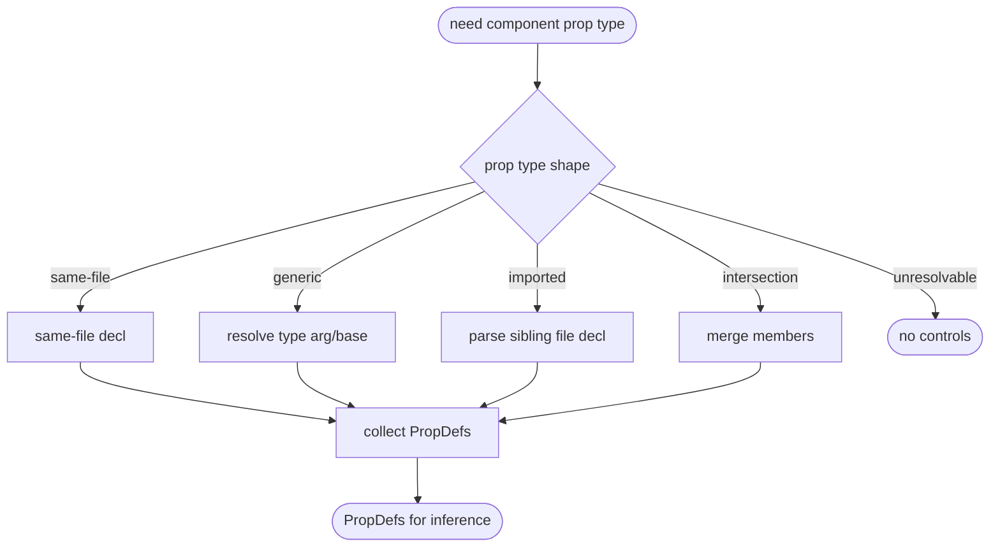

# jet stories controls: Generic, Cross-File, and Intersection Prop Types

## Logic
<!-- type: logic lang: mermaid -->



## Changes
<!-- type: changes lang: yaml -->

```yaml
coverage_kind: semantic
changes:
  - path: "projects/jet/src/stories/prop_extractor.rs"
    action: modify
    section: logic
    description: |
      Extend extract_props to resolve: generic prop types (React.FC<Props>,
      Props<Variant> where the type arg/base is statically determinable),
      cross-file imported prop types (follow the import to the sibling file and
      parse its interface/type decl), and intersection types (A & B -> union of
      members). Unresolvable shapes degrade gracefully to no props (no error).
    impl_mode: hand-written
  - path: "projects/jet/src/stories/controls.rs"
    action: modify
    section: logic
    description: |
      Consume the richer PropDef set (merged/dedup members) unchanged downstream;
      only adjust if member-merge ordering needs dedup.
    impl_mode: hand-written
  - path: "projects/jet/tests/stories/controls.rs"
    action: modify
    section: unit-test
    description: |
      Tests: imported prop type from a sibling file yields controls; intersection
      (Base & Extra) yields the union of members; a simple generic resolves;
      unresolvable generic -> no controls, no error; existing controls tests pass.
    impl_mode: hand-written
```

# Reviews

### Review 1
**Verdict:** approved

- [logic] Contract logic (jet-controls-advanced-props) complete + deterministic: locate -> shape decision (5 labeled branches incl unresolvable terminal) -> per-shape member collection -> PropDefs -> terminal. All nodes reachable; both terminals real. Extends B3 prop_extractor.
