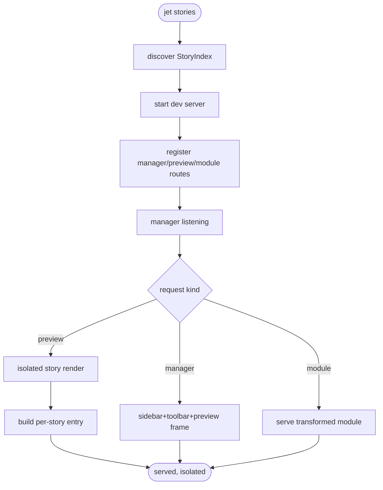

# jet stories: Dev Command, Native Manager UI, Isolated Render

## Logic
<!-- type: logic lang: mermaid -->

# Reviews

### Review 1
**Verdict:** approved

- [logic] Applicability is correct: jet stories discovers the StoryIndex (B1), starts a dev-server variant, registers manager/preview/module routes, and on each request branches to serve the manager shell (sidebar+toolbar+preview frame), an isolated per-story preview (built via the module graph, no app shell), or a transformed module. Scoped to command+manager+isolated render; HMR is B2b and controls are B3.
