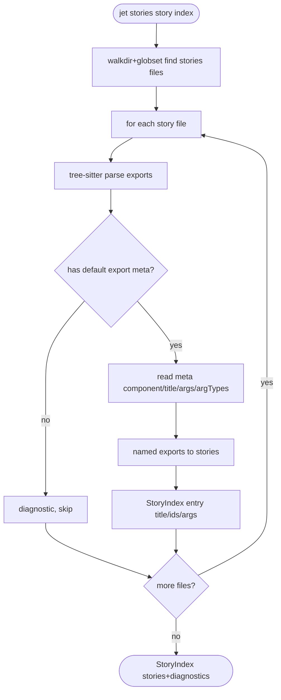

# jet stories: CSF Story Discovery and Parse

## Logic
<!-- type: logic lang: mermaid -->

```mermaid
---
id: jet-stories-csf-discovery
entry: start
nodes:
  start:        { kind: start,    label: "jet stories builds the story index" }
  glob:         { kind: process,  label: "walkdir + globset find **/*.stories.@(ts|tsx|js|jsx)" }
  loop:         { kind: process,  label: "for each story file" }
  parse:        { kind: process,  label: "tree-sitter parse; extract_imports -> exports" }
  has_default:  { kind: decision, label: "has default export (meta)?" }
  diag:         { kind: process,  label: "record diagnostic, skip file (no meta)" }
  read_meta:    { kind: process,  label: "read meta: component, title, args, argTypes" }
  read_stories: { kind: process,  label: "named exports -> stories (name, args, render)" }
  index:        { kind: process,  label: "StoryIndex entry: title hierarchy + stable ids + merged args" }
  more:         { kind: decision, label: "more files?" }
  done:         { kind: terminal, label: "StoryIndex { stories, diagnostics }" }
edges:
  - { from: start,        to: glob }
  - { from: glob,         to: loop }
  - { from: loop,         to: parse }
  - { from: parse,        to: has_default }
  - { from: has_default,  to: diag,        label: "no" }
  - { from: has_default,  to: read_meta,   label: "yes" }
  - { from: diag,         to: more }
  - { from: read_meta,    to: read_stories }
  - { from: read_stories, to: index }
  - { from: index,        to: more }
  - { from: more,         to: loop,        label: "yes" }
  - { from: more,         to: done,        label: "no" }
---
flowchart TD
    start([jet stories story index]) --> glob[walkdir+globset find stories files]
    glob --> loop[for each story file]
    loop --> parse[tree-sitter parse exports]
    parse --> has_default{has default export meta?}
    has_default -->|no| diag[diagnostic, skip]
    has_default -->|yes| read_meta[read meta component/title/args/argTypes]
    diag --> more{more files?}
    read_meta --> read_stories[named exports to stories]
    read_stories --> index[StoryIndex entry title/ids/args]
    index --> more
    more -->|yes| loop
    more -->|no| done([StoryIndex stories+diagnostics])
```
