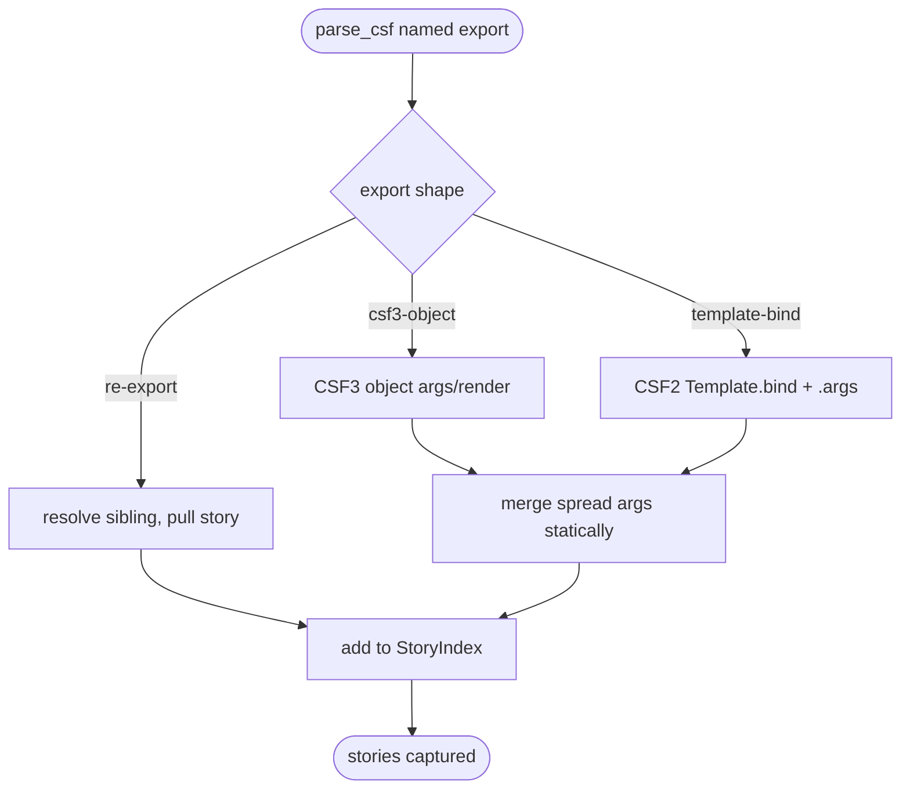

# jet stories discovery: CSF2 Template.bind, Re-exported Stories, and Spread Args

## Logic
<!-- type: logic lang: mermaid -->

```mermaid
---
id: jet-csf2-discovery
entry: scan
nodes:
  scan:     { kind: start,    label: "parse_csf scans a named export" }
  exp:      { kind: decision, label: "export shape" }
  csf3:     { kind: process,  label: "CSF3 object: { args, render } (existing)" }
  bind:     { kind: process,  label: "CSF2: const S = Template.bind({}); S.args = {} -> story" }
  reexport: { kind: process,  label: "export {X} from ./other: resolve sibling, pull story" }
  resargs:  { kind: process,  label: "resolve args: merge spread { ...base, x } (statically known)" }
  index:    { kind: process,  label: "add to StoryIndex" }
  done:     { kind: terminal, label: "stories captured incl CSF2 / re-export / spread" }
edges:
  - { from: scan,     to: exp }
  - { from: exp,      to: csf3,     label: "csf3-object" }
  - { from: exp,      to: bind,     label: "template-bind" }
  - { from: exp,      to: reexport, label: "re-export" }
  - { from: csf3,     to: resargs }
  - { from: bind,     to: resargs }
  - { from: reexport, to: index }
  - { from: resargs,  to: index }
  - { from: index,    to: done }
---
flowchart TD
    scan([parse_csf named export]) --> exp{export shape}
    exp -->|csf3-object| csf3[CSF3 object args/render]
    exp -->|template-bind| bind[CSF2 Template.bind + .args]
    exp -->|re-export| reexport[resolve sibling, pull story]
    csf3 --> resargs[merge spread args statically]
    bind --> resargs
    reexport --> index[add to StoryIndex]
    resargs --> index
    index --> done([stories captured])
```
