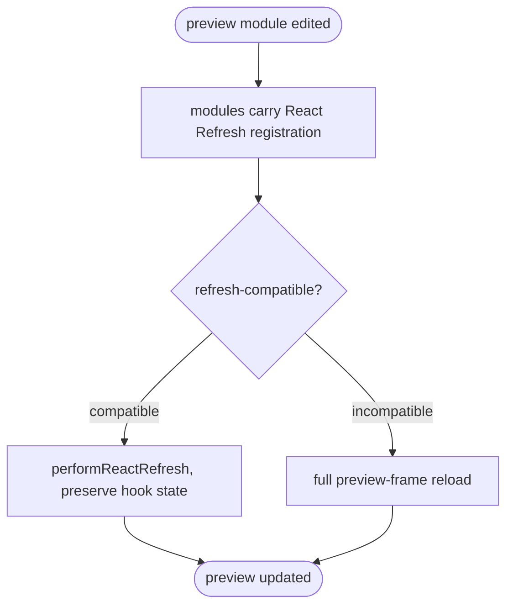

# jet stories preview: Full Hook-State-Preserving React Refresh

## Logic
<!-- type: logic lang: mermaid -->



## E2E Test
<!-- type: e2e-test lang: yaml -->

```yaml
e2e_tests:
  - id: stories_preview_hmr
    capability_id: component-workbench
    claim_id: stories-preview-hmr
    name: "Stories preview HMR"
    command: "cargo test -p jet --test preview_hmr -- --nocapture"
    proves: "Preview HMR updates the isolated preview while the manager shell remains untouched."
  - id: hook_state_preserving_refresh
    capability_id: component-workbench
    claim_id: hook-state-preserving-refresh
    name: "Hook-state-preserving refresh"
    command: "cargo test -p jet --test preview_hmr -- --nocapture"
    proves: "Compatible React Refresh preview edits preserve hook state and incompatible edits fall back to reload."
```

## Changes
<!-- type: changes lang: yaml -->

```yaml
coverage_kind: semantic
changes:
  - path: "projects/jet/src/stories/hmr.rs"
    action: modify
    section: logic
    description: |
      Drive a React-Refresh update on a compatible edit: serve the refresh
      runtime and, on an update message, call performReactRefresh instead of a
      blind re-render; keep the full-reload fallback for incompatible edits.
    impl_mode: hand-written
  - path: "projects/jet/src/stories/server.rs"
    action: modify
    section: logic
    description: |
      Transform preview modules with React-Refresh registration ($RefreshReg$/
      $RefreshSig$), reusing the dev_server react_refresh transform, and serve
      the react-refresh runtime endpoint for the preview frame.
    impl_mode: hand-written
  - path: "projects/jet/src/stories/manager.rs"
    action: modify
    section: logic
    description: |
      Inject the react-refresh runtime + refresh-aware update handling into the
      preview client (so a compatible edit reconciles in place, preserving hook
      state); manager shell unchanged.
    impl_mode: hand-written
  - path: "projects/jet/tests/stories/preview_hmr.rs"
    action: modify
    section: unit-test
    description: |
      Tests: preview modules are emitted with React-Refresh registration; the
      preview client wires performReactRefresh on update and full reload on
      incompatible; existing preview_hmr tests pass; manager not reloaded.
    impl_mode: hand-written
```

# Reviews

### Review 1
**Verdict:** approved

- [logic] Contract logic (jet-stories-refresh) complete + deterministic: edit -> instrumented modules -> compatibility decision (both labeled) -> performReactRefresh (state-preserving) vs full reload -> terminal. All nodes reachable; terminal real. Extends B2b.
