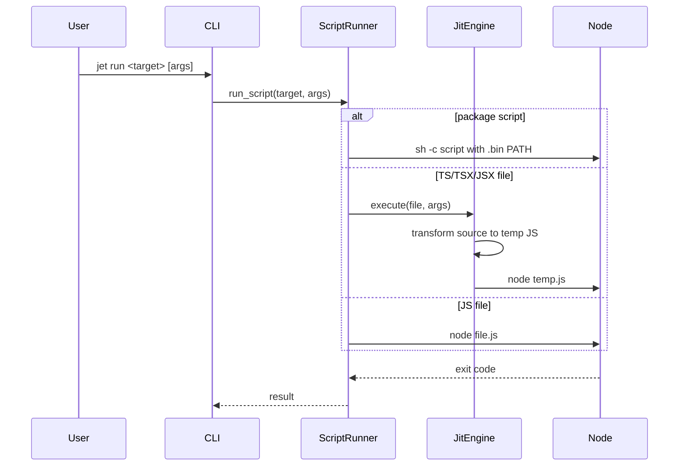
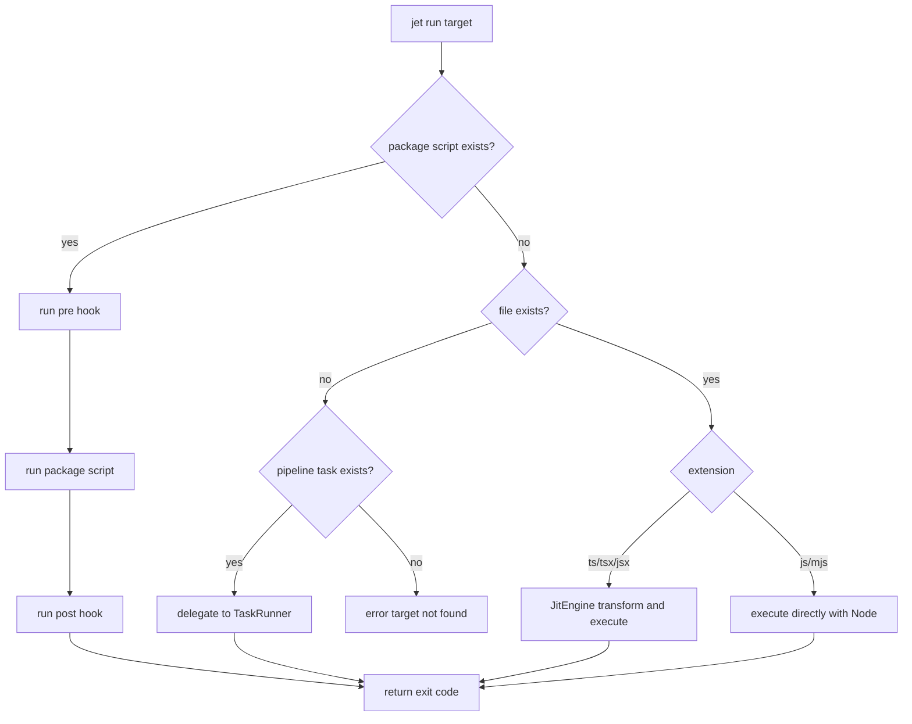

# Jet JIT Runner

## Changes
<!-- type: changes lang: yaml -->

```yaml
changes:
  - path: ".aw/tech-design/projects/jet/logic/jit-runner.md"
    action: modify
    section: doc
    impl_mode: hand-written
    description: |
      Legacy Jet TD content retained as notes during AW standardization.
      Rewrite this file into semantic TD sections before promoting source to CODEGEN.
```

## Legacy notes
<!-- type: doc lang: markdown -->

# Jet JIT Runner

### Overview

Jet's runner layer executes package scripts, arbitrary commands, JavaScript
files, and TypeScript/JSX files without a pre-build step. The CLI routes
`jet run`, `jet exec`, and `jet jtx` through `ScriptRunner`; TS/TSX/JSX files
delegate to `JitEngine`, which transforms source into temporary JavaScript and
executes it with Node.js. Pipeline task execution is handled by the task runner
modules and shares the `jet run` command surface.

| Concern | Source |
|---------|--------|
| CLI routing | `crates/jet/src/cli.rs` |
| Script and command runner | `crates/jet/src/runner/mod.rs` |
| JIT transform and watch execution | `crates/jet/src/runner/jit.rs` |
| Runner environment | `crates/jet/src/runner/env.rs` |
| Task graph/cache execution | `crates/jet/src/task_runner/` |

### Requirements

```yaml
requirements:
  - id: R1
    title: script resolution
    priority: must
    statement: "jet run <name> must prefer package.json scripts before file execution."
  - id: R2
    title: lifecycle hooks
    priority: should
    statement: "Script execution should run matching pre<name> and post<name> package scripts when present."
  - id: R3
    title: file execution
    priority: must
    statement: "Existing .js and .mjs files must execute directly through Node.js."
  - id: R4
    title: JIT TypeScript and JSX
    priority: must
    statement: "Existing .ts, .tsx, and .jsx files must transform to temporary JavaScript before Node execution."
  - id: R5
    title: watch mode
    priority: should
    statement: "JIT watch mode must re-run transformed files after source changes."
  - id: R6
    title: arbitrary command execution
    priority: must
    statement: "jet exec and jtx must execute commands with the runner environment and forwarded args."
  - id: R7
    title: task pipeline delegation
    priority: must
    statement: "jet run must delegate to task runner execution when the target matches pipeline config."
```

### Scenarios

```yaml
scenarios:
  - name: package script wins
    covers: [R1, R2]
    given:
      - "package.json contains scripts.build."
    when:
      - "jet run build is invoked."
    then:
      - "ScriptRunner executes the package script."
      - "prebuild and postbuild hooks run when present."
  - name: TypeScript file JIT execution
    covers: [R3, R4]
    given:
      - "scripts/demo.ts exists."
    when:
      - "jet run scripts/demo.ts is invoked."
    then:
      - "JitEngine transforms the file."
      - "Node.js executes the temporary JavaScript output."
  - name: watch mode re-executes on change
    covers: [R5]
    given:
      - "jet run file.ts --watch is active."
    when:
      - "file.ts changes."
    then:
      - "JitEngine transforms and executes the file again."
  - name: task runner target
    covers: [R7]
    given:
      - "jet.config.toml defines a pipeline task named build."
    when:
      - "jet run build is invoked."
    then:
      - "The CLI can delegate to TaskRunner for graph-aware execution."
```

### Interaction



### Logic



### Schema

```yaml
types:
  ScriptRunner:
    source: crates/jet/src/runner/mod.rs
    fields:
      project_root: PathBuf
      pkg_json: PackageJson
    methods:
      - "run_script(name, args) -> Result<ExitCode>"
      - "run_file(path, args) -> Result<ExitCode>"
      - "exec_command(cmd, args) -> Result<ExitCode>"
  JitEngine:
    source: crates/jet/src/runner/jit.rs
    methods:
      - "execute(file, args) -> Result<i32>"
      - "execute_watch(file, args) -> Result<()>"
    temp_dir: "std::env::temp_dir()/jet-jit"
  TaskRunner:
    source: crates/jet/src/task_runner/mod.rs
    purpose: "Pipeline task graph execution and caching."
```

### Changes

```yaml
changes:
  - path: .aw/tech-design/crates/jet/jit-runner.md
    action: delete
    impl_mode: hand-written
    description: "Remove the old root loose JIT runner spec."
  - path: .aw/tech-design/crates/jet/logic/jit-runner.md
    action: add
    impl_mode: hand-written
    description: "Rehome and normalize the JIT runner spec under logic/."
  - path: crates/jet/src/runner/mod.rs
    action: reference
    impl_mode: hand-written
    description: "Defines ScriptRunner target resolution and command execution."
  - path: crates/jet/src/runner/jit.rs
    action: reference
    impl_mode: hand-written
    description: "Defines JIT transform and watch execution."
```
