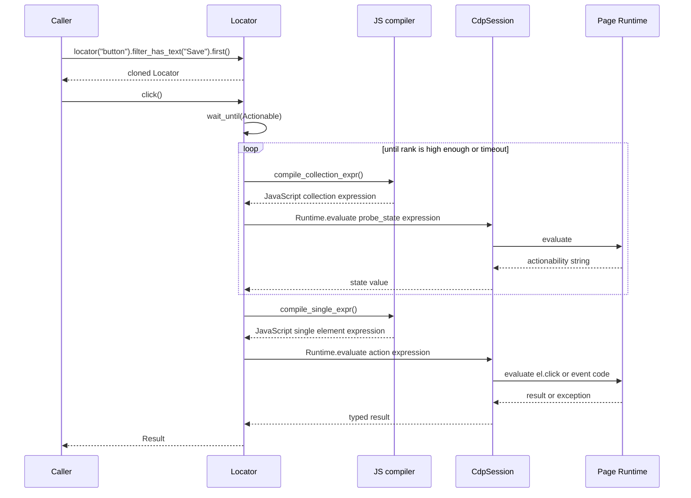
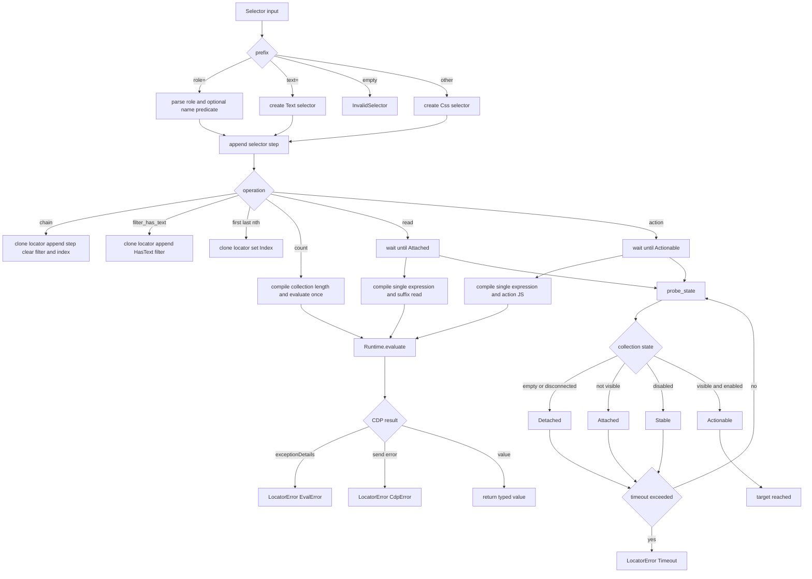
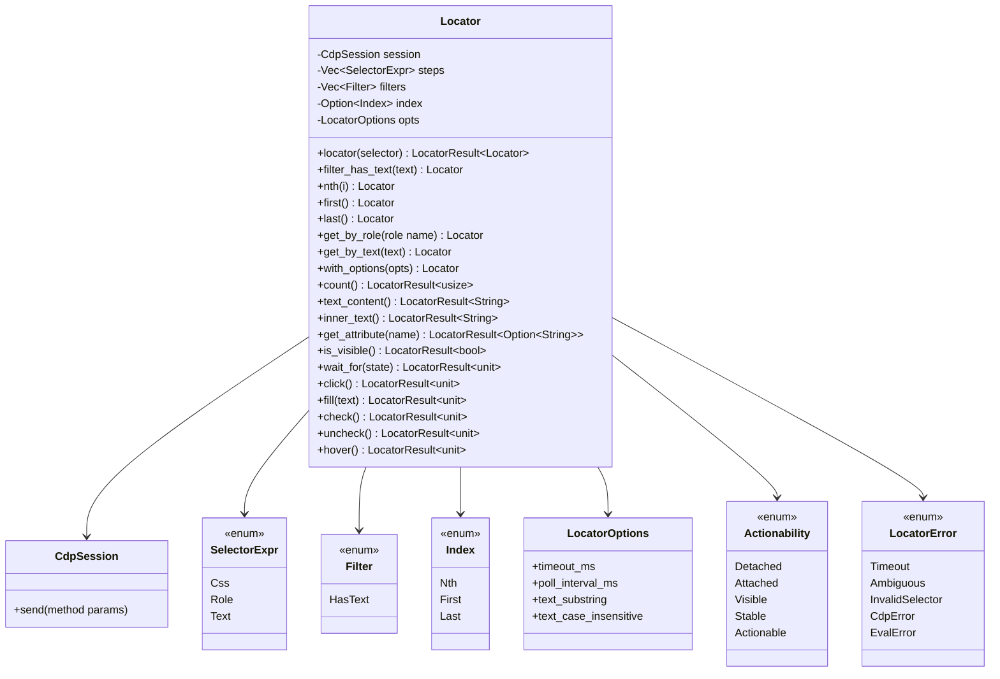
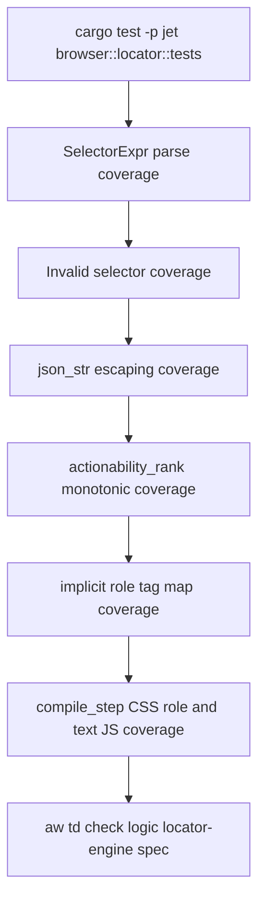

# Jet Locator Engine

## Changes
<!-- type: changes lang: yaml -->

```yaml
changes:
  - path: ".aw/tech-design/projects/jet/logic/locator-engine.md"
    action: modify
    section: doc
    impl_mode: hand-written
    description: |
      Legacy Jet TD content retained as notes during AW standardization.
      Rewrite this file into semantic TD sections before promoting source to CODEGEN.
```

## Legacy notes
<!-- type: doc lang: markdown -->

# Jet Locator Engine

### Overview

This spec owns the current Rust-side Jet locator engine in
`crates/jet/src/browser/locator.rs`. A locator is a lazy, cloneable DOM query
plan built from selector steps, text filters, positional indexing, and per
locator timeout options. Construction performs no CDP I/O; reads and actions
compile the plan into JavaScript and execute it through `Runtime.evaluate` on a
`CdpSession`.

The contract describes the implementation as it exists today. Role lookup is a
best-effort DOM query over explicit `role` attributes plus a small implicit tag
map, not a full accessibility tree query. Actions use in-page JavaScript such as
`el.click()` and synthetic events, not coordinate-level input dispatch.

| Area | Source | Responsibility |
|------|--------|----------------|
| Locator type | `crates/jet/src/browser/locator.rs` | Holds session, selector steps, filters, index, options |
| Selector parser | `crates/jet/src/browser/locator.rs` | Parses CSS, `role=...`, `role=...[name="..."]`, and `text=...` |
| Query compiler | `crates/jet/src/browser/locator.rs` | Builds collection, count, and single element JS expressions |
| Auto-wait | `crates/jet/src/browser/locator.rs` | Polls actionability stages until target state or timeout |
| Actions | `crates/jet/src/browser/locator.rs` | Click, fill, check, uncheck, and hover through page JS evaluation |
| Reads | `crates/jet/src/browser/locator.rs` | Count, text, inner text, attribute, visibility, and wait_for |

### Requirements

```mermaid
---
id: jet-locator-engine-requirements
entry: L1
---
requirementDiagram
    requirement L1 {
        id: L1
        text: Locator construction and chaining are lazy and send no CDP request
        risk: medium
        verifymethod: test
    }
    requirement L2 {
        id: L2
        text: SelectorExpr parse supports CSS role role name and text selector forms
        risk: high
        verifymethod: test
    }
    requirement L3 {
        id: L3
        text: Chained locators append selector steps and reset filters and index
        risk: medium
        verifymethod: test
    }
    requirement L4 {
        id: L4
        text: Text filters and positional indexes are applied after selector collection
        risk: high
        verifymethod: test
    }
    requirement L5 {
        id: L5
        text: Count evaluates the current collection length without auto wait
        risk: medium
        verifymethod: test
    }
    requirement L6 {
        id: L6
        text: Text and attribute reads wait only for Attached before evaluating the read
        risk: high
        verifymethod: test
    }
    requirement L7 {
        id: L7
        text: Actions wait for Actionable before evaluating page JavaScript
        risk: high
        verifymethod: test
    }
    requirement L8 {
        id: L8
        text: Actionability probes Detached Attached Stable and Actionable from current DOM state
        risk: high
        verifymethod: test
    }
    requirement L9 {
        id: L9
        text: Timeout errors include last reached actionability state selector description and timeout
        risk: medium
        verifymethod: test
    }
    requirement L10 {
        id: L10
        text: Runtime evaluate errors are returned as typed locator errors
        risk: medium
        verifymethod: test
    }
```

### Scenarios

```yaml
scenarios:
  - id: S1
    requirement: L1
    title: Page creates a root locator and additional locator calls only clone query state
  - id: S2
    requirement: L2
    title: Parser accepts CSS role text and role name selectors and rejects empty strings
  - id: S3
    requirement: L3
    title: Child locator appends a selector step and clears previous filter and index state
  - id: S4
    requirement: L4
    title: filter_has_text narrows the last step collection before nth first or last is selected
  - id: S5
    requirement: L5
    title: count returns the collection length from one Runtime.evaluate call without wait polling
  - id: S6
    requirement: L6
    title: text_content inner_text and get_attribute wait for Attached and then evaluate a suffix read
  - id: S7
    requirement: L7
    title: click fill check uncheck and hover wait for Actionable then run JavaScript in the page
  - id: S8
    requirement: L8
    title: Hidden or detached elements remain below the requested actionability rank until timeout
  - id: S9
    requirement: L9
    title: Timeout reports the selector chain including filters and index labels
  - id: S10
    requirement: L10
    title: CDP send failures and JavaScript exception details map into LocatorError variants
```

### Interaction



### Logic



### Dependency Model



### Locator API

```yaml
openrpc: 1.3.2
info:
  title: Jet Rust Locator API
  version: 0.1.0
  description: Lazy DOM locator API executed through Runtime.evaluate.
methods:
  - name: locator
    summary: Append a child selector step and return a cloned locator.
    params:
      - name: selector
        schema:
          type: string
    result:
      name: locator
      schema:
        type: object
        x-rust-type: Locator
    x-sdd:
      wait: none
      errors:
        - InvalidSelector
  - name: filter_has_text
    summary: Append a substring text filter to the current collection.
    params:
      - name: text
        schema:
          type: string
    result:
      name: locator
      schema:
        type: object
        x-rust-type: Locator
    x-sdd:
      wait: none
  - name: first
    summary: Select the first element in the filtered collection.
    params: []
    result:
      name: locator
      schema:
        type: object
        x-rust-type: Locator
    x-sdd:
      wait: none
  - name: nth
    summary: Select the indexed element in the filtered collection.
    params:
      - name: i
        schema:
          type: integer
    result:
      name: locator
      schema:
        type: object
        x-rust-type: Locator
    x-sdd:
      wait: none
  - name: count
    summary: Evaluate the current collection length without auto-wait.
    params: []
    result:
      name: count
      schema:
        type: integer
        minimum: 0
    x-sdd:
      wait: none
      cdp_methods:
        - Runtime.evaluate
  - name: text_content
    summary: Wait for Attached and return textContent or an empty string.
    params: []
    result:
      name: text
      schema:
        type: string
    x-sdd:
      wait: attached
      cdp_methods:
        - Runtime.evaluate
  - name: get_attribute
    summary: Wait for Attached and return an attribute value.
    params:
      - name: name
        schema:
          type: string
    result:
      name: value
      schema:
        type: string
        nullable: true
    x-sdd:
      wait: attached
      cdp_methods:
        - Runtime.evaluate
  - name: click
    summary: Wait for Actionable and evaluate el.click in the page.
    params: []
    result:
      name: unit
      schema:
        type: "null"
    x-sdd:
      wait: actionable
      cdp_methods:
        - Runtime.evaluate
  - name: fill
    summary: Wait for Actionable then set input or textarea value and dispatch input and change events.
    params:
      - name: text
        schema:
          type: string
    result:
      name: unit
      schema:
        type: "null"
    x-sdd:
      wait: actionable
      cdp_methods:
        - Runtime.evaluate
```

### Schema

```yaml
schemas:
  SelectorExpr:
    rust_type: SelectorExpr
    variants:
      - name: Css
        fields:
          selector:
            type: string
            parse_rule: Any non-empty selector without a recognized prefix.
      - name: Role
        fields:
          role:
            type: string
          name:
            type: string
            nullable: true
        parse_rule: role=<role> or role=<role>[name="<name>"].
      - name: Text
        fields:
          text:
            type: string
        parse_rule: text=<query>.
    validation:
      - Empty selector strings return LocatorError::InvalidSelector.
      - Role predicates other than name return LocatorError::InvalidSelector.
      - Unclosed role predicate brackets return LocatorError::InvalidSelector.
  LocatorOptions:
    rust_type: LocatorOptions
    fields:
      timeout_ms:
        type: u64
        default: 5000
      poll_interval_ms:
        type: u64
        default: 100
      text_substring:
        type: bool
        default: true
      text_case_insensitive:
        type: bool
        default: true
  Filter:
    rust_type: Filter
    variants:
      - name: HasText
        fields:
          text:
            type: string
  Index:
    rust_type: Index
    variants:
      - name: Nth
        fields:
          i:
            type: i32
            note: Negative indexes count from the end.
      - name: First
      - name: Last
  Actionability:
    rust_type: Actionability
    ordered_values:
      - Detached
      - Attached
      - Visible
      - Stable
      - Actionable
  LocatorError:
    rust_type: LocatorError
    variants:
      - Timeout
      - Ambiguous
      - InvalidSelector
      - CdpError
      - EvalError
```

### Test Plan



### Changes

```yaml
changes:
  - path: .aw/tech-design/crates/jet/logic/locator-engine.md
    action: create
    purpose: Re-home the current Rust locator engine TD under the logic spec directory.
    impl_mode: hand-written
  - path: .aw/tech-design/crates/jet/testing/locator-engine.md
    action: delete
    purpose: Remove the stale testing-directory TD that described future behavior as current behavior.
    impl_mode: hand-written
  - path: crates/jet/src/browser/locator.rs
    action: none
    purpose: Existing implementation remains the source described by this spec.
    impl_mode: hand-written
```
