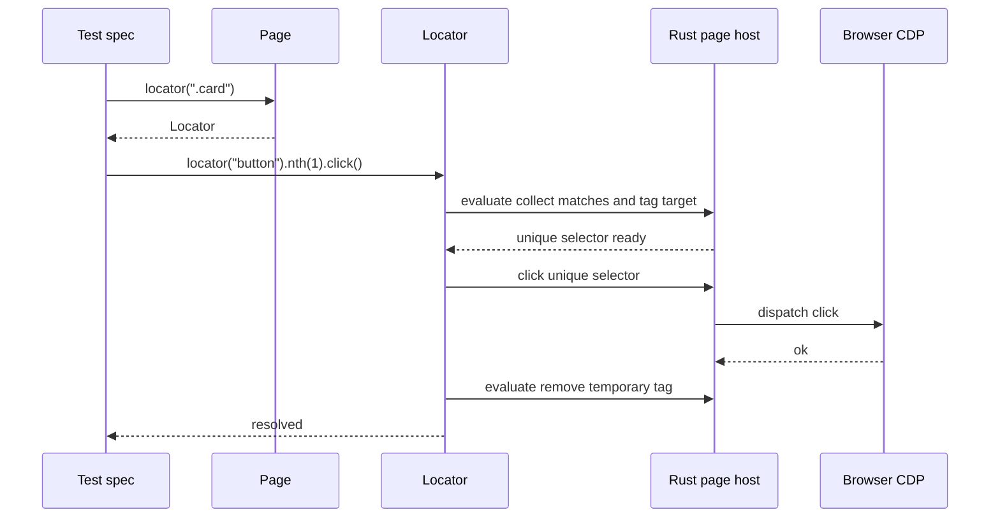
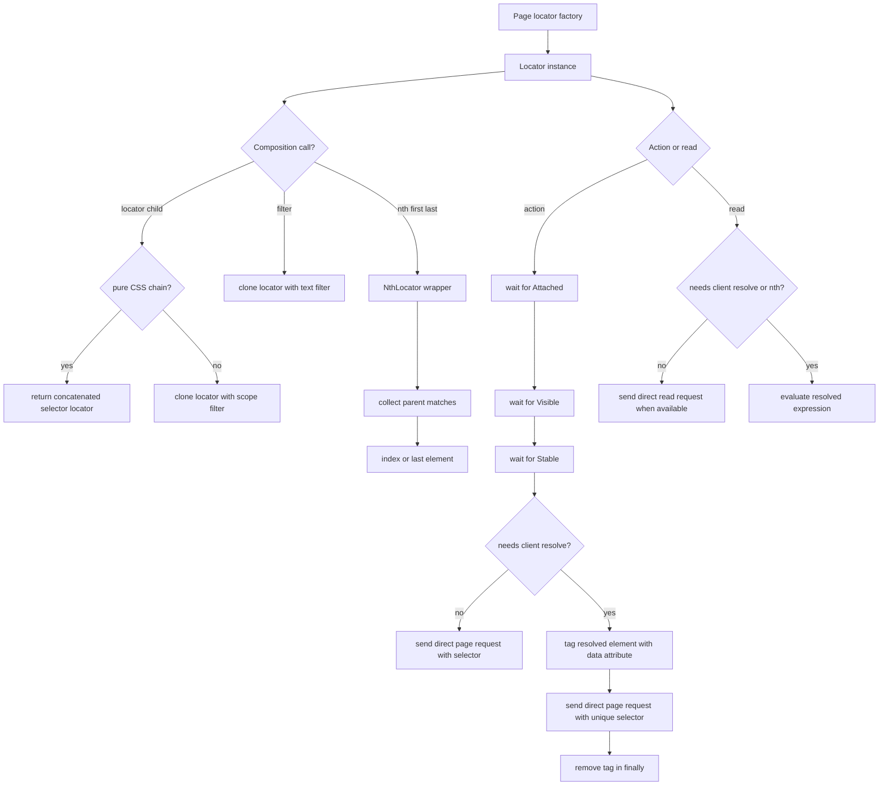
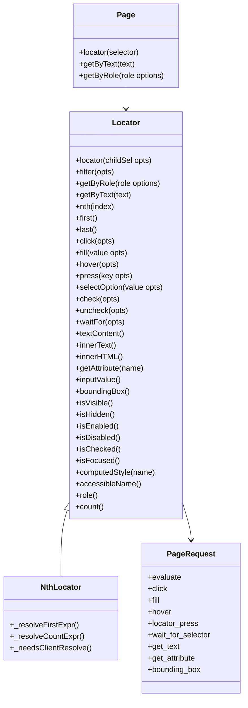

# Jet Locator JS API

## Changes
<!-- type: changes lang: yaml -->

```yaml
changes:
  - path: ".aw/tech-design/projects/jet/logic/locator-js-api.md"
    action: modify
    section: doc
    impl_mode: hand-written
    description: |
      Legacy Jet TD content retained as notes during AW standardization.
      Rewrite this file into semantic TD sections before promoting source to CODEGEN.
```

## Legacy notes
<!-- type: doc lang: markdown -->

# Jet Locator JS API

### Overview

This spec owns the current JavaScript-side `Page` and `Locator` API used by
Jet's native test runtime. The API provides Playwright-style locator
composition, text and role pseudo-selectors, text filters, `nth` selection,
auto-waited mutating actions, DOM reads, and locator-backed matcher readers.
No new Rust page request variants are introduced by this layer; pseudo
selectors, filters, actionability checks, and indexed reads are implemented by
client-side `evaluate` expressions in `crates/jet/runtime/test/page.js`.

### Owned Surface

| Area | Source | Responsibility |
|------|--------|----------------|
| Page factory | `crates/jet/runtime/test/page.js` | `locator`, `getByText`, `getByRole`, page-level helpers |
| Locator composition | `crates/jet/runtime/test/page.js` | CSS chaining, pseudo chaining, filter cloning, first/last/nth |
| Actionability | `crates/jet/runtime/test/page.js` | Attached, visible, stable polling before mutating actions |
| Action dispatch | `crates/jet/runtime/test/page.js` | `click`, `fill`, `hover`, `press`, `selectOption`, `check`, `uncheck` |
| Read dispatch | `crates/jet/runtime/test/page.js` | Text, attributes, visibility, box, enabled, checked, CSS, role, count, value |
| Nth selection | `crates/jet/runtime/test/page.js` | Indexed resolution through client-side collection and temporary tagging |
| Integration tests | `crates/jet/tests/locator_js_api.rs` | End-to-end coverage through inline `@jet/test` specs |

### Requirements

```mermaid
---
id: jet-locator-js-api-requirements
entry: L1
---
requirementDiagram
    requirement L1 {
        id: L1
        text: Pure CSS locator chaining concatenates parent and child selectors without eager RPC
        risk: high
        verifymethod: test
    }
    requirement L2 {
        id: L2
        text: Pseudo selector chains resolve client side through evaluate expressions
        risk: high
        verifymethod: test
    }
    requirement L3 {
        id: L3
        text: filter hasText and hasNotText narrow matches by string or RegExp inner text
        risk: high
        verifymethod: test
    }
    requirement L4 {
        id: L4
        text: Mutating locator actions wait for attached visible and stable states before dispatch
        risk: high
        verifymethod: test
    }
    requirement L5 {
        id: L5
        text: Visibility and stability are computed from style offsetParent and bounding client rect samples
        risk: high
        verifymethod: test
    }
    requirement L6 {
        id: L6
        text: NthLocator actions and reads target the indexed element rather than the first match
        risk: high
        verifymethod: test
    }
    requirement L7 {
        id: L7
        text: CDP direct actions on client resolved locators use temporary data attribute tagging
        risk: high
        verifymethod: test
    }
    requirement L8 {
        id: L8
        text: Locator readers support locator backed matchers for visibility text value count class attribute state CSS a11y and role
        risk: medium
        verifymethod: test
    }
    requirement L9 {
        id: L9
        text: Locator construction methods are lazy and only actions or reads send requests
        risk: medium
        verifymethod: test
    }
    requirement L10 {
        id: L10
        text: Timeout defaults to 5000ms and per call opts timeout overrides locator timeout
        risk: medium
        verifymethod: test
    }
```



### Scenarios

```yaml
scenarios:
  - id: S1
    requirement: L1
    title: CSS parent locator and CSS child locator combine into one usable selector
  - id: S2
    requirement: L2
    title: getByRole chain resolves child matches through evaluate
  - id: S3
    requirement: L3
    title: filter hasText keeps only matching list items
  - id: S4
    requirement: L3
    title: filter hasText RegExp counts matching priced items
  - id: S5
    requirement: L4
    title: Late mounted button is clicked after actionability polling
  - id: S6
    requirement: L5
    title: Hidden button times out while waiting for Visible
  - id: S7
    requirement: L5
    title: Static element passes the stability phase before click
  - id: S8
    requirement: L6
    title: nth click targets the second button
  - id: S9
    requirement: L6
    title: last and nth reads return indexed element values
  - id: S10
    requirement: L1
    title: Chained fill writes through the real fill request path
```

### Interaction



### Logic



### Dependency Model



### Data Schema

```yaml
locator_state:
  selector:
    type: string
    meaning: raw CSS or pseudo selector root
  timeout:
    type: number
    default_ms: 5000
  filters:
    variants:
      scope:
        fields:
          child: string
      text:
        fields:
          hasText: "string | RegExp | undefined"
          hasNotText: "string | RegExp | undefined"
actionability:
  poll_interval_ms: 50
  states:
    - Attached:
        predicate: resolved element exists
    - Visible:
        predicate: style not hidden, display not none, offsetParent acceptable, rect has width and height
    - Stable:
        predicate: two consecutive rect samples match
nth_locator:
  index:
    type: number
    special_values:
      - "-1 means last"
  count_semantics: 1 if indexed element exists else 0
```

### Test Plan

```mermaid
---
id: jet-locator-js-api-test-plan
entry: T1
---
requirementDiagram
    requirement L1 {
        id: L1
        text: css chaining
        risk: high
        verifymethod: test
    }
    requirement L3 {
        id: L3
        text: text filters
        risk: high
        verifymethod: test
    }
    requirement L4 {
        id: L4
        text: actionability wait
        risk: high
        verifymethod: test
    }
    requirement L6 {
        id: L6
        text: nth target
        risk: high
        verifymethod: test
    }
    element T1 {
        type: test
        docref: cargo test -p jet --test locator_js_api
    }
```

### Execution

```bash
cargo test -p jet --test locator_js_api
```

### Coverage Matrix

| Requirement | Test functions |
|-------------|----------------|
| L1 | `test_t1_sub_locator_css_concat`, `test_t10_chained_fill` |
| L2 | `test_t2_sub_locator_pseudo_scope` |
| L3 | `test_t3_filter_has_text_click`, `test_t4_filter_regex` |
| L4 | `test_t5_auto_wait_late_mount` |
| L5 | `test_t6_auto_wait_timeout_hidden`, `test_t7_stability_static` |
| L6 | `test_t8_nth_click_indexed`, `test_t9_nth_reads_indexed` |
| L7 | `test_t8_nth_click_indexed`, `test_t10_chained_fill` |
| L8 | `test_t9_nth_reads_indexed`, matcher tests in `matchers_state_value_a11y.rs` |
| L9 | Covered by construction-before-action behavior inside T1 through T4 |
| L10 | `test_t6_auto_wait_timeout_hidden` |

### Changes

```yaml
files:
  - path: .aw/tech-design/crates/jet/logic/locator-js-api.md
    action: ADD
    impl_mode: hand-written
    desc: Re-home the Locator JS API TD as a checker-compliant current-state contract.

  - path: .aw/tech-design/crates/jet/testing/locator-js-api.md
    action: DELETE
    impl_mode: hand-written
    desc: Remove the unexpected top-level testing directory copy of this TD.

  - path: crates/jet/runtime/test/page.js
    action: NONE
    impl_mode: hand-written
    desc: Existing Page, Locator, NthLocator, auto-wait, pseudo selector, and action/read implementation.

  - path: crates/jet/tests/locator_js_api.rs
    action: NONE
    impl_mode: hand-written
    desc: Existing integration tests for locator chaining, filtering, actionability, and nth behavior.
```
