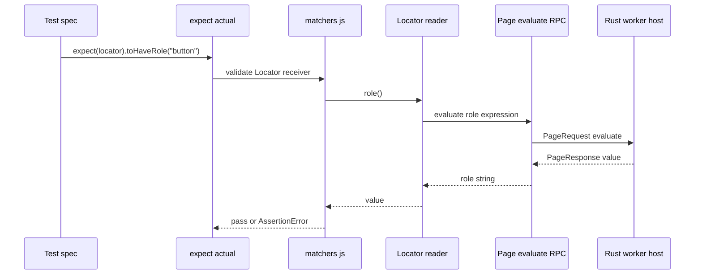
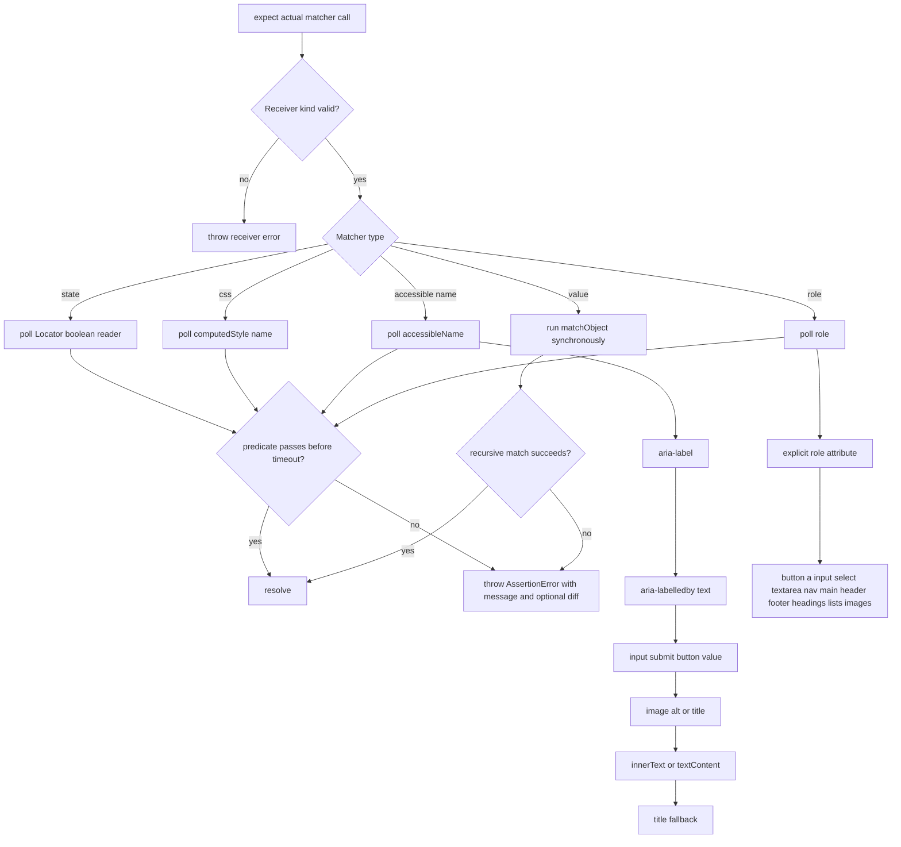
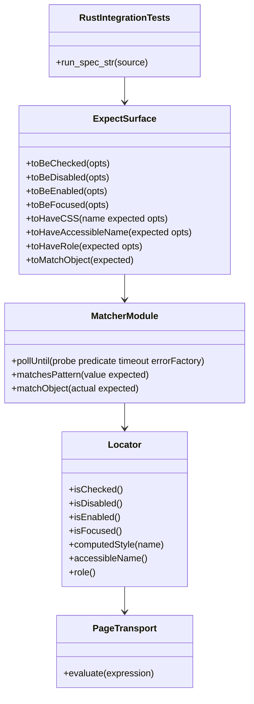

# Jet State Value And Accessibility Matchers

## Changes
<!-- type: changes lang: yaml -->

```yaml
changes:
  - path: ".aw/tech-design/projects/jet/logic/matchers-state-value-a11y.md"
    action: modify
    section: doc
    impl_mode: hand-written
    description: |
      Legacy Jet TD content retained as notes during AW standardization.
      Rewrite this file into semantic TD sections before promoting source to CODEGEN.
```

## Legacy notes
<!-- type: doc lang: markdown -->

# Jet State Value And Accessibility Matchers

### Overview

This spec owns the current Playwright-compatible matcher group for element
state, computed CSS, accessibility metadata, and partial object matching in
Jet's native test runtime. The matcher functions live in the embedded
JavaScript runtime and poll locator/page state through existing `evaluate`
requests; they do not add new Rust wire variants. Rust integration tests drive
inline `@jet/test` specs through `test_runner::run` and skip when Node or a
Chromium cache is unavailable.

### Owned Surface

| Area | Source | Responsibility |
|------|--------|----------------|
| Matcher exports | `crates/jet/runtime/test/matchers.js` | Polling matcher implementations and recursive `matchObject` helper |
| Expect wiring | `crates/jet/runtime/test/index.js` | Exposes matcher methods from `expect(actual)` and validates receiver kind |
| Locator readers | `crates/jet/runtime/test/page.js` | `isChecked`, `isDisabled`, `isEnabled`, `isFocused`, `computedStyle`, `accessibleName`, `role` |
| Integration tests | `crates/jet/tests/matchers_state_value_a11y.rs` | End-to-end runner tests for M1 through M8 |

### Requirements

```mermaid
---
id: jet-matchers-state-value-a11y-requirements
entry: M1
---
requirementDiagram
    requirement M1 {
        id: M1
        text: toBeChecked polls Locator isChecked until true or timeout
        risk: high
        verifymethod: test
    }
    requirement M2 {
        id: M2
        text: toBeDisabled polls Locator isDisabled until true or timeout
        risk: high
        verifymethod: test
    }
    requirement M3 {
        id: M3
        text: toBeEnabled polls Locator isEnabled until true or timeout
        risk: high
        verifymethod: test
    }
    requirement M4 {
        id: M4
        text: toBeFocused polls Locator isFocused against document activeElement
        risk: high
        verifymethod: test
    }
    requirement M5 {
        id: M5
        text: toHaveCSS polls computedStyle by camelCase property and accepts string or RegExp
        risk: medium
        verifymethod: test
    }
    requirement M6 {
        id: M6
        text: toHaveAccessibleName polls the implemented accessible name subset
        risk: medium
        verifymethod: test
    }
    requirement M7 {
        id: M7
        text: toHaveRole polls explicit role first then the implemented implicit role subset
        risk: medium
        verifymethod: test
    }
    requirement M8 {
        id: M8
        text: toMatchObject synchronously checks recursive partial objects regexes primitives and arrays
        risk: medium
        verifymethod: test
    }
    requirement M9 {
        id: M9
        text: Matcher failures report expected and actual values with stable messages
        risk: medium
        verifymethod: test
    }
```



### Scenarios

```yaml
scenarios:
  - id: S1
    requirement: M1
    title: Checkbox click makes toBeChecked pass
  - id: S2
    requirement: M1
    title: Unchecked box fails fast with a short timeout
  - id: S3
    requirement: M2
    title: Disabled button satisfies toBeDisabled
  - id: S4
    requirement: M3
    title: Plain button satisfies toBeEnabled
  - id: S5
    requirement: M4
    title: Focused input satisfies toBeFocused after evaluate focus
  - id: S6
    requirement: M5
    title: Inline CSS color and display match string or regex expectations
  - id: S7
    requirement: M6
    title: aria-label wins and inner text remains the fallback accessible name
  - id: S8
    requirement: M7
    title: Explicit role and common implicit roles are detected
  - id: S9
    requirement: M8
    title: Partial object and nested regex matches pass while missing keys fail
```

### Interaction



### Logic



### Dependency Model



### Data Schema

```yaml
matcher_surface:
  locator_async:
    toBeChecked:
      args: [{ name: opts, type: "{ timeout?: number }", optional: true }]
      reader: Locator.isChecked
    toBeDisabled:
      args: [{ name: opts, type: "{ timeout?: number }", optional: true }]
      reader: Locator.isDisabled
    toBeEnabled:
      args: [{ name: opts, type: "{ timeout?: number }", optional: true }]
      reader: Locator.isEnabled
    toBeFocused:
      args: [{ name: opts, type: "{ timeout?: number }", optional: true }]
      reader: Locator.isFocused
    toHaveCSS:
      args:
        - { name: name, type: string }
        - { name: expected, type: "string | RegExp" }
        - { name: opts, type: "{ timeout?: number }", optional: true }
      reader: Locator.computedStyle
    toHaveAccessibleName:
      args:
        - { name: expected, type: "string | RegExp" }
        - { name: opts, type: "{ timeout?: number }", optional: true }
      reader: Locator.accessibleName
    toHaveRole:
      args:
        - { name: expected, type: string }
        - { name: opts, type: "{ timeout?: number }", optional: true }
      reader: Locator.role
  value_sync:
    toMatchObject:
      args: [{ name: expected, type: unknown }]
      semantics:
        primitives: strict equality
        regexp: actual must be string and RegExp.test must pass
        arrays: equal length and pairwise recursive match
        objects: every expected key must recursively match actual value
defaults:
  timeout_ms: 5000
  poll_interval_ms: 100
```

### Test Plan

```mermaid
---
id: jet-matchers-state-value-a11y-test-plan
entry: T1
---
requirementDiagram
    requirement M1 {
        id: M1
        text: checked matcher
        risk: high
        verifymethod: test
    }
    requirement M5 {
        id: M5
        text: css matcher
        risk: medium
        verifymethod: test
    }
    requirement M6 {
        id: M6
        text: accessible name matcher
        risk: medium
        verifymethod: test
    }
    requirement M7 {
        id: M7
        text: role matcher
        risk: medium
        verifymethod: test
    }
    requirement M8 {
        id: M8
        text: object matcher
        risk: medium
        verifymethod: test
    }
    element T1 {
        type: test
        docref: cargo test -p jet --test matchers_state_value_a11y
    }
```

### Execution

```bash
cargo test -p jet --test matchers_state_value_a11y
```

### Coverage Matrix

| Requirement | Test functions |
|-------------|----------------|
| M1 | `test_m1a_to_be_checked_pass`, `test_m1b_to_be_checked_timeout` |
| M2 | `test_m2_m3_disabled_enabled` |
| M3 | `test_m2_m3_disabled_enabled` |
| M4 | `test_m4_focused` |
| M5 | `test_m5_css` |
| M6 | `test_m6_accessible_name` |
| M7 | `test_m7_role` |
| M8 | `test_m8_match_object` |
| M9 | `test_m1b_to_be_checked_timeout`, `test_m8_match_object` |

### Changes

```yaml
files:
  - path: .aw/tech-design/crates/jet/logic/matchers-state-value-a11y.md
    action: ADD
    impl_mode: hand-written
    desc: Re-home the matcher TD as a checker-compliant current-state contract.

  - path: .aw/tech-design/crates/jet/testing/matchers-state-value-a11y.md
    action: DELETE
    impl_mode: hand-written
    desc: Remove the unexpected top-level testing directory copy of this TD.

  - path: crates/jet/runtime/test/matchers.js
    action: NONE
    impl_mode: hand-written
    desc: Existing polling matchers and recursive matchObject helper.

  - path: crates/jet/runtime/test/index.js
    action: NONE
    impl_mode: hand-written
    desc: Existing expect surface wiring for locator and value matchers.

  - path: crates/jet/runtime/test/page.js
    action: NONE
    impl_mode: hand-written
    desc: Existing Locator readers for state CSS accessible name and role.

  - path: crates/jet/tests/matchers_state_value_a11y.rs
    action: NONE
    impl_mode: hand-written
    desc: Existing end-to-end integration tests for this matcher group.
```
