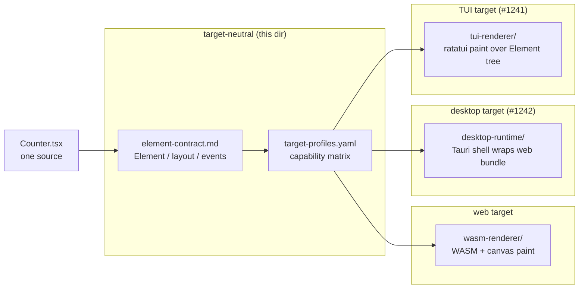

# jet multi-target — index

## Changes
<!-- type: changes lang: yaml -->

```yaml
changes:
  - path: ".aw/tech-design/projects/jet/logic/multi-target/README.md"
    action: modify
    section: doc
    impl_mode: hand-written
    description: |
      Legacy Jet TD content retained as notes during AW standardization.
      Rewrite this file into semantic TD sections before promoting source to CODEGEN.
```

## Legacy notes
<!-- type: doc lang: markdown -->

# jet multi-target — index

### Purpose

Specifies how Jet builds **one** React-style TSX UI source into **three**
runtime targets — web, desktop, and TUI — over a single shared
renderer-neutral contract.

This directory is the foundation slice for [#1238][i1238] under epic
[#1237][i1237]. It defines:

- The cross-target Element / layout / event contract that every renderer
  implementation MUST honor (`element-contract.md`).
- Per-target **capability profiles** that let Cue components intentionally
  degrade presentation on TUI while preserving behavior
  (`target-profiles.md` + `target-profiles.yaml`).
- The build-pipeline boundary between target-neutral and target-specific
  code (`README.md` §"Build pipeline boundary" below).

It does **not** specify any renderer's implementation — those live under
sibling spec directories (`wasm-renderer/` for web today; `tui-renderer/`
and `desktop-runtime/` to follow under [#1241] / [#1242]).

[i1237]: https://github.com/chrischeng-c4/cclab/issues/1237
[i1238]: https://github.com/chrischeng-c4/cclab/issues/1238
[#1241]: https://github.com/chrischeng-c4/cclab/issues/1241
[#1242]: https://github.com/chrischeng-c4/cclab/issues/1242

### File map

| File | Type | Owns |
|------|------|------|
| `README.md` | overview | This index. Scope, cross-references, build-pipeline boundary. |
| `element-contract.md` | logic | Renderer-neutral Element tree, layout tree, command/query/event boundary. The contract every target MUST honor. |
| `target-profiles.md` | logic | Per-target capability profiles (web/desktop/TUI) + degradation rules + presentation guarantees. |
| `target-profiles.yaml` | data | Machine-readable capability matrix. Validated by `target-profiles.yaml.schema.json`. |
| `target-profiles.yaml.schema.json` | schema | JSON Schema for `target-profiles.yaml`. |
| `tui-renderer.md` | logic | TUI `TargetRenderer` impl plan + slice ledger (#1241). |
| `desktop-runtime.md` | logic | Tauri-shell packaging plan + slice ledger (#1242). |
| `build-targets.md` | logic | `jet build --target {web,desktop,tui}` CLI wiring + manifest emission (#1239). |

### Build pipeline boundary



**Rule.** Anything that can be expressed in terms of the Element /
layout / event contract MUST live target-neutral. Anything that depends
on a specific paint surface, OS shell, or input device MUST live in the
target's renderer/runtime spec.

### Substrate (do not duplicate; reference)

The contract here sits **on top of** the existing jet-wasm renderer
specs. Nothing in this directory restates them — it MUST cite them.

- `../../wasm-renderer/architecture.md` — overall WASM runtime layering.
- `../../wasm-renderer/subset.md` + `subset-rigor.md` — supported React
  dialect. The contract here MUST NOT require features outside this
  subset.
- `../../wasm-renderer/conformance.md` (+ `conformance.yaml`) — React DOM
  oracle conformance harness. Per-target capability degradation SHOULD
  be expressed in this conformance vocabulary so existing tests can
  assert behavior parity.
- `../../wasm-renderer/layout-runtime.md` + `layout-bridge.md` — layout
  tree shape. The Element-tree-to-layout-tree contract referenced in
  `element-contract.md` is rooted here.
- `../../wasm-renderer/paint-runtime.md` — paint pipeline. Defines what
  "presentation" means on the web baseline; TUI degrades from this.
- `../../wasm-renderer/event-pipeline.md` — event model. The shared event
  contract referenced in `element-contract.md` is rooted here.
- `../../wasm-renderer/hooks-runtime.md` — hooks behavior. Capability
  profiles MUST NOT alter hook semantics.

### Cue-side requirements

The TUI capability profile is driven by Cue's already-shipping ratatui
UX:

- `../../../projects/cue/specs/cue-tui-lifecycle-ux.md` — Cue's TUI
  widgets and interaction patterns. The TUI profile MUST cover these.

### Out of scope

- Cloud backend implementation for Cue web (epic #1237 explicitly
  excludes it).
- Replacing all existing Cue ratatui code in the first slice — the
  TUI renderer prototype lands as a separate spike under #1241.
- Supporting arbitrary DOM-heavy React libraries — the supported
  dialect is the existing jet-wasm subset; the TUI profile is a
  **further restriction** of that subset, not an extension.
- Hot-reload across target switches (web build with HMR is already
  spec'd in `../../wasm-renderer/wasm-dev-server.md`; equivalent
  HMR for TUI/desktop is deferred).

### Status

| Item | Status |
|------|--------|
| `element-contract.md` | draft (initial pass under #1238) |
| `target-profiles.md` | draft (initial pass under #1238) |
| `target-profiles.yaml` | draft (matrix populated; schema pending) |
| `target-profiles.yaml.schema.json` | pending |
| Build target plumbing in jet CLI | deferred to #1239 |
| Cue dogfood acceptance app | deferred to #1240 |
| TUI renderer implementation | deferred to #1241 |
| Desktop packaging | spec drafted (`desktop-runtime.md`); Slices 2-5 pending under #1242 |
