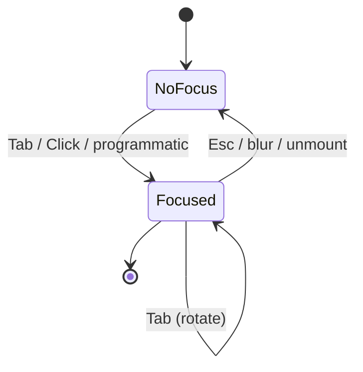

# jet multi-target — element contract

## Changes
<!-- type: changes lang: yaml -->

```yaml
changes:
  - path: ".aw/tech-design/projects/jet/logic/multi-target/element-contract.md"
    action: modify
    section: doc
    impl_mode: hand-written
    description: |
      Legacy Jet TD content retained as notes during AW standardization.
      Rewrite this file into semantic TD sections before promoting source to CODEGEN.
```

## Legacy notes
<!-- type: doc lang: markdown -->

# jet multi-target — element contract

### Overview

The renderer-neutral contract that every Jet target (web, desktop, TUI)
MUST honor. This spec is the **interface boundary** between the
target-neutral substrate (transpiler, react runtime, hooks, layout
solve) and the per-target renderer (paint surface, input source, OS
shell).

The four pillars of the contract:

1. **Element tree** — the React vDOM produced by `render`. Renderer-neutral.
2. **Layout tree** — taffy-driven layout output. Renderer-neutral.
3. **Event model** — synthetic events + bubble dispatch. Renderer-neutral.
4. **Renderer trait** — the seam every per-target renderer plugs into.

Pillars 1-3 are already specified by `../../wasm-renderer/`; this doc
**imports** them and forbids divergence. Pillar 4 is the new surface
introduced by [#1238].

[#1238]: https://github.com/chrischeng-c4/cclab/issues/1238

### Design Contract

| ID | Rule | Verifiable by |
|----|------|---------------|
| C1 | The `Element`, `Props`, `Callback`, and `EventCallback` types in `crates/jet-wasm/src/lib.rs` are the **canonical** Element-tree types. No target may define alternative Element types. | `cargo check` — every renderer crate uses `jet_wasm::Element`. |
| C2 | The `LayoutTree` / `LaidOutNode` types from `../../wasm-renderer/layout-runtime.md` are the canonical layout-tree types. The `layout()` entry point is pure and target-independent. | The function lives in a target-neutral crate (`jet-wasm`); no target re-implements layout. |
| C3 | The `SyntheticMouseEvent` + `dispatch_click` algorithm from `../../wasm-renderer/event-pipeline.md` is the canonical event spine. Targets MAY add native event sources (TUI key, terminal resize) that **synthesize** into the same dispatch path. | Every event source ends in a `dispatch_*` call against the layout tree. |
| C4 | Each target implements `trait Renderer` (defined below). The trait is the **only** seam targets are allowed to use. | `impl Renderer for WebRenderer / TuiRenderer / DesktopRenderer` exists; nothing else is plugged into the substrate. |
| C5 | Each target publishes a `TargetProfile` (see `target-profiles.md`). Cue components MAY query the active profile via `useTarget()` to gate optional UI. | A `useTarget()` hook exists; reads a const profile resolved at build time. |
| C6 | Style props that a target cannot honor MUST degrade per the rules in `target-profiles.md` §"Degradation". They MUST NOT silently drop, and they MUST NOT cause a runtime panic. | Conformance harness scenario per profile (web=identity; TUI=lossy degradation; desktop=identity). |
| C7 | Hooks (`useState`, `useEffect`, `useRef`, …) are target-neutral. A target MUST NOT alter hook semantics. | `../../wasm-renderer/hooks-runtime.md` is shared verbatim across targets. |
| C8 | The transpiler (`crates/jet/src/tsx_to_rust/`) is target-neutral. The same emitted Rust source compiles against every target's renderer crate. | Snapshot test: `Counter.tsx` lowers to one Rust source; one source compiles under each target feature flag. |
| C9 | The build pipeline selects the renderer crate via cargo features (`--features web|desktop|tui`). Mutual exclusion is enforced at compile time. | Cargo manifest: features are mutually exclusive; CI builds all three. |
| C10 | The Element-tree → layout-tree → event-dispatch boundary is an **acyclic** dependency. A target's renderer reads the layout tree; it does not feed back into the Element tree except via event handlers. | Module-graph check: no edge from `<target>-renderer` to the React fiber. |

### Renderer trait

```yaml
$schema: "https://json-schema.org/draft/2020-12/schema"
$id: jet-multi-target-renderer-trait
title: "jet Renderer trait — target seam"
description: |
  The single seam between the target-neutral substrate (Element +
  layout + events) and a target's paint surface. Every target
  implements this trait once; the substrate calls into it. No other
  target-specific entry point is permitted (C4).

definitions:
  RendererTrait:
    $id: "#RendererTrait"
    type: object
    description: |
      Rust trait signature (canonical text below). YAML form is the
      schema; the markdown after this block restates the same trait
      in Rust syntax.
    properties:
      profile:
        $ref: "./target-profiles.yaml.schema.json#/definitions/TargetProfile"
        description: |
          Static profile of the running target (C5). Resolved at
          build time, exposed at runtime as a const reference.
      mount:
        type: object
        description: |
          One-time setup. Receives the root layout-tree handle and
          must arrange to call back into the substrate when input
          events arrive on the target's native input channel.
        properties:
          root: { type: string, const: "&LayoutTree" }
          on_event: { type: string, const: "Box<dyn Fn(SyntheticEvent)>" }
      paint:
        type: object
        description: |
          Render the laid-out tree to the target's surface. Called
          on every commit. Must be pure w.r.t. its inputs (no
          dependence on prior call state other than the surface
          framebuffer).
        properties:
          frame: { type: string, const: "&[LaidOutNode]" }
      teardown:
        type: object
        description: |
          One-time disposal. Releases the surface and any input
          listeners.
```

### Trait — Rust form

```rust
/// The seam between the renderer-neutral substrate and a per-target
/// paint surface. Defined in `crates/jet-multi-target/src/lib.rs`
/// (target-neutral); implemented by `crates/jet-{wasm,tui,desktop}-
/// renderer/`.
pub trait Renderer {
    /// Static capability profile for this target. Resolved at build
    /// time. C5.
    fn profile(&self) -> &'static TargetProfile;

    /// One-time setup. Wire the target's native input channel into
    /// the substrate's event dispatcher.
    fn mount(
        &mut self,
        root: &LayoutTree,
        on_event: Box<dyn Fn(SyntheticEvent)>,
    );

    /// Paint a laid-out frame. Called every commit.
    fn paint(&mut self, frame: &[LaidOutNode]);

    /// One-time disposal.
    fn teardown(&mut self);
}
```

### Forbidden extensions

A renderer implementation MUST NOT:

- Define its own `Element` / `Props` / `Callback` types (C1).
- Implement layout (C2).
- Re-implement event bubbling (C3) — only synthesize native events
  into `SyntheticEvent` and feed them into `on_event`.
- Mutate the React fiber tree directly (C10).

### SyntheticEvent — extension over SyntheticMouseEvent

```yaml
$schema: "https://json-schema.org/draft/2020-12/schema"
$id: jet-multi-target-synthetic-event
title: "SyntheticEvent — multi-target extension"
description: |
  `../../wasm-renderer/event-pipeline.md` defines `SyntheticMouseEvent`
  for the click-only v1 surface. Multi-target needs a sum type that
  also carries keyboard, focus, and lifecycle events fed by TUI /
  desktop renderers. SyntheticEvent is that sum.

definitions:
  SyntheticEvent:
    $id: "#SyntheticEvent"
    description: |
      Discriminated union of every event that flows through
      dispatch_*. Variants MUST be additive; existing variants are
      stable across targets (a click on TUI carries the same struct
      as a click on web).
    oneOf:
      - type: object
        required: [kind, mouse]
        properties:
          kind: { const: "mouse" }
          mouse:
            $ref: "../../wasm-renderer/event-pipeline.md#SyntheticMouseEvent"
        description: |
          Existing click-spine event from event-pipeline.md.
          Web sources from canvas listener; TUI sources from mouse
          escape sequences (where the terminal supports them);
          desktop forwards the web event directly.
      - type: object
        required: [kind, key]
        properties:
          kind: { const: "key" }
          key:
            type: object
            required: [key, code, modifiers]
            properties:
              key: { type: string, description: "Logical key, e.g. \"a\", \"Enter\", \"ArrowLeft\"." }
              code: { type: string, description: "Physical key code, e.g. \"KeyA\", \"Enter\"." }
              modifiers:
                type: object
                properties:
                  alt: { type: boolean }
                  ctrl: { type: boolean }
                  shift: { type: boolean }
                  meta: { type: boolean }
        description: |
          Keyboard input. TUI is the dominant source; web sources
          from window keydown/keyup; desktop forwards web. Layout
          target is the focus owner (see Focus model below).
      - type: object
        required: [kind, focus]
        properties:
          kind: { const: "focus" }
          focus:
            type: object
            required: [layout_index, gained]
            properties:
              layout_index: { type: integer, minimum: 0 }
              gained: { type: boolean }
        description: |
          Focus gain/loss. Sourced by the target's input-channel
          (TUI: explicit Tab dispatch; web: native focus events;
          desktop: forwarded from web).
      - type: object
        required: [kind, lifecycle]
        properties:
          kind: { const: "lifecycle" }
          lifecycle:
            type: object
            required: [phase]
            properties:
              phase: { enum: [resize, suspend, resume] }
              size:
                type: object
                description: "Present on phase=resize."
                properties:
                  width: { type: integer, minimum: 0 }
                  height: { type: integer, minimum: 0 }
        description: |
          Target-lifecycle signals. TUI fires resize on terminal
          SIGWINCH; web fires resize on window resize; desktop
          forwards web. suspend/resume from OS power events on
          desktop only.
```

### Open question — keyboard rollout

The keyboard branch of `SyntheticEvent` is a **forward-looking** addition
to the contract: `../../wasm-renderer/event-pipeline.md` is currently
click-only. The TUI renderer (#1241) cannot ship without keyboard, so
the keyboard branch MUST land before that issue starts. Tracked as a
follow-up under #1241's Reference Context, not blocking on this issue's
review.

### Focus model

Cross-target focus owner — needed because TUI cannot rely on a mouse
hover/click to convey focus.



| ID | Rule | Verifiable by |
|----|------|---------------|
| F1 | At most one layout node holds focus per target instance. | Test: dispatch focus.gained on B while A is focused → A receives focus.gained=false before B receives gained=true. |
| F2 | Tab order follows depth-first layout-tree traversal of nodes whose props include `tabIndex >= 0`. | Conformance test against a 5-node tree. |
| F3 | Web inherits browser focus rules (DOM tabindex). The substrate's focus model **mirrors** the browser focus rather than overriding it. | The `focus` SyntheticEvent on web is generated from native focus events, not synthesized by jet. |
| F4 | TUI synthesizes focus events from Tab / arrow keys. The TUI renderer maintains the focus owner; the substrate is informed via SyntheticEvent. | TUI renderer test: pressing Tab while focus is on layout-index 3 fires focus.gained=false then focus.gained=true on the next tabIndex-eligible node. |

### Primitives

Renderer-neutral element intrinsics that every target MUST honor. Each
primitive declares its prop schema and a per-target rendering rule.
Renderers MUST follow C6 degradation when a prop cannot be honored on
the active target.

Primitives below were surfaced from the Cue app protocol mapping (#1246
Slice 3) — they unify cross-target idioms that today force every
renderer to invent its own seam.

### `<spinner>` — in-flight indicator

Used wherever a UI conveys "work pending" (chat-bubble pending state,
lifecycle-running glyph, etc.). Surfaced by #1333.

| Prop | Type | Description |
|------|------|-------------|
| `tick` | `number?` | Optional app-driven cadence source. Targets that animate natively MAY ignore. |

Per-target rendering:

| Target | Rendering rule |
|--------|----------------|
| web | CSS keyframes (renderer's choice of animation); the `tick` prop is ignored. |
| desktop | Inherits web. |
| TUI | Renders one frame of the Braille rotating glyph sequence `⠋⠙⠹⠸⠼⠴⠦⠧⠇⠏` indexed by `(tick ?? 0) % 10`. The TUI renderer MUST NOT drive its own animation timer — cadence is app-driven so multi-spinner UIs stay phase-aligned. See [`target-profiles.md`](./target-profiles.md) §"TUI cadence sources". |

### `<modal>` — overlay with focus trap

Renderer-neutral overlay primitive with a first-class focus-trap
contract. Surfaced by #1334.

| Prop | Type | Description |
|------|------|-------------|
| `focus_target_id` | `string` (required) | Id of the descendant element that MUST receive focus on open. |
| `accent` | `"info" \| "warn" \| "error"`? | Color scheme hint. Targets MAY ignore. |

Per-target rendering:

| Target | Rendering rule |
|--------|----------------|
| web | Overlay layer with dim backdrop; JS-side focus trap honours `focus_target_id` and routes Tab/Shift-Tab inside the modal subtree only. Esc fires a `focus.lost` SyntheticEvent on the modal root. |
| desktop | Inherits web. |
| TUI | Inline panel that captures the top-pane area; backdrop is a single dim background color. Key events route to the `focus_target_id` subtree until the modal unmounts. Esc unmounts the modal (caller-owned). |

Focus contract: when the modal mounts, the renderer MUST synthesize a
`focus.gained = true` SyntheticEvent on the layout node whose `id`
matches `focus_target_id`, AFTER any prior focus owner receives
`focus.gained = false` (F1).

### `<action_row>` — horizontal action group with cursor

Composite primitive for "row of clickable actions with one selected" —
unifies TUI keyboard arrows and web/desktop tab-stop under one
controlled-cursor contract. Surfaced by #1335.

| Prop | Type | Description |
|------|------|-------------|
| `actions` | `ReadonlyArray<{ id: string; label: string; disabled?: boolean }>` | The items. Order is layout order. |
| `cursor` | `number` | Index of the currently-selected action. Controlled. |
| `on_cursor` | `(next: number) => void`? | Fires on cursor change (Left/Right on TUI; hover or focus on web/desktop). |
| `on_pick` | `(id: string) => void`? | Fires on Enter (TUI) or click (web/desktop) of the cursor target. |

Per-target rendering:

| Target | Rendering rule |
|--------|----------------|
| web | Mouse + keyboard. Tab cycles the cursor; click fires `on_pick`. Disabled actions skip in Tab order and ignore click. |
| desktop | Inherits web. |
| TUI | Keyboard only. Left/Right move the cursor (wrapping skips disabled actions); Enter fires `on_pick`. Mouse routes through T9 when terminal lacks pointer. |

Out-of-range `cursor` values are clamped to `[0, actions.length - 1]`
by the renderer; if `actions.length === 0`, no cursor is rendered and
both callbacks are silenced.

### `<markdown>` — formatted text body

Renders a Markdown body subject to the active target's capability
matrix. Surfaced by #1336.

| Prop | Type | Description |
|------|------|-------------|
| `body` | `string` (required) | Markdown source. Parsing follows CommonMark with GFM tables. |

Renderers MUST consult the active profile's
[`markdown` capability matrix](./target-profiles.md §"Markdown capability")
and degrade per feature flag:

| Feature | Web/desktop | TUI |
|---------|-------------|-----|
| `inline_styles` (bold / italic / code spans) | render | render |
| `lists` (bullet + ordered) | render | render |
| `code_blocks` | render | render |
| `tables` | render | drop body; show one-line placeholder `[table omitted]` (T10 family) |
| `images` | render | drop element; replace with `aria-label` text if present, else `[image]` |
| `links` | clickable | render label inline + footnote-style `(URL)` after the paragraph |

Cue components MAY branch on `use_target().markdown` to pre-substitute
content (e.g., a bullet list when the active target lacks `tables`)
rather than relying on the renderer's fallback.

### Out of scope

- IME / composition events. Deferred to a later spec.
- Touch events (`touchstart` / pinch / swipe). The web target may
  synthesize `mouse` events from primary touches; multi-touch is
  out of scope for v1.
- Drag-and-drop. Out of scope across all targets in v1.
- Animation timing primitives (`requestAnimationFrame`). Each
  target has its own paint loop; an exposed `useAnimationFrame`
  hook is deferred.
- A11y APIs (ARIA, screen-reader bridges). Web has built-in
  accessibility via `../../wasm-renderer/architecture.md`; TUI a11y
  is its own design space and out of scope here.

### Test strategy

The cross-target contract is verified by extending the existing
React-DOM oracle harness (`../../wasm-renderer/conformance.md`):

1. **Web baseline** — every entry in `../../wasm-renderer/conformance.yaml`
   keeps `status: verified` against the web target.
2. **TUI degradation** — each entry gets a `targets:` field listing
   per-target status (`verified` / `degraded` / `unsupported`).
   Degraded entries link to the degradation rule in
   `target-profiles.md` that justifies the divergence.
3. **Desktop** — defaults to `targets.desktop = inherits-web`.
   Desktop diverges from web only when an OS-shell concern
   (window chrome, notifications) explicitly requires it.

The schema extension to `conformance.yaml` is part of #1238's
acceptance criteria; the actual test additions land alongside the
TUI / desktop renderer prototypes (#1241 / #1242).

### Changes

Implementation slices that follow this contract:

- New crate `jet-multi-target` (target-neutral) — owns the `Renderer`
  trait, `SyntheticEvent` sum, focus model, `useTarget()` hook.
  Re-exports `Element` / `LayoutTree` / `LaidOutNode` from
  `jet-wasm` to give a single import surface.
- `jet-wasm` `--feature web` → implements `Renderer` for the canvas
  paint surface. Existing `canvas_app::install_click_listener`
  becomes a thin shim over the trait's `mount`.
- `jet-tui-renderer` (#1241) — new crate, implements `Renderer`
  over ratatui buffers.
- `jet-desktop-renderer` (#1242) — new crate, wraps the web bundle
  in Tauri.
- `jet` CLI build target plumbing (#1239) — `--target {web,desktop,tui}`
  → cargo feature selection.
