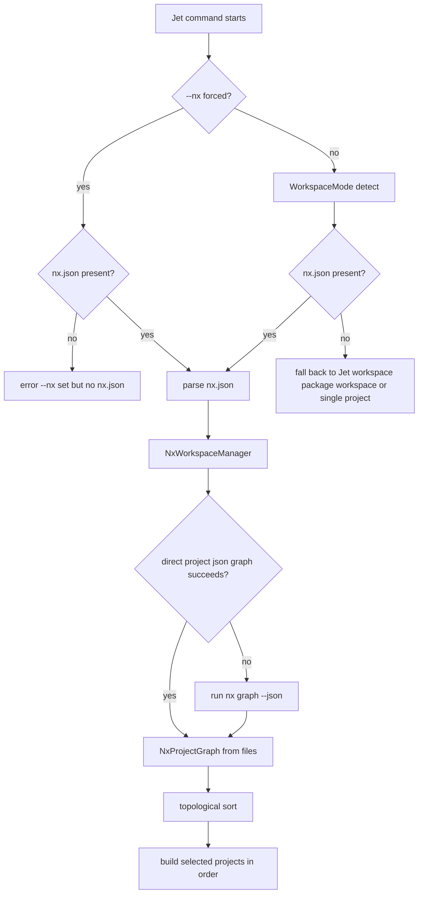
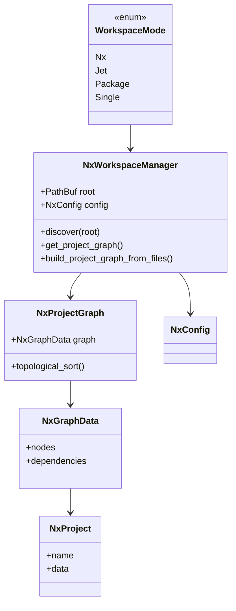
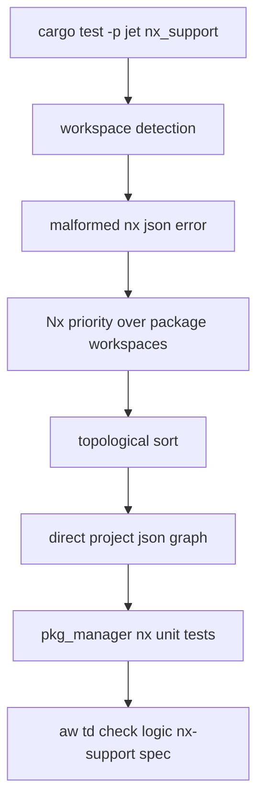

# Jet Nx Support

## Changes
<!-- type: changes lang: yaml -->

```yaml
changes:
  - path: ".aw/tech-design/projects/jet/logic/nx-support.md"
    action: modify
    section: doc
    impl_mode: hand-written
    description: |
      Legacy Jet TD content retained as notes during AW standardization.
      Rewrite this file into semantic TD sections before promoting source to CODEGEN.
```

## Legacy notes
<!-- type: doc lang: markdown -->

# Jet Nx Support

### Overview

This spec owns Jet's Nx monorepo integration. Jet detects an Nx workspace by
finding and parsing `nx.json`, builds or retrieves the Nx project graph, orders
projects topologically, and routes build/install flows through the Nx-aware
workspace mode when appropriate.

| Area | Source | Responsibility |
|------|--------|----------------|
| Nx graph model | `crates/jet/src/pkg_manager/nx.rs` | Parse Nx graph JSON and direct `project.json` files |
| Workspace detection | `crates/jet/src/pkg_manager/workspace.rs` | Prefer Nx over Jet workspace and package workspace modes |
| CLI flags | `crates/jet/src/cli.rs` | `--nx` force mode and Nx project build selection |
| Tests | `crates/jet/tests/nx_support.rs`, `crates/jet/src/pkg_manager/nx_test.rs` | Detection, parsing, topological sort, direct file graph |

### Requirements

```mermaid
---
id: jet-nx-support-requirements
entry: N1
---
requirementDiagram
    requirement N1 {
        id: N1
        text: Workspace detection returns Nx mode when nx json is present and valid
        risk: high
        verifymethod: test
    }
    requirement N2 {
        id: N2
        text: Malformed nx json produces a parse error instead of silently falling back
        risk: medium
        verifymethod: test
    }
    requirement N3 {
        id: N3
        text: Nx takes priority over package json workspaces and Jet workspace mode
        risk: high
        verifymethod: test
    }
    requirement N4 {
        id: N4
        text: Nx project graph supports deterministic topological build ordering
        risk: high
        verifymethod: test
    }
    requirement N5 {
        id: N5
        text: Direct project json scanning can build a project graph without invoking Nx CLI
        risk: high
        verifymethod: test
    }
    requirement N6 {
        id: N6
        text: CLI build uses Nx graph when Nx mode is detected or forced
        risk: high
        verifymethod: test
    }
    requirement N7 {
        id: N7
        text: Forced Nx mode errors clearly when nx json is absent
        risk: medium
        verifymethod: test
    }
```



### Scenarios

```yaml
scenarios:
  - id: S1
    requirement: N1
    title: Repository with nx.json is detected as an Nx workspace
  - id: S2
    requirement: N2
    title: Invalid nx.json fails detection with a parse error
  - id: S3
    requirement: N3
    title: Repository with both nx.json and package workspaces chooses Nx
  - id: S4
    requirement: N4
    title: Graph dependencies produce dependency-first topological order
  - id: S5
    requirement: N5
    title: project.json files are scanned into graph nodes and dependency edges
  - id: S6
    requirement: N6
    title: jet build dispatches through Nx graph when in Nx workspace
  - id: S7
    requirement: N7
    title: jet build --nx outside Nx workspace exits with a clear error
```

### Logic



### Dependency Model



### Schema

```yaml
schemas:
  NxConfig:
    rust_type: NxConfig
    fields:
      affected:
        type: map
        value: serde_json::Value
      tasks_runner_options:
        type: map
        value: serde_json::Value
  NxProjectGraph:
    rust_type: NxProjectGraph
    fields:
      graph:
        type: NxGraphData
  NxGraphData:
    rust_type: NxGraphData
    fields:
      nodes:
        type: map
        value: NxProject
      dependencies:
        type: map
        value: array<NxDependency>
  NxProject:
    rust_type: NxProject
    fields:
      name:
        type: string
      data:
        type: Option<NxProjectData>
  NxDependency:
    rust_type: NxDependency
    fields:
      source:
        type: string
      target:
        type: string
      type:
        type: string
```

### Test Plan



### Changes

```yaml
changes:
  - path: .aw/tech-design/crates/jet/logic/nx-support.md
    action: create
    purpose: Re-home and normalize the Nx support TD.
    impl_mode: hand-written
  - path: .aw/tech-design/crates/jet/nx-support.md
    action: delete
    purpose: Remove duplicated loose root spec.
    impl_mode: hand-written
  - path: crates/jet/src/pkg_manager/nx.rs
    action: none
    purpose: Existing Nx graph and workspace manager implementation described by this spec.
    impl_mode: hand-written
  - path: crates/jet/src/pkg_manager/workspace.rs
    action: none
    purpose: Existing workspace detection priority described by this spec.
    impl_mode: hand-written
  - path: crates/jet/src/cli.rs
    action: none
    purpose: Existing Nx CLI dispatch described by this spec.
    impl_mode: hand-written
```
