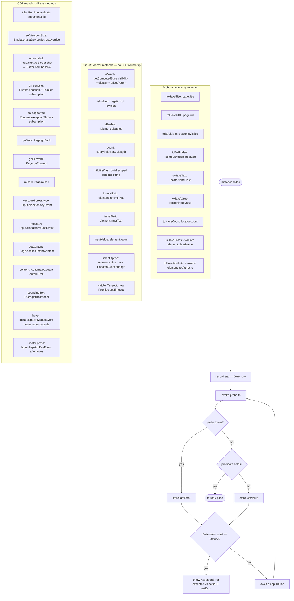

# Enhancement Page Api Parity With Playwright Fill Gaps In Runti Spec

## Changes
<!-- type: changes lang: yaml -->

```yaml
changes:
  - path: ".aw/tech-design/projects/jet/logic/page-api-parity.md"
    action: modify
    section: doc
    impl_mode: hand-written
    description: |
      Legacy Jet TD content retained as notes during AW standardization.
      Rewrite this file into semantic TD sections before promoting source to CODEGEN.
```

## Legacy notes
<!-- type: doc lang: markdown -->

# Enhancement Page Api Parity With Playwright Fill Gaps In Runti Spec

### Overview

`crates/jet/runtime/test/page.js` and `crates/jet/runtime/test/index.js` implement a Playwright-compatible test surface for the jet native test runner. The current Page proxy exposes only `goto`, `url`, `evaluate`, `click`, `fill`, `waitForSelector`, `waitForLoadState`, `locator`, `getByText`, `getByRole`, and `close`. The Locator class exposes only `click`, `fill`, `waitFor`, `textContent`, and `getAttribute`. The `expect()` matcher set covers `toHaveText`, `toBeVisible`, and `toMatchSnapshot`.

This change fills 27 gaps across three groups:

- **Page methods (R1–R10)**: `title`, `setViewportSize`, `waitForTimeout`, `screenshot`, `on` (console/pageerror events), `goBack`, `goForward`, `reload`, `keyboard.press`/`keyboard.type`, `mouse.click`/`mouse.move`/`mouse.down`/`mouse.up`, `setContent`, `content`.
- **Locator methods (R11–R19)**: `boundingBox`, `isVisible`, `isHidden`, `isEnabled`, `hover`, `press`, `selectOption`, `count`, `nth`/`first`/`last`, `innerHTML`, `innerText`, `inputValue`.
- **expect matchers (R20–R27)**: `toHaveTitle`, `toHaveURL`, `toBeVisible`, `toBeHidden`, `toHaveText` (locator-backed), `toHaveValue`, `toHaveCount`, `toHaveClass`, `toHaveAttribute`.

Methods requiring a CDP round-trip add new `PageRequest` variants handled by `crates/jet/src/cdp_driver/page_binding.rs`. Pure-JS methods (state queries, index helpers, controlled delay) are implemented entirely in `page.js` via `this._send` evaluate calls. Polling matchers live in a new `crates/jet/runtime/test/matchers.js` module imported by `index.js` to keep `index.js` under the 1000-line threshold.

**Out of scope**: network interception (`page.route`, request/response events), video recording, accessibility snapshots, multi-context management, file uploads, full mobile emulation profiles, session/cookie persistence, and service workers.
### Requirements


### Scenarios

```text
- id: S1
  given: page loaded with document.title = 'My App'
  when: page.title() called
  then: resolves to 'My App'
  req: R1

- id: S2
  given: page open
  when: page.setViewportSize({width:1280,height:720}) called
  then: CDP Emulation.setDeviceMetricsOverride sent; subsequent layout reflects new viewport
  req: R2

- id: S3
  given: test needing a controlled delay
  when: page.waitForTimeout(500) called
  then: resolves after ~500ms without issuing any CDP command
  req: R3

- id: S4
  given: page displaying content
  when: page.screenshot() called
  then: resolves to Buffer containing PNG bytes (non-empty)
  req: R4

- id: S5
  given: page.on('console', handler) registered before page.goto
  when: browser executes console.log('hello')
  then: handler called with message object containing text 'hello'
  req: R5

- id: S6
  given: page.on('pageerror', handler) registered
  when: browser throws uncaught Error('boom')
  then: handler called with Error whose message contains 'boom'
  req: R5

- id: S7
  given: page at URL A, then navigated to URL B
  when: page.goBack() called
  then: page URL returns to A
  req: R6

- id: S8
  given: page at URL A
  when: page.reload() called
  then: page reloads and URL remains A
  req: R6

- id: S9
  given: input element focused
  when: page.keyboard.press('Enter') called
  then: CDP Input.dispatchKeyEvent type=keyDown then keyUp sent for 'Enter'
  req: R7

- id: S10
  given: input element focused
  when: page.keyboard.type('hello') called
  then: CDP Input.dispatchKeyEvent sent for each character in sequence
  req: R7

- id: S11
  given: clickable element at (100, 200)
  when: page.mouse.click(100, 200) called
  then: CDP Input.dispatchMouseEvent mouseMoved then mousePressed then mouseReleased sent
  req: R8

- id: S12
  given: page open
  when: page.setContent('<h1>hello</h1>') called
  then: page DOM updated; page.content() returns HTML containing '<h1>hello</h1>'
  req: R9

- id: S13
  given: page with known HTML structure
  when: page.content() called
  then: resolves to string containing document.documentElement.outerHTML
  req: R10

- id: S14
  given: element with known position and size
  when: locator.boundingBox() called
  then: returns {x,y,width,height} matching DOM box model
  req: R11

- id: S15
  given: visible element
  when: locator.isVisible() called
  then: returns true
  req: R12

- id: S16
  given: element with display:none
  when: locator.isHidden() called
  then: returns true
  req: R12

- id: S17
  given: element without disabled attribute
  when: locator.isEnabled() called
  then: returns true
  req: R12

- id: S18
  given: element with hover-dependent tooltip
  when: locator.hover() called
  then: CDP mousemove sent to element center; tooltip becomes visible
  req: R13

- id: S19
  given: input element
  when: locator.press('Tab') called
  then: CDP Input.dispatchKeyEvent sent with key 'Tab'
  req: R14

- id: S20
  given: select element with options ['a','b','c']
  when: locator.selectOption('b') called
  then: element value is 'b' and change event dispatched
  req: R15

- id: S21
  given: page with three matching elements
  when: locator.count() called
  then: returns 3
  req: R16

- id: S22
  given: list of three items
  when: locator.nth(1) called then textContent read
  then: returns text of second item
  req: R17

- id: S23
  given: element with inner HTML '<span>hi</span>'
  when: locator.innerHTML() called
  then: returns '<span>hi</span>'
  req: R18

- id: S24
  given: element with visible text 'hello world'
  when: locator.innerText() called
  then: returns 'hello world'
  req: R18

- id: S25
  given: input element with value 'foo'
  when: locator.inputValue() called
  then: returns 'foo'
  req: R19

- id: S26
  given: page title changes asynchronously after navigation
  when: expect(page).toHaveTitle('Dashboard') called with default 5s timeout
  then: matcher polls every 100ms until title matches, then passes
  req: R20

- id: S27
  given: page URL changes after SPA routing
  when: expect(page).toHaveURL(/\/home/) called
  then: matcher polls every 100ms until URL matches regex, then passes
  req: R21

- id: S28
  given: element initially hidden, becomes visible within 2s
  when: expect(locator).toBeVisible() called with default 5s timeout
  then: matcher passes when isVisible() returns true
  req: R22

- id: S29
  given: element text set asynchronously
  when: expect(locator).toHaveText('Done') called
  then: matcher polls innerText() until equal to 'Done'
  req: R23

- id: S30
  given: input value set by user interaction
  when: expect(locator).toHaveValue('admin@example.com') called
  then: matcher polls inputValue() until equal
  req: R24

- id: S31
  given: list rendered after data fetch
  when: expect(locator).toHaveCount(5) called
  then: matcher polls count() until equals 5
  req: R25

- id: S32
  given: element acquires class 'active' after click
  when: expect(locator).toHaveClass('active') called
  then: matcher polls className until it contains 'active'
  req: R26

- id: S33
  given: element with data-testid set asynchronously
  when: expect(locator).toHaveAttribute('data-testid', 'submit-btn') called
  then: matcher polls getAttribute until value matches
  req: R27

- id: S34
  given: any polling matcher, condition never met
  when: timeout (default 5s) elapses
  then: AssertionError thrown with message describing expected vs actual value
  req: [R20, R21, R22, R23, R24, R25, R26, R27]
```
### Logic


### Test Plan

```mermaid
---
id: test-plan
---
requirementDiagram

requirement R1 {
  id: R1
  text: "page.title()"
  risk: low
  verifymethod: test
}
requirement R2 {
  id: R2
  text: "page.setViewportSize()"
  risk: low
  verifymethod: test
}
requirement R3 {
  id: R3
  text: "page.waitForTimeout()"
  risk: low
  verifymethod: test
}
requirement R4 {
  id: R4
  text: "page.screenshot()"
  risk: medium
  verifymethod: test
}
requirement R5 {
  id: R5
  text: "page.on(console/pageerror)"
  risk: medium
  verifymethod: test
}
requirement R6 {
  id: R6
  text: "page.goBack/goForward/reload"
  risk: low
  verifymethod: test
}
requirement R7 {
  id: R7
  text: "page.keyboard.press/type"
  risk: medium
  verifymethod: test
}
requirement R8 {
  id: R8
  text: "page.mouse.*"
  risk: medium
  verifymethod: test
}
requirement R9 {
  id: R9
  text: "page.setContent()"
  risk: low
  verifymethod: test
}
requirement R10 {
  id: R10
  text: "page.content()"
  risk: low
  verifymethod: test
}
requirement R11 {
  id: R11
  text: "locator.boundingBox()"
  risk: medium
  verifymethod: test
}
requirement R12 {
  id: R12
  text: "locator.isVisible/isHidden/isEnabled"
  risk: low
  verifymethod: test
}
requirement R13 {
  id: R13
  text: "locator.hover()"
  risk: low
  verifymethod: test
}
requirement R14 {
  id: R14
  text: "locator.press()"
  risk: low
  verifymethod: test
}
requirement R15 {
  id: R15
  text: "locator.selectOption()"
  risk: low
  verifymethod: test
}
requirement R16 {
  id: R16
  text: "locator.count()"
  risk: low
  verifymethod: test
}
requirement R17 {
  id: R17
  text: "locator.nth/first/last"
  risk: low
  verifymethod: test
}
requirement R18 {
  id: R18
  text: "locator.innerHTML/innerText"
  risk: low
  verifymethod: test
}
requirement R19 {
  id: R19
  text: "locator.inputValue()"
  risk: low
  verifymethod: test
}
requirement R20 {
  id: R20
  text: "toHaveTitle matcher"
  risk: low
  verifymethod: test
}
requirement R21 {
  id: R21
  text: "toHaveURL matcher"
  risk: low
  verifymethod: test
}
requirement R22 {
  id: R22
  text: "toBeVisible/toBeHidden matchers"
  risk: low
  verifymethod: test
}
requirement R23 {
  id: R23
  text: "toHaveText matcher (locator)"
  risk: low
  verifymethod: test
}
requirement R24 {
  id: R24
  text: "toHaveValue matcher"
  risk: low
  verifymethod: test
}
requirement R25 {
  id: R25
  text: "toHaveCount matcher"
  risk: low
  verifymethod: test
}
requirement R26 {
  id: R26
  text: "toHaveClass matcher"
  risk: low
  verifymethod: test
}
requirement R27 {
  id: R27
  text: "toHaveAttribute matcher"
  risk: low
  verifymethod: test
}

element T1 {
  type: "test"
  docref: "Given data: page with title set; When page.title() called; Then returns document.title string"
}
element T2 {
  type: "test"
  docref: "Given open page; When setViewportSize({width:800,height:600}); Then Emulation.setDeviceMetricsOverride sent with correct params"
}
element T3 {
  type: "test"
  docref: "Given running test; When waitForTimeout(200) awaited; Then resolves after >=200ms, no CDP traffic emitted"
}
element T4 {
  type: "test"
  docref: "Given page with visible content; When screenshot() called; Then returns non-empty Buffer with PNG magic bytes"
}
element T5 {
  type: "test"
  docref: "Given page.on('console', h) registered; When page executes console.log('ping'); Then h called with message text 'ping'"
}
element T6 {
  type: "test"
  docref: "Given page.on('pageerror', h) registered; When page throws uncaught Error; Then h called with Error containing thrown message"
}
element T7 {
  type: "test"
  docref: "Given page navigated A then B; When goBack(); Then URL returns to A"
}
element T8 {
  type: "test"
  docref: "Given page at URL; When reload(); Then page reloads and URL unchanged"
}
element T9 {
  type: "test"
  docref: "Given focused input; When keyboard.press('Enter'); Then Input.dispatchKeyEvent sent for Enter keyDown+keyUp"
}
element T10 {
  type: "test"
  docref: "Given focused input; When keyboard.type('abc'); Then three keyDown+keyUp CDP events sent in order"
}
element T11 {
  type: "test"
  docref: "Given clickable element at coords; When mouse.click(x,y); Then mouseMoved+mousePressed+mouseReleased CDP events sent"
}
element T12 {
  type: "test"
  docref: "Given open page; When setContent('<p>hi</p>'); Then content() returns HTML containing <p>hi</p>"
}
element T13 {
  type: "test"
  docref: "Given page with known HTML; When content() called; Then returns outerHTML string containing doctype and body"
}
element T14 {
  type: "test"
  docref: "Given positioned element; When boundingBox() called; Then returns {x,y,width,height} all numbers, matches DOM rect"
}
element T15 {
  type: "test"
  docref: "Given visible element; When isVisible(); Then true. Given display:none; When isHidden(); Then true"
}
element T16 {
  type: "test"
  docref: "Given enabled input; When isEnabled(); Then true. Given disabled attr; Then false"
}
element T17 {
  type: "test"
  docref: "Given hoverable element; When hover(); Then mousemove CDP event dispatched to element center coords"
}
element T18 {
  type: "test"
  docref: "Given input; When locator.press('Tab'); Then Input.dispatchKeyEvent with key='Tab' sent"
}
element T19 {
  type: "test"
  docref: "Given select with options; When selectOption('b'); Then element.value=='b' and change event fired"
}
element T20 {
  type: "test"
  docref: "Given 3 matching elements; When count(); Then returns 3"
}
element T21 {
  type: "test"
  docref: "Given list of items; When nth(1).innerText(); Then returns text of second item"
}
element T22 {
  type: "test"
  docref: "Given locator.first()/last(); Then each returns innerText of first/last matched element"
}
element T23 {
  type: "test"
  docref: "Given element with inner HTML; When innerHTML(); Then returns raw HTML string"
}
element T24 {
  type: "test"
  docref: "Given element with text; When innerText(); Then returns visible text"
}
element T25 {
  type: "test"
  docref: "Given input with value; When inputValue(); Then returns current value string"
}
element T26 {
  type: "test"
  docref: "Given page title set to 'App'; When expect(page).toHaveTitle('App'); Then passes immediately. Timeout path: title never set — AssertionError after 5s"
}
element T27 {
  type: "test"
  docref: "Given SPA routing to /home; When expect(page).toHaveURL(/\/home/); Then passes when URL matches regex"
}
element T28 {
  type: "test"
  docref: "Given element becomes visible after 200ms; When expect(locator).toBeVisible(); Then passes within 5s"
}
element T29 {
  type: "test"
  docref: "Given element hidden; When expect(locator).toBeHidden(); Then passes immediately"
}
element T30 {
  type: "test"
  docref: "Given element text set async; When expect(locator).toHaveText('Done'); Then passes when innerText matches"
}
element T31 {
  type: "test"
  docref: "Given input value set async; When expect(locator).toHaveValue('x'); Then passes when inputValue equals 'x'"
}
element T32 {
  type: "test"
  docref: "Given list renders 5 items async; When expect(locator).toHaveCount(5); Then passes when count==5"
}
element T33 {
  type: "test"
  docref: "Given element acquires class 'active'; When expect(locator).toHaveClass('active'); Then passes when className contains 'active'"
}
element T34 {
  type: "test"
  docref: "Given attribute set async; When expect(locator).toHaveAttribute('data-id','42'); Then passes when getAttribute matches"
}

T1 - verifies -> R1
T2 - verifies -> R2
T3 - verifies -> R3
T4 - verifies -> R4
T5 - verifies -> R5
T6 - verifies -> R5
T7 - verifies -> R6
T8 - verifies -> R6
T9 - verifies -> R7
T10 - verifies -> R7
T11 - verifies -> R8
T12 - verifies -> R9
T13 - verifies -> R10
T14 - verifies -> R11
T15 - verifies -> R12
T16 - verifies -> R12
T17 - verifies -> R13
T18 - verifies -> R14
T19 - verifies -> R15
T20 - verifies -> R16
T21 - verifies -> R17
T22 - verifies -> R17
T23 - verifies -> R18
T24 - verifies -> R18
T25 - verifies -> R19
T26 - verifies -> R20
T27 - verifies -> R21
T28 - verifies -> R22
T29 - verifies -> R22
T30 - verifies -> R23
T31 - verifies -> R24
T32 - verifies -> R25
T33 - verifies -> R26
T34 - verifies -> R27
```


### Changes

```yaml
- file: crates/jet/runtime/test/page.js
  action: modify
  section: logic
  impl_mode: hand-written
  description: |
    Add Page methods: title (R1), setViewportSize (R2), waitForTimeout (R3),
    screenshot (R4), on/console/pageerror (R5), goBack/goForward/reload (R6),
    keyboard.press/type (R7), mouse.click/move/down/up (R8), setContent (R9),
    content (R10).
    Add Locator methods: boundingBox (R11), isVisible/isHidden/isEnabled (R12),
    hover (R13), press (R14), selectOption (R15), count (R16),
    nth/first/last (R17), innerHTML/innerText (R18), inputValue (R19).
    Each CDP-backed method sends a PageRequest kind string over _send.
    Each pure-JS method calls this._send with kind: 'evaluate' and an inline expression.
    keyboard and mouse are lazy-initialized accessor objects on the Page instance.
    _eventListeners map keyed by event name ('console','pageerror') holds arrays;
    page.close() drains them and sends kind: 'remove_event_listener' to Rust.
    Annotation comments: // @spec <spec_path>#R<N> on each new method.
  spec_annotations:
    - "// @spec .aw/changes/enhancement-page-api-parity-with-playwright-fill-gaps-in-runti/specs/enhancement-page-api-parity-with-playwright-fill-gaps-in-runti-spec.md#R1"
    - "// @spec ...#R2 through #R19 (one per method)"
  estimated_loc: 400

- file: crates/jet/src/cdp_driver/page_binding.rs
  action: modify
  section: logic
  impl_mode: hand-written
  description: |
    Add PageRequest enum variants for each CDP round-trip method:
      Title, SetViewportSize, Screenshot, On (event subscribe), GoBack, GoForward,
      Reload, KeyboardPress, KeyboardType, MouseEvent, SetContent, Content,
      BoundingBox, Hover, LocatorPress, RemoveEventListener.
    Add corresponding handlers in dispatch_page_request that map each variant
    to the appropriate CDP domain command.
    Pure-JS methods (waitForTimeout, isVisible/Hidden/Enabled, selectOption,
    count, nth/first/last, innerHTML, innerText, inputValue) do NOT require new
    wire variants — they execute via the existing Evaluate variant.
    Event subscription variants (On-console, On-pageerror) register callbacks on
    the per-page CdpClient event loop that forward CDP Runtime.consoleAPICalled /
    Runtime.exceptionThrown events to JS via a PageResponse::Event message.
  estimated_loc: 600

- file: crates/jet/runtime/test/matchers.js
  action: create
  section: logic
  impl_mode: hand-written
  description: |
    New module containing all polling expect matchers: toHaveTitle (R20),
    toHaveURL (R21), toBeVisible/toBeHidden (R22), toHaveText (R23),
    toHaveValue (R24), toHaveCount (R25), toHaveClass (R26),
    toHaveAttribute (R27).
    Each matcher exported as an async function accepting (actual, expected, opts)
    where opts.timeout defaults to 5000ms, polling cadence is 100ms.
    Shared helper: async function pollUntil(probe, predicate, timeout, buildError)
    encapsulates the polling loop shown in the logic flowchart.
    Imported by index.js and attached to the expect() return object.
  estimated_loc: 200

- file: crates/jet/runtime/test/index.js
  action: modify
  section: logic
  impl_mode: hand-written
  description: |
    Import matchers from ./matchers.js.
    Attach new matchers to the expect() return object: toHaveTitle, toHaveURL,
    toBeVisible, toBeHidden, toHaveText (locator-backed), toHaveValue,
    toHaveCount, toHaveClass, toHaveAttribute.
    Existing toHaveText (page selector-based), toBeVisible (old form), and
    toMatchSnapshot remain unchanged.
    Matcher dispatch: if actual has __jet_page_id, route to page matchers
    (toHaveTitle, toHaveURL); if actual is a Locator instance, route to
    locator matchers.
  estimated_loc: 50

- file: crates/jet/tests/page_api_parity.rs
  action: create
  section: unit-test
  impl_mode: hand-written
  description: |
    Integration tests T1-T34 covering every requirement.
    Tests run spec strings through test_runner::run against data: URLs or
    fixture HTML files under crates/jet/tests/fixtures/.
    Tests requiring Chromium skip gracefully via chromium_available() guard
    (same pattern as page_fixture_auto_inject.rs).
    Each test annotated with REQ comment referencing the requirement it verifies.
  estimated_loc: 300
```
