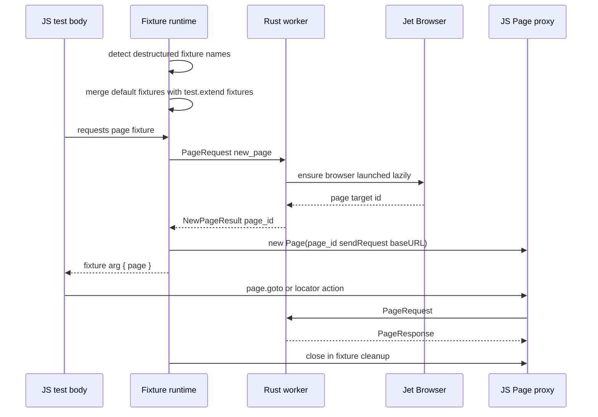
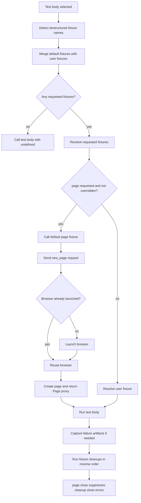
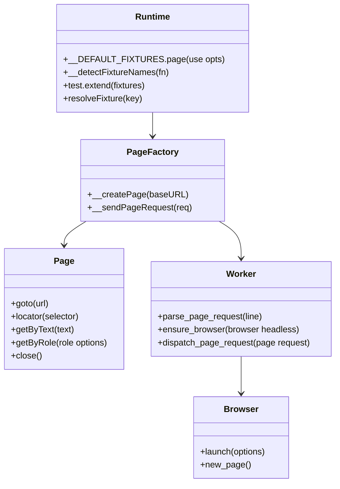

# Jet Page Fixture Auto Injection

## Changes
<!-- type: changes lang: yaml -->

```yaml
changes:
  - path: ".aw/tech-design/projects/jet/logic/page-fixture-auto-inject.md"
    action: modify
    section: doc
    impl_mode: hand-written
    description: |
      Legacy Jet TD content retained as notes during AW standardization.
      Rewrite this file into semantic TD sections before promoting source to CODEGEN.
```

## Legacy notes
<!-- type: doc lang: markdown -->

# Jet Page Fixture Auto Injection

### Overview

This spec owns Jet's Playwright-compatible default `page` fixture. The
embedded `@jet/test` runtime pre-registers `page` as a built-in fixture, detects
whether a test body destructures that fixture, creates a CDP-backed `Page` only
when needed, closes the page during fixture cleanup, and lets user
`test.extend({ page })` fixtures override the default. The Rust worker lazily
launches Chromium on the first `new_page` page request and reuses that browser
for subsequent page requests in the same worker.

### Owned Surface

| Area | Source | Responsibility |
|------|--------|----------------|
| Default fixture registry | `crates/jet/runtime/test/index.js` | Built-in `page` fixture and cleanup behavior |
| Fixture detection | `crates/jet/runtime/test/index.js` | Detect destructured fixture names from test body source |
| Fixture resolution | `crates/jet/runtime/test/index.js` | Merge defaults with `test.extend`, resolve dependencies, run cleanups |
| Page proxy | `crates/jet/runtime/test/page.js` | CDP-backed `Page` wrapper with base URL resolution |
| Worker page requests | `crates/jet/src/test_runner/worker.rs` | Handle `new_page`, lazy browser launch, active page map, browser errors |
| Integration tests | `crates/jet/tests/page_fixture_auto_inject.rs` | End-to-end coverage for injection, cleanup, base URL, override, and errors |

### Requirements

```mermaid
---
id: jet-page-fixture-auto-inject-requirements
entry: R1
---
requirementDiagram
    requirement R1 {
        id: R1
        text: page is injected into tests that destructure page without requiring test extend
        risk: high
        verifymethod: test
    }
    requirement R2 {
        id: R2
        text: injected page is backed by Jet CDP requests and not Playwright package APIs
        risk: high
        verifymethod: test
    }
    requirement R3 {
        id: R3
        text: relative page goto values resolve against baseURL when configured
        risk: medium
        verifymethod: test
    }
    requirement R4 {
        id: R4
        text: each resolved page fixture closes in cleanup even after test failure
        risk: high
        verifymethod: test
    }
    requirement R5 {
        id: R5
        text: worker lazily launches one browser for first page request and reuses it for worker lifetime
        risk: medium
        verifymethod: test
    }
    requirement R6 {
        id: R6
        text: Page exposes the currently implemented navigation locator action and read surface
        risk: medium
        verifymethod: test
    }
    requirement R7 {
        id: R7
        text: user supplied page fixture overrides the default for extended test objects
        risk: medium
        verifymethod: test
    }
    requirement R8 {
        id: R8
        text: user fixtures can resolve alongside the default page machinery without breaking CDP setup
        risk: medium
        verifymethod: test
    }
    requirement R9 {
        id: R9
        text: tests that do not destructure page do not create the page fixture
        risk: medium
        verifymethod: test
    }
    requirement R10 {
        id: R10
        text: browser launch and page creation failures surface clear browser messages
        risk: high
        verifymethod: test
    }
```



### Scenarios

```yaml
scenarios:
  - id: S1
    requirement: R1
    title: Test destructures page and receives a Page proxy without test.extend
  - id: S2
    requirement: R4
    title: Sequential tests get distinct pages and cleanup runs between tests
  - id: S3
    requirement: R4
    title: Failing test still closes the created page in fixture cleanup
  - id: S4
    requirement: R5
    title: Multiple tests in one worker reuse one lazily launched browser
  - id: S5
    requirement: R3
    title: Page goto resolves relative paths against baseURL
  - id: S6
    requirement: R7
    title: Extended test object uses user supplied page fixture instead of default page
  - id: S7
    requirement: R8
    title: User fixture runs while default page machinery is active
  - id: S8
    requirement: R9
    title: Test without destructured page argument runs without creating a page
  - id: S9
    requirement: R10
    title: Missing browser reports a browser launch failure message
```

### Interaction



### Logic



### Dependency Model



### Data Schema

```yaml
fixture_registry:
  defaults:
    page:
      shape: flat_fixture
      resolves_when: test body destructures page
      cleanup: page.close in finally
  merge_order:
    - default fixtures
    - user test.extend fixtures override defaults
page_request:
  new_page:
    request: { kind: new_page, req_id: number }
    success: { kind: new_page_result, req_id: number, page_id: string }
    error: { kind: error, req_id: number, message: string }
page_proxy:
  fields:
    page_id: string
    send_request: function
    base_url: string
browser_lifecycle:
  launch_policy: lazy on first new_page request
  reuse_scope: one worker
```

### Test Plan

```mermaid
---
id: jet-page-fixture-auto-inject-test-plan
entry: T1
---
requirementDiagram
    requirement R1 {
        id: R1
        text: default injection
        risk: high
        verifymethod: test
    }
    requirement R3 {
        id: R3
        text: base URL resolution
        risk: medium
        verifymethod: test
    }
    requirement R4 {
        id: R4
        text: cleanup
        risk: high
        verifymethod: test
    }
    requirement R7 {
        id: R7
        text: user override
        risk: medium
        verifymethod: test
    }
    requirement R10 {
        id: R10
        text: browser error
        risk: high
        verifymethod: test
    }
    element T1 {
        type: test
        docref: cargo test -p jet --test page_fixture_auto_inject
    }
```

### Execution

```bash
cargo test -p jet --test page_fixture_auto_inject
```

### Coverage Matrix

| Requirement | Test functions |
|-------------|----------------|
| R1 | `test_page_fixture_auto_injected_into_test_body` |
| R2 | `test_page_fixture_auto_injected_into_test_body` |
| R3 | `test_base_url_resolution_for_relative_path` |
| R4 | cleanup assertions in `page_fixture_auto_inject.rs` |
| R5 | `test_browser_shared_across_tests_in_worker` |
| R6 | page surface exercised by `page_fixture_auto_inject.rs` plus `page_api_parity.rs` |
| R7 | `test_user_supplied_page_fixture_overrides_default` |
| R8 | `test_user_fixture_receives_cdp_page_as_dependency` |
| R9 | no-fixture argument tests in `page_fixture_auto_inject.rs` |
| R10 | browser launch failure tests in `page_fixture_auto_inject.rs` |

### Changes

```yaml
files:
  - path: .aw/tech-design/crates/jet/logic/page-fixture-auto-inject.md
    action: ADD
    section: doc
    impl_mode: hand-written
    desc: Re-home the page fixture TD as a checker-compliant current-state contract.

  - path: .aw/tech-design/crates/jet/testing/page-fixture-auto-inject.md
    action: DELETE
    section: doc
    impl_mode: hand-written
    desc: Remove the unexpected top-level testing directory copy of this TD.

  - path: crates/jet/runtime/test/index.js
    action: NONE
    section: doc
    impl_mode: hand-written
    desc: Existing default fixture registry, fixture detection, fixture resolution, and cleanup flow.

  - path: crates/jet/runtime/test/page.js
    action: NONE
    section: doc
    impl_mode: hand-written
    desc: Existing CDP-backed Page proxy and baseURL resolution.

  - path: crates/jet/src/test_runner/worker.rs
    action: NONE
    section: doc
    impl_mode: hand-written
    desc: Existing lazy browser launch and new_page request handling.

  - path: crates/jet/tests/page_fixture_auto_inject.rs
    action: NONE
    section: doc
    impl_mode: hand-written
    desc: Existing integration tests for injection, cleanup, baseURL, override, and browser errors.
```
