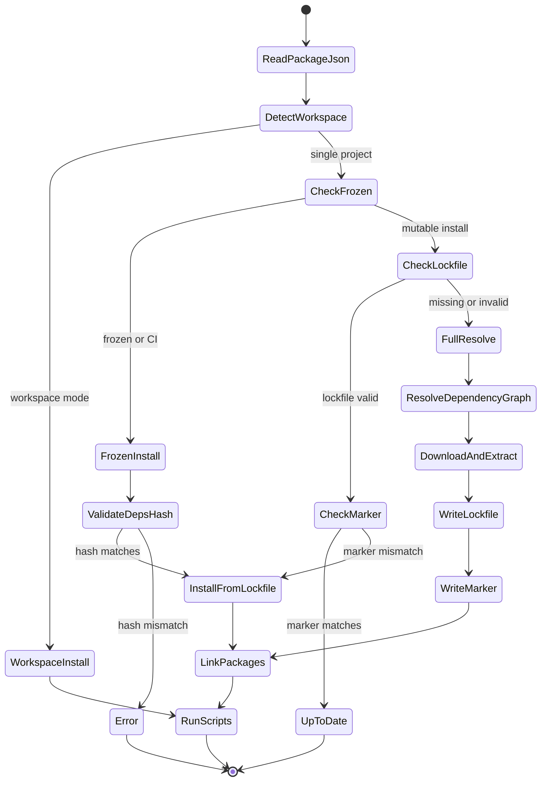
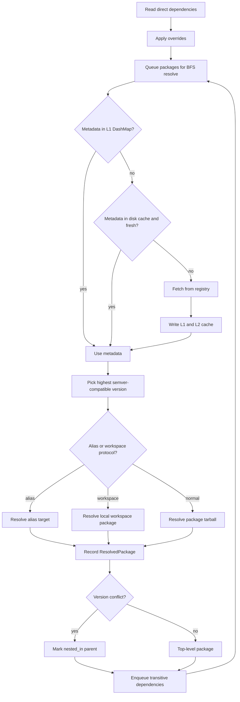
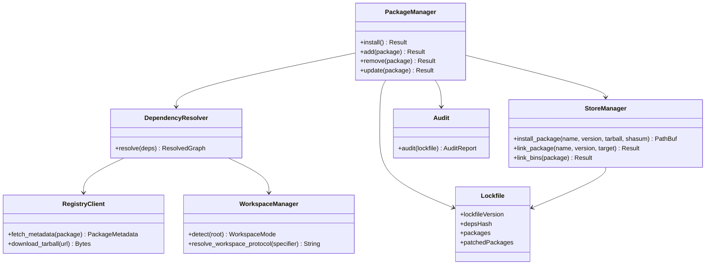

# Jet Package Manager

## Changes
<!-- type: changes lang: yaml -->

```yaml
changes:
  - path: ".aw/tech-design/projects/jet/logic/pkg-manager.md"
    action: modify
    section: doc
    impl_mode: hand-written
    description: |
      Legacy Jet TD content retained as notes during AW standardization.
      Rewrite this file into semantic TD sections before promoting source to CODEGEN.
```

## Legacy notes
<!-- type: doc lang: markdown -->

# Jet Package Manager

### Overview

Jet package manager is an npm-compatible installer with pnpm-style content
addressing. It resolves package metadata, writes `jet-lock.yaml`, downloads and
extracts tarballs into a global store, symlinks packages into `node_modules`,
supports workspaces, applies platform filters, exposes audit/patch/publish
commands, and prunes unused store entries.

### Source Map

| Concern | Source |
|---------|--------|
| Install orchestration | `crates/jet/src/pkg_manager/mod.rs` |
| Dependency resolution | `crates/jet/src/pkg_manager/resolver.rs` |
| Registry metadata and tarballs | `crates/jet/src/pkg_manager/registry.rs` |
| Lockfile model | `crates/jet/src/pkg_manager/lockfile.rs` |
| Global store and symlinks | `crates/jet/src/pkg_manager/store.rs` |
| Workspace detection | `crates/jet/src/pkg_manager/workspace.rs`, `nx.rs` |
| Platform filters | `crates/jet/src/pkg_manager/platform.rs` |
| Audit | `crates/jet/src/pkg_manager/audit.rs` |
| Store garbage collection | `crates/jet/src/pkg_manager/gc.rs` |
| Patch workflow | `crates/jet/src/pkg_manager/patch.rs` |
| Publishing | `crates/jet/src/pkg_manager/publish.rs` |

### Requirements

```mermaid
---
id: jet-pkg-manager-requirements
entry: R1
---
requirementDiagram
    requirement R1 {
        id: R1
        text: Install must reuse valid lockfile and marker state when possible
        risk: high
        verifymethod: test
    }
    requirement R2 {
        id: R2
        text: Resolver must fetch metadata through L1 and L2 cache before registry HTTP
        risk: high
        verifymethod: test
    }
    requirement R3 {
        id: R3
        text: Store must verify tarball shasum and link packages into node_modules
        risk: high
        verifymethod: test
    }
    requirement R4 {
        id: R4
        text: Lockfile must persist resolved package graph and dependency hash
        risk: high
        verifymethod: test
    }
    requirement R5 {
        id: R5
        text: Workspace detection must prefer Nx then Jet then package workspaces then pnpm
        risk: medium
        verifymethod: test
    }
    requirement R6 {
        id: R6
        text: Platform filters must skip incompatible optional dependencies
        risk: medium
        verifymethod: test
    }
    requirement R7 {
        id: R7
        text: Audit patch publish and store prune commands operate on package metadata and lockfile state
        risk: medium
        verifymethod: test
    }
```



### Scenarios

```yaml
scenarios:
  - id: S1
    requirement: R1
    title: Frozen install rejects dependency hash drift
  - id: S2
    requirement: R2
    title: Resolver uses cached metadata before registry fetch
  - id: S3
    requirement: R3
    title: Verified store package links into node_modules
  - id: S4
    requirement: R4
    title: Full resolve writes jet-lock.yaml with packages map
  - id: S5
    requirement: R5
    title: Workspace protocol resolves to local package version
  - id: S6
    requirement: R6
    title: Optional dependency with mismatched os is skipped
  - id: S7
    requirement: R7
    title: Store prune removes unreferenced global store entries
```

### Install State Machine



### Resolution Logic



### Dependency Model



### Schema

```yaml
PackageMetadata:
  source: crates/jet/src/pkg_manager/registry.rs
  fields:
    name: string
    dist_tags: "HashMap<String, String>"
    versions: "HashMap<String, VersionMetadata>"
VersionMetadata:
  fields:
    version: string
    dist:
      tarball: string
      shasum: string
      integrity: optional string
    dependencies: "HashMap<String, String>"
    peerDependencies: "HashMap<String, String>"
    optionalDependencies: "HashMap<String, String>"
Lockfile:
  source: crates/jet/src/pkg_manager/lockfile.rs
  persisted_as: jet-lock.yaml
  fields:
    lockfileVersion: "2.0"
    depsHash: string
    overrides: "HashMap<String, String>"
    patchedPackages: "HashMap<String, String>"
    packages: "HashMap<String, LockPackage>"
LockPackage:
  fields:
    version: string
    resolution:
      tarball: string
      shasum: string
      integrity: optional string
    workspace: boolean
    localPath: optional string
    dependencies: "HashMap<String, String>"
    peerDependencies: "HashMap<String, String>"
    bin: "HashMap<String, String>"
    nestedIn: optional string
AuditReport:
  source: crates/jet/src/pkg_manager/audit.rs
  fields:
    vulnerabilities: array
    summary:
      critical: integer
      high: integer
      moderate: integer
      low: integer
      total: integer
```

### Test Plan

```mermaid
---
id: jet-pkg-manager-test-plan
entry: T1
---
requirementDiagram
    requirement R2 {
        id: R2
        text: resolver cache and metadata
        risk: high
        verifymethod: test
    }
    requirement R4 {
        id: R4
        text: lockfile persistence
        risk: high
        verifymethod: test
    }
    requirement R5 {
        id: R5
        text: workspace detection
        risk: medium
        verifymethod: test
    }
    requirement R6 {
        id: R6
        text: platform filtering
        risk: medium
        verifymethod: test
    }
    element T1 {
        type: test
        docref: cargo test -p jet pkg_manager::
    }
    element T2 {
        type: test
        docref: cargo test -p jet pkg_manager::nx_test
    }
```

### Execution

```bash
cargo test -p jet pkg_manager::
cargo test -p jet pkg_manager::nx_test
```

### Changes

```yaml
files:
  - path: .aw/tech-design/crates/jet/logic/pkg-manager.md
    action: MODIFY
    section: doc
    impl_mode: hand-written
    desc: Replace legacy package-manager architecture prose with a checker-compliant current-state contract.

  - path: crates/jet/src/pkg_manager/mod.rs
    action: NONE
    section: doc
    impl_mode: hand-written
    desc: Existing implementation owns install orchestration and command surface.

  - path: crates/jet/src/pkg_manager/resolver.rs
    action: NONE
    section: doc
    impl_mode: hand-written
    desc: Existing implementation owns dependency resolution, metadata cache, aliases, and conflicts.

  - path: crates/jet/src/pkg_manager/store.rs
    action: NONE
    section: doc
    impl_mode: hand-written
    desc: Existing implementation owns global store extraction, verification, symlinks, and bins.

  - path: crates/jet/src/pkg_manager/workspace.rs
    action: NONE
    section: doc
    impl_mode: hand-written
    desc: Existing implementation owns Jet and pnpm workspace detection and local dependency links.
```
