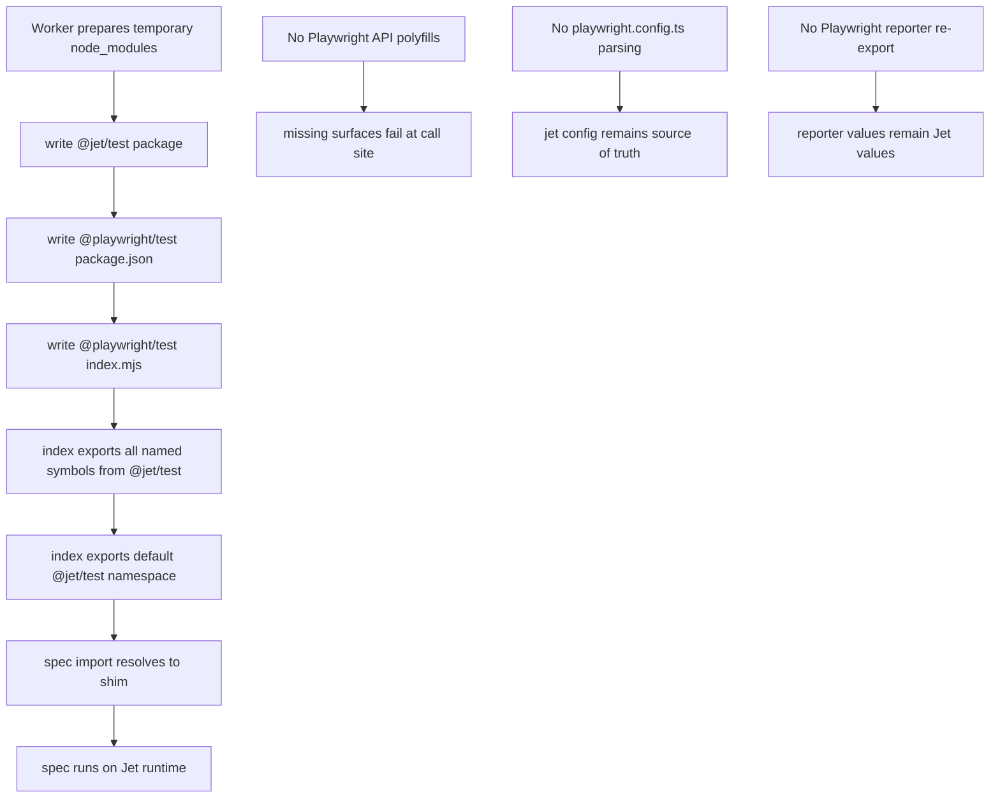
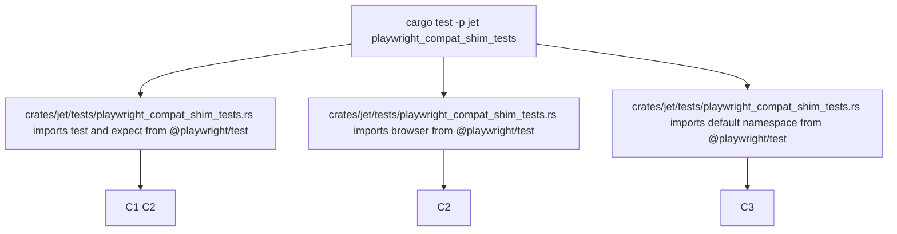

# jet `@playwright/test` compat shim — namespace re-export (P4.5)

## Changes
<!-- type: changes lang: yaml -->

```yaml
changes:
  - path: ".aw/tech-design/projects/jet/logic/playwright-compat-shim-reexport.md"
    action: modify
    section: doc
    impl_mode: hand-written
    description: |
      Legacy Jet TD content retained as notes during AW standardization.
      Rewrite this file into semantic TD sections before promoting source to CODEGEN.
```

## Legacy notes
<!-- type: doc lang: markdown -->

# jet `@playwright/test` compat shim — namespace re-export (P4.5)

### Overview

Phase 7 P4.5. Lets existing specs keep `import { test, expect } from
"@playwright/test"` and run on the jet runtime unchanged. The worker
writes a second shim package next to `@jet/test` that re-exports every
symbol:

```
node_modules/
  @jet/test/index.mjs          # full runtime
  @playwright/test/
    package.json               # {"name":"@playwright/test","type":"module","main":"./index.mjs"}
    index.mjs                  # export * from "@jet/test";
                               # import * as __jet from "@jet/test";
                               # export default __jet;
```

Distinct from the earlier `playwright-compat-shim.md` spec which
describes the `--playwright` escape-hatch subprocess (`npx playwright
test` delegate). This shim is runtime-compat — tests stay on the jet
engine, only their import lines resolve to the shim.

### Design Contract

```mermaid
---
id: jet-playwright-compat-shim-reexport-requirements
entry: C1
---
requirementDiagram
    requirement C1 {
        id: C1
        text: Specs importing test and expect from @playwright/test resolve against the shim and run through __jetRun
        risk: high
        verifymethod: test
    }
    requirement C2 {
        id: C2
        text: Runtime symbols are reachable through named imports from @playwright/test
        risk: high
        verifymethod: test
    }
    requirement C3 {
        id: C3
        text: Default import from @playwright/test yields the @jet/test namespace object
        risk: medium
        verifymethod: test
    }
    requirement C4 {
        id: C4
        text: Worker recreates the shim in its temporary node_modules tree for each run
        risk: medium
        verifymethod: review
    }
```

### Non-Goals



### Test Plan



### Changes

```yaml
_sdd:
  id: playwright-compat-shim-reexport-changes
  refs:
    - $ref: "test-runner"
changes:
  - path: crates/jet/src/test_runner/worker.rs
    action: modify
    section: doc
    impl_mode: hand-written
    purpose: |
      After writing `node_modules/@jet/test/`, also write
      `node_modules/@playwright/test/` with a minimal package.json +
      index.mjs that `export *` + `export default` from @jet/test.
  - path: crates/jet/tests/playwright_compat_shim_tests.rs
    action: create
    section: doc
    impl_mode: hand-written
    purpose: "Integration coverage PC1..PC3."
  - path: .aw/tech-design/crates/jet/logic/playwright-compat-shim-reexport.md
    action: create
    section: doc
    impl_mode: hand-written
    purpose: "This spec."
```
