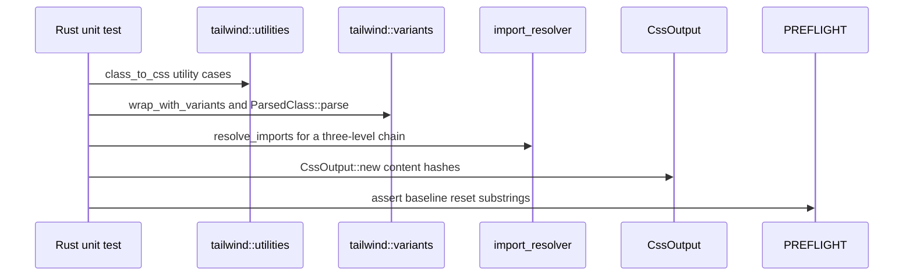
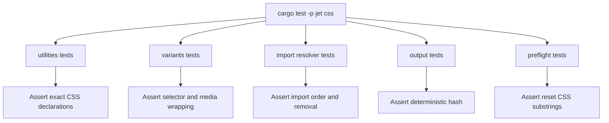
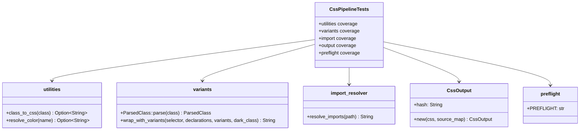

# Jet PostCSS Tailwind Test Coverage

## Changes
<!-- type: changes lang: yaml -->

```yaml
changes:
  - path: ".aw/tech-design/projects/jet/logic/postcss-tailwind.md"
    action: modify
    section: doc
    impl_mode: hand-written
    description: |
      Legacy Jet TD content retained as notes during AW standardization.
      Rewrite this file into semantic TD sections before promoting source to CODEGEN.
```

## Legacy notes
<!-- type: doc lang: markdown -->

# Jet PostCSS Tailwind Test Coverage

### Overview

This spec owns focused test coverage for Jet's native Rust CSS/Tailwind
pipeline. The functional foundation is specified in
`logic/css/postcss-tailwind-foundation.md`; this file tracks the unit tests
that lock down utility generation, variant wrapping, import resolution,
content hashing, and Preflight CSS.

### Coverage Surface

| Area | Source | Covered behavior |
|------|--------|------------------|
| Tailwind utilities | `crates/jet/src/css/tailwind/utilities.rs` | Color, typography, display, grid, arbitrary values |
| Tailwind variants | `crates/jet/src/css/tailwind/variants.rs` | Responsive, pseudo-class, group, and parsed variant splitting |
| CSS imports | `crates/jet/src/css/import_resolver.rs` | Recursive `@import` chain resolution |
| CSS output | `crates/jet/src/css/output.rs` | Deterministic SHA-256 hash prefix |
| Preflight | `crates/jet/src/css/tailwind/preflight.rs` | Embedded Tailwind base reset |

### Requirements

```mermaid
---
id: jet-postcss-tailwind-test-requirements
entry: TR1
---
requirementDiagram
    requirement TR1 {
        id: TR1
        text: Color utilities produce Tailwind v3 RGB values
        risk: high
        verifymethod: test
    }
    requirement TR2 {
        id: TR2
        text: Typography utility exact table returns expected declarations
        risk: high
        verifymethod: test
    }
    requirement TR3 {
        id: TR3
        text: Display and layout utilities return expected display values
        risk: high
        verifymethod: test
    }
    requirement TR4 {
        id: TR4
        text: Grid utilities generate template and span declarations
        risk: medium
        verifymethod: test
    }
    requirement TR5 {
        id: TR5
        text: Variant wrappers produce pseudo class ancestor and media selectors
        risk: high
        verifymethod: test
    }
    requirement TR6 {
        id: TR6
        text: ParsedClass splits variant prefixes from base class
        risk: medium
        verifymethod: test
    }
    requirement TR7 {
        id: TR7
        text: Multi-level CSS imports inline depth first and remove import statements
        risk: high
        verifymethod: test
    }
    requirement TR8 {
        id: TR8
        text: CssOutput hash is deterministic and content addressed
        risk: medium
        verifymethod: test
    }
    requirement TR9 {
        id: TR9
        text: Preflight CSS contains baseline reset rules
        risk: medium
        verifymethod: test
    }
```

### TR1: Color Utility Output

```yaml
id: TR1
priority: high
status: implemented
source:
  - crates/jet/src/css/tailwind/utilities.rs
```

Tests must verify `bg-blue-500`, `text-red-600`, and `border-green-300`
resolve to the Tailwind v3 RGB declarations.

### TR2: Typography Utility Output

```yaml
id: TR2
priority: high
status: implemented
source:
  - crates/jet/src/css/tailwind/utilities.rs
```

Tests must verify exact lookup entries for `text-lg`, `font-bold`, and
`text-center`.

### TR3: Display and Layout Utility Output

```yaml
id: TR3
priority: high
status: implemented
source:
  - crates/jet/src/css/tailwind/utilities.rs
```

Tests must verify `grid`, `block`, `hidden`, and `inline-flex` map to the
expected display declarations.

### TR4: Grid Utility Output

```yaml
id: TR4
priority: medium
status: implemented
source:
  - crates/jet/src/css/tailwind/utilities.rs
```

Tests must verify generated grid declarations for `grid-cols-3` and
`col-span-2`.

### TR5: Variant Wrapping

```yaml
id: TR5
priority: high
status: implemented
source:
  - crates/jet/src/css/tailwind/variants.rs
```

Tests must verify `hover`, `group-hover`, and combined `sm:hover` wrapping.
Selector declarations must remain intact after wrapping.

### TR6: ParsedClass Splitting

```yaml
id: TR6
priority: medium
status: implemented
source:
  - crates/jet/src/css/tailwind/variants.rs
```

Tests must verify compound variant parsing (`md:hover:text-blue-500`) and the
no-variant path (`flex`).

### TR7: Recursive Import Resolution

```yaml
id: TR7
priority: high
status: implemented
source:
  - crates/jet/src/css/import_resolver.rs
```

Tests must verify a three-level import chain resolves in depth-first order and
the output contains no `@import` statements.

### TR8: CssOutput Hash

```yaml
id: TR8
priority: medium
status: implemented
source:
  - crates/jet/src/css/output.rs
```

Tests must verify `CssOutput::new` generates an 8-character hex hash, is
deterministic for identical CSS, and changes when CSS content changes.

### TR9: Preflight Baseline

```yaml
id: TR9
priority: medium
status: implemented
source:
  - crates/jet/src/css/tailwind/preflight.rs
```

Tests must verify `PREFLIGHT` is non-empty and contains baseline reset rules
including `box-sizing: border-box`, `margin: 0`, and a `font-family`
declaration.

### Scenarios

```yaml
scenarios:
  - id: S1
    requirement: TR1
    title: bg-blue-500 produces background RGB
  - id: S2
    requirement: TR1
    title: text-red-600 produces text RGB
  - id: S3
    requirement: TR1
    title: border-green-300 produces border RGB
  - id: S4
    requirement: TR2
    title: text-lg returns font size and line height
  - id: S5
    requirement: TR2
    title: font-bold returns weight 700
  - id: S6
    requirement: TR2
    title: text-center returns text align
  - id: S7
    requirement: TR3
    title: display utilities return expected values
  - id: S8
    requirement: TR4
    title: grid-cols-3 returns template columns
  - id: S9
    requirement: TR4
    title: col-span-2 returns grid column span
  - id: S10
    requirement: TR5
    title: hover variant appends pseudo class
  - id: S11
    requirement: TR5
    title: group-hover prepends group ancestor
  - id: S12
    requirement: TR5
    title: sm-hover combines media and pseudo wrapping
  - id: S13
    requirement: TR6
    title: compound variants split into variants and base
  - id: S14
    requirement: TR6
    title: no-variant class remains base only
  - id: S15
    requirement: TR7
    title: three-level import chain merges correctly
  - id: S16
    requirement: TR8
    title: CssOutput hash is deterministic and unique
  - id: S17
    requirement: TR9
    title: Preflight contains reset rules
```

### Interaction



### Logic



### Dependency Model



### Test Plan

```mermaid
---
id: jet-postcss-tailwind-test-plan
entry: T1
---
requirementDiagram
    requirement TR1 {
        id: TR1
        text: color utilities
        risk: high
        verifymethod: test
    }
    requirement TR5 {
        id: TR5
        text: variant wrapping
        risk: high
        verifymethod: test
    }
    requirement TR7 {
        id: TR7
        text: import chain
        risk: high
        verifymethod: test
    }
    requirement TR8 {
        id: TR8
        text: output hash
        risk: medium
        verifymethod: test
    }
    requirement TR9 {
        id: TR9
        text: preflight reset
        risk: medium
        verifymethod: test
    }
    element T1 {
        type: test
        docref: cargo test -p jet css::
    }
    element T2 {
        type: test
        docref: cargo test -p jet tailwind::variants::tests
    }
    element T3 {
        type: test
        docref: cargo test -p jet import_resolver::tests::three_level_import_chain_merged
    }
```

### Execution

```bash
cargo test -p jet css::
cargo test -p jet tailwind::variants::tests
cargo test -p jet import_resolver::tests::three_level_import_chain_merged
cargo test -p jet css::output::tests::css_output_hash_deterministic
cargo test -p jet tailwind::preflight::tests::preflight_contains_reset_rules
```

### Coverage Matrix

| Requirement | Test examples |
|-------------|---------------|
| TR1 | `color_bg_blue_500`, `color_text_red_600`, `color_border_green_300` |
| TR2 | `typography_text_lg`, `typography_font_bold`, `typography_text_center` |
| TR3 | `display_grid_block_hidden_inline_flex` |
| TR4 | `grid_cols_3_template`, `grid_col_span_2` |
| TR5 | `variant_hover_pseudo_class`, `variant_group_hover_ancestor`, `variant_sm_hover_combined` |
| TR6 | `parsed_class_compound_variants`, `parsed_class_no_variants` |
| TR7 | `three_level_import_chain_merged` |
| TR8 | `css_output_hash_deterministic` |
| TR9 | `preflight_contains_reset_rules` |

### Changes

```yaml
files:
  - path: .aw/tech-design/crates/jet/logic/postcss-tailwind.md
    action: MODIFY
    section: doc
    impl_mode: hand-written
    desc: Replace old TODO-heavy test coverage spec with this checkable current-state contract.

  - path: crates/jet/src/css/tailwind/utilities.rs
    action: NONE
    section: doc
    impl_mode: hand-written
    desc: Existing tests cover color, typography, display, and grid utility output.

  - path: crates/jet/src/css/tailwind/variants.rs
    action: NONE
    section: doc
    impl_mode: hand-written
    desc: Existing tests cover variant wrapping and ParsedClass splitting.

  - path: crates/jet/src/css/import_resolver.rs
    action: NONE
    section: doc
    impl_mode: hand-written
    desc: Existing tests cover three-level import chain resolution.

  - path: crates/jet/src/css/output.rs
    action: NONE
    section: doc
    impl_mode: hand-written
    desc: Existing tests cover deterministic content hash generation.

  - path: crates/jet/src/css/tailwind/preflight.rs
    action: NONE
    section: doc
    impl_mode: hand-written
    desc: Existing tests cover baseline Preflight reset content.
```
