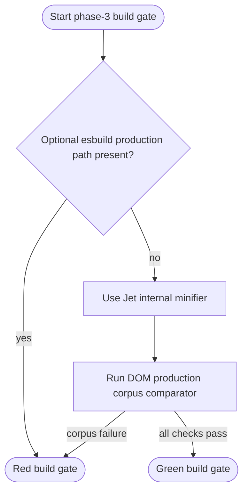
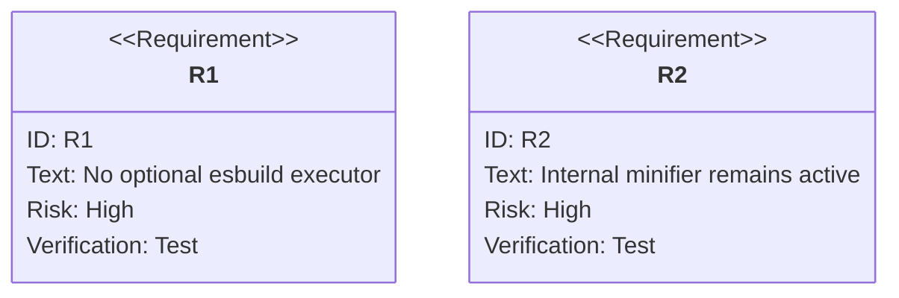

# Remove Optional Esbuild From Phase 3 Production Build Gate

## Scenarios
<!-- type: scenarios lang: yaml -->

```yaml
scenarios:
  - id: S1
    requirement: R1
    title: Build gate rejects optional esbuild executor usage
    given: phase 1 package and phase 2 Browser Bridge gates are green
    when: the phase-3 build gate scans Jet build internals
    then: no production build path references try_esbuild_minify or node_modules/.bin/esbuild
  - id: S2
    requirement: R2
    title: Jet build uses internal minification
    given: a production DOM fixture is built through jet build
    when: minification is requested
    then: Jet-owned Rust minification/transformation code handles minification without invoking an external esbuild binary
  - id: S3
    requirement: R3
    title: Build gate reaches corpus comparison
    given: optional esbuild executor usage is removed
    when: projects/jet/scripts/verify-basic-dom-gates.sh --phase build runs
    then: the gate proceeds to bundler/transform/asset tests and DOM production corpus comparison evidence
```
## Logic
<!-- type: logic lang: mermaid -->



## CLI
<!-- type: cli lang: yaml -->

```yaml
commands:
  - name: phase_3_build_gate
    command: "projects/jet/scripts/verify-basic-dom-gates.sh --phase build"
    verifies:
      - Jet build has no optional esbuild executor path
      - bundler transform asset unit gates pass
      - DOM production corpus comparator is reached
  - name: esbuild_guard_scan
    command: "rg -n \"try_esbuild_minify|node_modules.*\\\\.bin.*esbuild|Command::new\\\\(&esbuild\\\\)\" projects/jet/src/cli.rs"
    verifies:
      - optional esbuild production path is absent
```

## Unit Test
<!-- type: unit-test lang: mermaid -->



## E2E Test
<!-- type: e2e-test lang: yaml -->

```yaml
e2e_tests:
  - id: phase_3_build_gate
    name: Phase-3 DOM production build gate reaches corpus comparison
    command: "projects/jet/scripts/verify-basic-dom-gates.sh --phase build"
    verifies:
      - internal-minifier guard no longer fails on optional esbuild usage
      - next evidence comes from the DOM production corpus comparator
```

## Changes
<!-- type: changes lang: yaml -->

```yaml
coverage_kind: semantic
changes:
  - path: "projects/jet/src/cli.rs"
    action: modify
    section: logic
    description: |
      Remove optional esbuild binary probing from production minification and
      route Jet build through the internal Rust minifier path.
    impl_mode: hand-written
  - path: "projects/jet/scripts/verify-basic-dom-gates.sh"
    action: verify
    section: e2e-test
    description: |
      Keep the phase-3 guard that rejects optional esbuild executor usage and
      then runs the DOM production corpus comparator.
    impl_mode: hand-written
  - path: "projects/jet/scripts/verify-basic-dom-gates.sh"
    action: verify
    section: scenarios
    description: |
      Verify the build-gate scenarios for rejecting optional esbuild executor
      usage, using Jet internal minification, and reaching corpus comparison.
    impl_mode: hand-written
  - path: "projects/jet/scripts/verify-basic-dom-gates.sh"
    action: verify
    section: cli
    description: |
      Own the phase-3 CLI gate command and esbuild guard scan command used by
      the production build readiness check.
    impl_mode: hand-written
  - path: "projects/jet/src/cli.rs"
    action: verify
    section: unit-test
    description: |
      Own the unit-test requirement that Jet build avoids optional esbuild
      executor paths while preserving internal minification.
    impl_mode: hand-written
```
