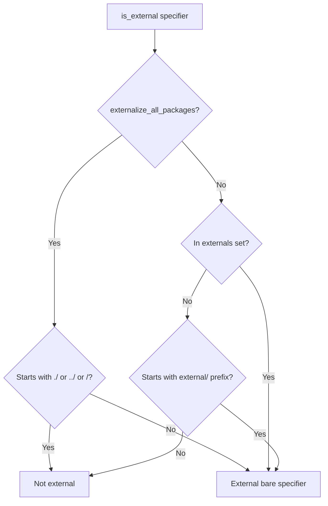
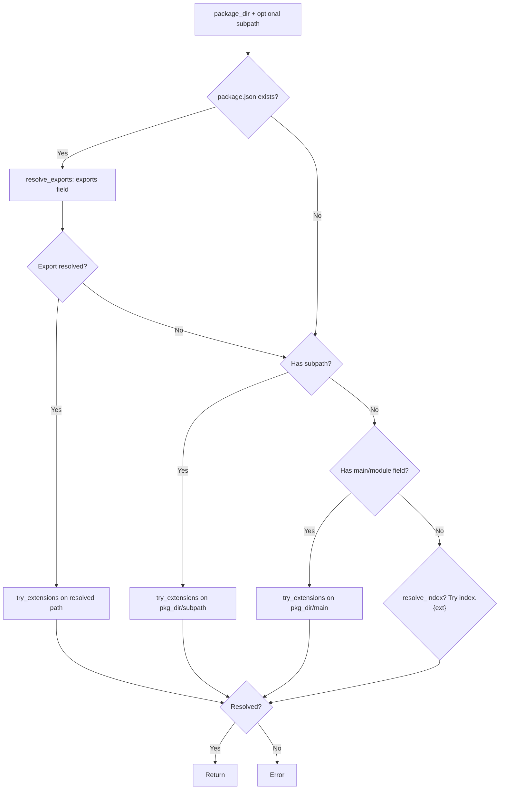
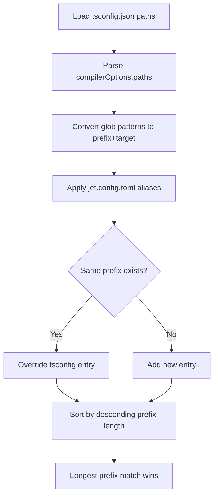

# jet Resolver

## Changes
<!-- type: changes lang: yaml -->

```yaml
changes:
  - path: ".aw/tech-design/projects/jet/logic/resolver.md"
    action: modify
    section: doc
    impl_mode: hand-written
    description: |
      Legacy Jet TD content retained as notes during AW standardization.
      Rewrite this file into semantic TD sections before promoting source to CODEGEN.
```

## Legacy notes
<!-- type: doc lang: markdown -->

# jet Resolver

### Overview

Node.js-compatible module resolution for the bundler, dev server, and JIT runner. Resolves relative paths, absolute paths, package specifiers, and path aliases. Supports `package.json` `exports` field, `module`/`main` field, extension trying, and index file resolution.

<!-- LOC counts removed — derive from source with `wc -l crates/jet/src/resolver/*.rs` -->

### Resolution Algorithm

```mermaid
---
id: jet-resolution-algorithm
entry: A
---
flowchart TD
    A["resolve(specifier, from)"] --> B{Is external?}
    B -- Yes --> C[Return external ResolvedModule]
    B -- No --> D[detect_kind]
    D --> E{Kind?}
    E -->|Relative| F["resolve_relative: from.parent / specifier"]
    E -->|Absolute| G["resolve_absolute: PathBuf(specifier)"]
    E -->|Alias| H["resolve_alias: match prefix -> target/rest"]
    E -->|Package| I["resolve_package: walk up node_modules"]
    F --> J[try_extensions]
    G --> J
    H --> J
    I --> K[parse_package_specifier]
    K --> L["Walk up from `from` dir"]
    L --> M{node_modules/{pkg} exists?}
    M -- No --> N[parent dir]
    N --> L
    M -- Yes --> O[resolve_package_dir]
    O --> J
    J --> P{Exact file exists?}
    P -- Yes --> Q[Return path]
    P -- No --> R{Try .js .jsx .ts .tsx .json?}
    R -- Match --> Q
    R -- No match --> S{Is directory?}
    S -- Yes --> T{Try index.{ext}?}
    T -- Match --> Q
    T -- No match --> U[Error: Cannot resolve]
    S -- No --> U
```

### Specifier Classification

```yaml
$schema: "https://json-schema.org/draft/2020-12/schema"
$id: "jet://schemas/resolve-kind"
type: string
enum:
  - Relative
  - Absolute
  - Package
  - Alias
description: "Module specifier classification"
x-rules:
  Relative: "Starts with ./ or ../"
  Absolute: "Starts with /"
  Alias: "Matches a configured alias prefix (tsconfig paths or jet.config.toml alias)"
  Package: "Everything else (bare specifier like 'react', '@babel/core')"
```

### External Detection



### Package Resolution

`resolve_package_dir(package_dir, subpath)`:



### Exports Field Resolution

`resolve_exports(package_json_path, subpath)` implements Node.js conditional exports:

| Pattern | Behavior |
|---------|----------|
| `"exports": "./dist/index.js"` | String shorthand for `"."` subpath |
| `"exports": { ".": "./dist/index.js" }` | Subpath map |
| `"exports": { ".": { "import": "...", "require": "..." } }` | Conditional exports |
| `"exports": { "./*": "./dist/*.js" }` | Wildcard pattern with `*` substitution |

Condition matching follows **JSON object key insertion order** (per Node.js PACKAGE_EXPORTS_RESOLVE spec). The `conditions` parameter is a membership filter — for each key in the exports object (in insertion order), the first key present in the conditions set wins. There is no fixed priority list; the package author controls precedence via key order in `package.json`.

`module` field takes precedence over `main` for ESM resolution (pre-exports convention).

### Package Specifier Parsing

`parse_package_specifier(specifier)` -> `(package_name, subpath)`:

| Input | Package Name | Subpath |
|-------|-------------|---------|
| `react` | `react` | `None` |
| `react/jsx-runtime` | `react` | `Some("./jsx-runtime")` |
| `@babel/core` | `@babel/core` | `None` |
| `@babel/core/lib/config` | `@babel/core` | `Some("./lib/config")` |
| `lodash/fp/map` | `lodash` | `Some("./fp/map")` |

Scoped packages (`@org/pkg`) always consume 2 path segments for the package name.

### Alias Resolution

`AliasResolver::load(project_root, config_aliases)`:



Sources (priority order):
1. `jet.config.toml` `[alias]` section (highest, overrides tsconfig)
2. `tsconfig.json` `compilerOptions.paths` (base)

Both strip glob suffix (`@/*` -> `@/`) and resolve targets relative to project root.

### ResolveOptions

```yaml
$schema: "https://json-schema.org/draft/2020-12/schema"
$id: "jet://schemas/resolve-options"
type: object
properties:
  base_dirs:
    type: array
    items:
      type: string
      format: path
    default:
      - "."
  extensions:
    type: array
    items:
      type: string
    default:
      - js
      - jsx
      - ts
      - tsx
      - json
  resolve_index:
    type: boolean
    default: true
    description: "Whether to resolve directory/index.{ext}"
  alias:
    type: array
    items:
      type: array
      prefixItems:
        - type: string
          description: "Prefix (e.g. '@/')"
        - type: string
          format: path
          description: "Target directory"
  externals:
    type: array
    items:
      type: string
    description: "Packages excluded from bundling"
  externalize_all_packages:
    type: boolean
    default: false
    description: "Treat all bare specifiers as external (lib builds)"
  conditions:
    type: array
    items:
      type: string
    default:
      - import
      - browser
      - default
    description: "Membership set for package.json exports condition matching. Object key insertion order in exports determines precedence; this set filters which keys are eligible."
```

### ResolvedModule

```yaml
$schema: "https://json-schema.org/draft/2020-12/schema"
$id: "jet://schemas/resolved-module"
type: object
properties:
  path:
    type: string
    format: path
  kind:
    $ref: "jet://schemas/resolve-kind"
  is_external:
    type: boolean
required:
  - path
  - kind
  - is_external
```
