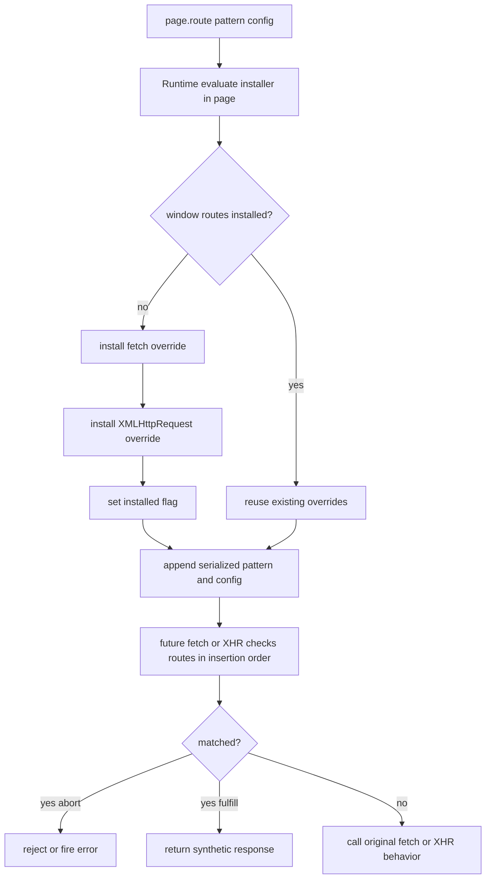

# jet `page.route` — in-page fetch/XHR interception

## Changes
<!-- type: changes lang: yaml -->

```yaml
changes:
  - path: ".aw/tech-design/projects/jet/logic/route-intercept.md"
    action: modify
    section: doc
    impl_mode: hand-written
    description: |
      Legacy Jet TD content retained as notes during AW standardization.
      Rewrite this file into semantic TD sections before promoting source to CODEGEN.
```

## Legacy notes
<!-- type: doc lang: markdown -->

# jet `page.route` — in-page fetch/XHR interception

### Overview

Phase 6 P3.3 (MVP scope). Lets tests mock HTTP responses for
`fetch()` and `XMLHttpRequest` calls made by page scripts without
touching the real network:

```js
await page.route('**/api/users', { status: 200, body: '{"users":[]}' });
await page.route('**/analytics/**', { abort: true });
await page.route(/\/img\/.*\.webp$/, { status: 204, body: '' });
```

The implementation is **pure JS in the page context** — it does not use
CDP `Fetch.enable`. `page.route()` evaluates a small installer that
overrides `window.fetch` and `window.XMLHttpRequest`, consulting a
`window.__jetRoutes` list that `page.route()` / `unroute()` / `unrouteAll()`
mutate.

Trade-offs vs a full CDP `Fetch.enable` / `Fetch.requestPaused` pipeline
(deferred):

| Limitation | Impact |
|---|---|
| Navigation + resource loads (images, CSS, `<script src>`) are NOT intercepted. | Tests that mock API calls from page JS work; tests that mock the document itself don't. |
| Routes are per-document — `goto`/`setContent` wipes `window.__jetRoutes`. | Call `route()` AFTER each navigation. |
| Handlers are static objects, not JS callbacks receiving the request. | Cannot dynamically modify requests (add headers, rewrite URL) — only fulfill/abort. |

Future (out of this change): full CDP-backed interception with
request-paused event streaming into JS handlers.

### Design Contract

```mermaid
---
id: jet-route-intercept-requirements
entry: R1
---
requirementDiagram
    requirement R1 {
        id: R1
        text: page route appends to window routes and installs fetch and XHR overrides idempotently
        risk: high
        verifymethod: test
    }
    requirement R2 {
        id: R2
        text: page unroute removes routes whose serialized pattern equals the requested pattern
        risk: medium
        verifymethod: test
    }
    requirement R3 {
        id: R3
        text: page unrouteAll clears all registered routes and returns the dropped count
        risk: medium
        verifymethod: test
    }
    requirement R4 {
        id: R4
        text: fetch override fulfills matched routes or rejects abort routes
        risk: high
        verifymethod: test
    }
    requirement R5 {
        id: R5
        text: glob matching supports star and double star while escaping other regex metacharacters
        risk: high
        verifymethod: test
    }
    requirement R6 {
        id: R6
        text: RegExp patterns evaluate by source and flags inside the page context
        risk: medium
        verifymethod: test
    }
    requirement R7 {
        id: R7
        text: XMLHttpRequest override populates response fields and fires load or error events
        risk: high
        verifymethod: test
    }
    requirement R8 {
        id: R8
        text: routes are checked in insertion order and first match wins
        risk: medium
        verifymethod: test
    }
    requirement R9 {
        id: R9
        text: non matching URLs fall through to original fetch or XMLHttpRequest behavior
        risk: high
        verifymethod: test
    }
```



### Installer Algorithm



Pattern serialization sent as JSON so the evaluator sees a plain object
it can compare directly in `unroute`.

### Test Plan

Location: `crates/jet/tests/route_intercept_tests.rs`.

| id | Test | Covers |
|----|------|--------|
| RI1 | fetch matches glob → mock response body returned. | R1 R4 R5 |
| RI2 | fetch matches RegExp → mock response returned. | R1 R4 R6 |
| RI3 | fetch non-matching URL passes through (no throw). | R9 |
| RI4 | fetch `{abort:true}` → the fetch rejects. | R4 |
| RI5 | unroute drops a single pattern, subsequent fetch passes through. | R2 |
| RI6 | unrouteAll drops everything, returns the count. | R3 |
| RI7 | XMLHttpRequest mocked: `xhr.status` / `responseText` match config. | R7 |
| RI8 | XMLHttpRequest abort: onerror fires. | R7 |
| RI9 | First-match-wins: two routes both match → first applies. | R8 |

All tests skip gracefully when Chromium is unavailable.

### Changes

```yaml
_sdd:
  id: route-intercept-changes
  refs:
    - $ref: "page-api-parity#R6"
changes:
  - path: crates/jet/runtime/test/page.js
    action: modify
    section: doc
    impl_mode: hand-written
    purpose: |
      Add Page.route / unroute / unrouteAll. Append
      _jetRouteInstallerSrc() emitting the fetch + XHR overrides +
      window.__jetRoutes list management.
  - path: crates/jet/tests/route_intercept_tests.rs
    action: create
    section: doc
    impl_mode: hand-written
    purpose: "Integration coverage RI1..RI9."
  - path: .aw/tech-design/crates/jet/logic/route-intercept.md
    action: create
    section: doc
    impl_mode: hand-written
    purpose: "This spec."
```
