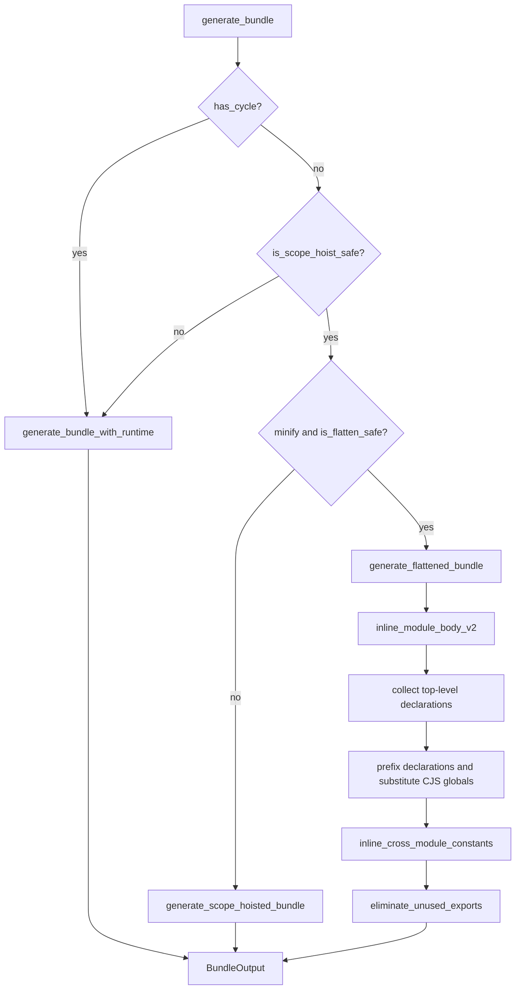
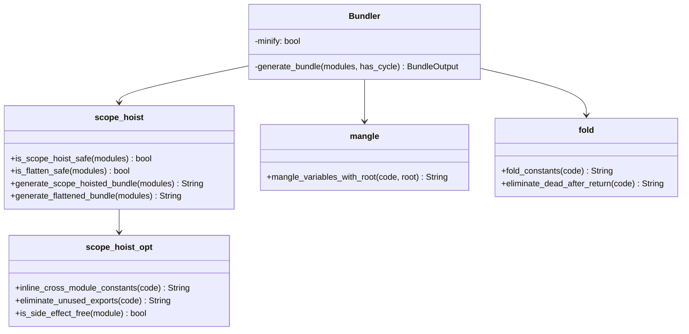

# Jet Scope Hoisting

## Changes
<!-- type: changes lang: yaml -->

```yaml
changes:
  - path: ".aw/tech-design/projects/jet/logic/scope-hoisting.md"
    action: modify
    section: doc
    impl_mode: hand-written
    description: |
      Legacy Jet TD content retained as notes during AW standardization.
      Rewrite this file into semantic TD sections before promoting source to CODEGEN.
```

## Legacy notes
<!-- type: doc lang: markdown -->

# Jet Scope Hoisting

### Overview

Scope hoisting selects the compact production bundle format for Jet when the
module graph is safe to flatten. The implementation has two bundle-generation
paths:

- Phase 1 scope hoisting in `generate_scope_hoisted_bundle`, which keeps each
  module in an IIFE but removes the global `__jet__.define` registry.
- Phase 2 true flattening in `generate_flattened_bundle`, which merges module
  bodies into one scope, prefixes top-level declarations, substitutes CommonJS
  globals, then runs post-flattening optimizations.

This spec replaces the old loose root spec
`.aw/tech-design/crates/jet/scope-hoisting.md`. Root files are no longer
allowed under a crate spec directory except `README.md`; the active contract is
now this `logic/` spec.

### Source Map

| Contract | Source | Runtime role |
|----------|--------|--------------|
| Phase 1 wrapper generation | `crates/jet/src/bundler/scope_hoist.rs` | Emit ordered module IIFEs and local require switch |
| Scope-hoist safety | `crates/jet/src/bundler/scope_hoist.rs` | Reject graphs with dynamic imports |
| Flatten safety | `crates/jet/src/bundler/scope_hoist.rs` | Bail out on `eval`, `with`, and `arguments[` |
| Phase 2 flattening | `crates/jet/src/bundler/scope_hoist.rs` | Inline bodies, prefix declarations, substitute CJS globals |
| Post-flattening optimization | `crates/jet/src/bundler/scope_hoist_opt.rs` | Inline constants, remove unused exports, gate side effects |
| Pipeline selection | `crates/jet/src/bundler/mod.rs` | Pick runtime, Phase 1, or Phase 2 based on cycle/safety/minify |
| Minifier handoff | `crates/jet/src/bundler/mod.rs` | Feed flat output to mangling and folding passes in production tests |

### Requirements

```mermaid
---
id: jet-scope-hoisting-requirements
entry: R1
---
requirementDiagram
    requirement R1 {
        id: R1
        text: Non-dynamic graphs may use scope hoisting
        risk: high
        verifymethod: test
    }
    requirement R2 {
        id: R2
        text: Phase 1 removes the global runtime registry while preserving wrappers
        risk: medium
        verifymethod: test
    }
    requirement R3 {
        id: R3
        text: Phase 2 flattens safe modules into one scope
        risk: high
        verifymethod: test
    }
    requirement R4 {
        id: R4
        text: Top-level declarations are prefixed to avoid collisions
        risk: high
        verifymethod: test
    }
    requirement R5 {
        id: R5
        text: Unsafe modules fall back to wrapped execution
        risk: high
        verifymethod: test
    }
    requirement R6 {
        id: R6
        text: Post-flattening optimizers inline constants and remove unused exports
        risk: high
        verifymethod: test
    }
    requirement R7 {
        id: R7
        text: Side-effectful node_modules modules are not flattened
        risk: high
        verifymethod: test
    }
    requirement R8 {
        id: R8
        text: Production pipeline remains smaller than Phase 1 output
        risk: medium
        verifymethod: test
    }
```

### R1: Scope-Hoist Safety

```yaml
id: R1
priority: high
status: implemented
source:
  - crates/jet/src/bundler/scope_hoist.rs
```

`is_scope_hoist_safe` must reject any module containing dynamic `import(`.
Dynamic import requires runtime chunk loading, so the bundler must choose
`generate_bundle_with_runtime` instead of either scope-hoisted format.

### R2: Phase 1 Wrapper Hoisting

```yaml
id: R2
priority: medium
status: implemented
source:
  - crates/jet/src/bundler/scope_hoist.rs
```

`generate_scope_hoisted_bundle` must execute modules in dependency order inside
local wrappers and provide a local `_r(id)` require switch. It removes the
global registry overhead while preserving module boundaries.

### R3: Phase 2 True Flattening

```yaml
id: R3
priority: high
status: implemented
source:
  - crates/jet/src/bundler/scope_hoist.rs
```

`generate_flattened_bundle` must merge safe module bodies into one outer IIFE.
CommonJS globals are substituted per module: `module` to `_mN`, `exports` to
`_mNe`, and `require` to `_r`.

### R4: Collision-Free Prefix Renaming

```yaml
id: R4
priority: high
status: implemented
source:
  - crates/jet/src/bundler/scope_hoist.rs
```

Top-level `var`, `let`, `const`, `function`, and `class` declarations must be
collected and renamed with `_mN_` prefixes before modules share a flat scope.
The production mangler can then compress those prefixed names safely.

### R5: Unsafe Module Bailout

```yaml
id: R5
priority: high
status: implemented
source:
  - crates/jet/src/bundler/scope_hoist.rs
```

`is_flatten_safe` must reject modules using `eval`, `with`, or `arguments[`.
When the check fails, `generate_flattened_bundle` must return Phase 1 output.

### R6: Post-Flattening Optimization

```yaml
id: R6
priority: high
status: implemented
source:
  - crates/jet/src/bundler/scope_hoist_opt.rs
  - crates/jet/src/bundler/mod.rs
```

After Phase 2 flattening, the bundler must run
`inline_cross_module_constants` and `eliminate_unused_exports`. This pass owns
cross-module constant propagation, dead prefixed export removal, and dead
prefixed variable removal.

### R7: Side-Effect Boundary

```yaml
id: R7
priority: high
status: implemented
source:
  - crates/jet/src/bundler/scope_hoist.rs
  - crates/jet/src/bundler/scope_hoist_opt.rs
```

Node modules are flattened only when side-effect analysis says they are safe.
Project modules that passed `is_flatten_safe` are eligible for Phase 2, while
side-effectful package modules keep wrapper boundaries.

### R8: Production Size Handoff

```yaml
id: R8
priority: medium
status: implemented
source:
  - crates/jet/src/bundler/mod.rs
```

The production simulation pipeline must include Phase 2 flattening, R6
optimizers, variable mangling, boolean replacement, constant folding, and
post-return DCE. Existing tests assert Phase 2 remains no larger than Phase 1
on representative modules.

### Scenarios

```yaml
scenarios:
  - id: S1
    requirement: R1
    title: Dynamic import selects runtime bundle
  - id: S2
    requirement: R2
    title: Phase 1 emits local wrapper require
  - id: S3
    requirement: R3
    title: Safe minified build selects Phase 2
  - id: S4
    requirement: R4
    title: Duplicate top-level names are prefixed
  - id: S5
    requirement: R5
    title: Eval module falls back to Phase 1
  - id: S6
    requirement: R6
    title: Cross-module constants enable DCE
  - id: S7
    requirement: R7
    title: Side-effect package module stays wrapped
  - id: S8
    requirement: R8
    title: Phase 2 production pipeline is smaller than Phase 1
```

### S1: Dynamic Import Selects Runtime Bundle

1. Given a module contains `import("./lazy")`.
2. When `generate_bundle` evaluates bundle format.
3. Then `is_scope_hoist_safe` is false.
4. Then the runtime module system is used.

### S2: Phase 1 Emits Local Wrapper Require

1. Given a safe graph is built with `minify=false`.
2. When `generate_bundle` runs.
3. Then `generate_scope_hoisted_bundle` emits a local `_r(id)` switch.
4. Then modules remain wrapped in per-module functions.

### S3: Safe Minified Build Selects Phase 2

1. Given a graph has no cycles, no dynamic imports, and no unsafe constructs.
2. Given bundle options set `minify=true`.
3. When `generate_bundle` runs.
4. Then `generate_flattened_bundle` is selected.

### S4: Duplicate Top-Level Names Are Prefixed

1. Given two modules each declare `var count`.
2. When Phase 2 flattening runs.
3. Then the declarations become distinct prefixed names.
4. Then production mangling may compress them without collisions.

### S5: Eval Module Falls Back to Phase 1

1. Given a module contains `eval("code")`.
2. When `is_flatten_safe` evaluates the module set.
3. Then Phase 2 is rejected.
4. Then Phase 1 wrapper output is returned.

### S6: Cross-Module Constants Enable DCE

1. Given a flattened module declares `_m1_MODE = "production"`.
2. Given another module checks `_m1_MODE !== "production"`.
3. When post-flattening optimization runs.
4. Then the constant is inlined.
5. Then the dead branch and unused export are removed.

### S7: Side-Effect Package Module Stays Wrapped

1. Given a node_modules module has top-level side effects.
2. When Phase 2 eligibility is evaluated.
3. Then the module is not flattened into the parent scope.
4. Then execution order remains explicit.

### S8: Phase 2 Production Pipeline Is Smaller Than Phase 1

1. Given representative modules with repeated prefixed names.
2. When the production simulation pipeline runs.
3. Then Phase 2 output is less than or equal to Phase 1 output.

### Interaction

```mermaid
---
id: jet-scope-hoisting-interaction
entry: Bundler
---
sequenceDiagram
    participant Bundler as Bundler::generate_bundle
    participant Safety as scope_hoist safety checks
    participant Phase1 as generate_scope_hoisted_bundle
    participant Phase2 as generate_flattened_bundle
    participant Opt as scope_hoist_opt
    participant Runtime as generate_bundle_with_runtime

    Bundler->>Safety: has_cycle and dynamic import checks
    alt cycle or dynamic import
        Bundler->>Runtime: generate runtime bundle
    else minify and flatten-safe
        Bundler->>Phase2: flatten modules
        Phase2->>Opt: inline constants
        Opt-->>Bundler: remove unused exports
    else safe but not flattened
        Bundler->>Phase1: generate local wrappers
    end
```

### Logic



### Dependency Model



### Test Plan

```mermaid
---
id: jet-scope-hoisting-test-plan
entry: T1
---
requirementDiagram
    requirement R1 {
        id: R1
        text: safety checks
        risk: high
        verifymethod: test
    }
    requirement R3 {
        id: R3
        text: Phase 2 flattening
        risk: high
        verifymethod: test
    }
    requirement R6 {
        id: R6
        text: post flatten optimization
        risk: high
        verifymethod: test
    }
    requirement R8 {
        id: R8
        text: size handoff
        risk: medium
        verifymethod: test
    }
    element T1 {
        type: test
        docref: cargo test -p jet scope_hoist::tests
    }
    element T2 {
        type: test
        docref: cargo test -p jet scope_hoist_opt::tests
    }
    element T3 {
        type: test
        docref: cargo test -p jet bundler::tests::test_phase2_pipeline_with_cross_module_dce
    }
    element T4 {
        type: test
        docref: cargo test -p jet bundler::tests::test_phase2_pipeline_size_smaller_than_phase1
    }
```

### Unit Commands

```bash
cargo test -p jet scope_hoist::tests
cargo test -p jet scope_hoist_opt::tests
cargo test -p jet bundler::tests::test_phase2_pipeline_with_cross_module_dce
cargo test -p jet bundler::tests::test_phase2_pipeline_size_smaller_than_phase1
```

### Coverage Matrix

| Requirement | Existing coverage |
|-------------|-------------------|
| R1 | `test_scope_hoist_safe_no_dynamic_imports`, `test_scope_hoist_unsafe_with_dynamic_import` |
| R2 | `test_generate_scope_hoisted_bundle_*` |
| R3 | `test_generate_flattened_bundle_*`, `test_phase2_bundle_uses_flat_format_when_minify` |
| R4 | Phase 2 duplicate-name and prefix tests in `scope_hoist.rs` and `mod.rs` |
| R5 | `test_generate_flattened_bundle_falls_back_on_eval`, unsafe construct tests |
| R6 | `scope_hoist_opt` tests for constants and unused exports |
| R7 | `scope_hoist_opt` side-effect tests |
| R8 | `test_phase2_pipeline_size_smaller_than_phase1` |

### Changes

```yaml
files:
  - path: .aw/tech-design/crates/jet/scope-hoisting.md
    action: DELETE
    section: doc
    impl_mode: hand-written
    desc: Remove loose crate-root duplicate. Crate root may contain README.md only.

  - path: .aw/tech-design/crates/jet/logic/scope-hoisting.md
    action: MODIFY
    section: doc
    impl_mode: hand-written
    desc: Replace legacy placeholder-heavy scope-hoisting spec with this checkable logic contract.

  - path: crates/jet/src/bundler/scope_hoist.rs
    action: NONE
    section: doc
    impl_mode: hand-written
    desc: Existing implementation owns Phase 1 wrappers, Phase 2 flattening, safety checks, and prefix renaming.

  - path: crates/jet/src/bundler/scope_hoist_opt.rs
    action: NONE
    section: doc
    impl_mode: hand-written
    desc: Existing implementation owns post-flattening constant inlining, unused export removal, and side-effect gates.

  - path: crates/jet/src/bundler/mod.rs
    action: NONE
    section: doc
    impl_mode: hand-written
    desc: Existing implementation owns bundle format selection and production simulation tests.
```
