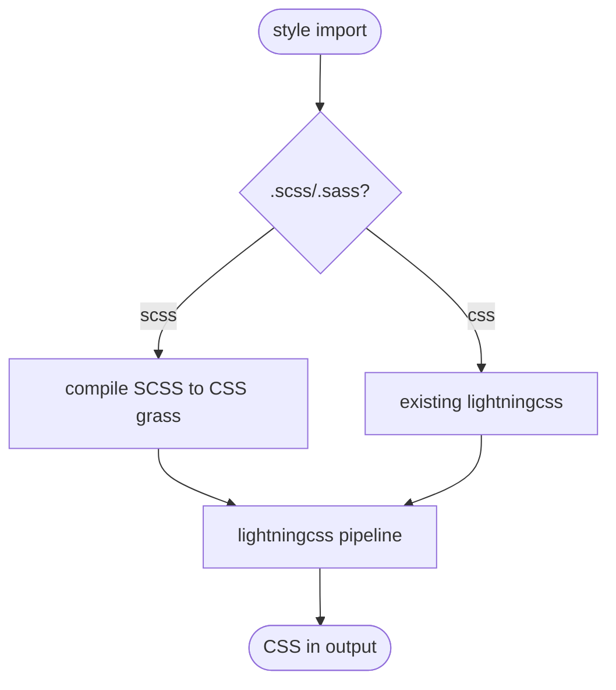

# jet SCSS/Sass compilation in build + lib CSS pipeline

## Logic
<!-- type: logic lang: mermaid -->



## E2E Test
<!-- type: e2e-test lang: yaml -->

```yaml
e2e_tests:
  - id: scss_sass_compilation
    capability_id: bundler-production-build
    claim_id: scss-sass-compilation
    name: "SCSS and Sass compilation"
    command: "cargo test -p jet --lib css::scss"
    proves: "SCSS/Sass compilation is covered by the focused css::scss gate."
```

## Changes
<!-- type: changes lang: yaml -->

```yaml
coverage_kind: semantic
changes:
  - path: "projects/jet/Cargo.toml"
    action: modify
    section: logic
    description: |
      Add a Rust Sass implementation dependency (grass) for SCSS/Sass compilation.
    impl_mode: hand-written
  - path: "projects/jet/src/bundler/css_bundle/mod.rs"
    action: modify
    section: logic
    description: |
      Compile .scss/.sass to CSS (grass) before the lightningcss pipeline; support nesting, variables, @use/@import partials; flows into the single lib style.css.
    impl_mode: hand-written
  - path: "projects/jet/src/bundler/imports.rs"
    action: modify
    section: logic
    description: |
      Resolve .scss/.sass style imports through the new compile step.
    impl_mode: hand-written
  - path: "projects/jet/tests/build/scss.rs"
    action: create
    section: unit-test
    description: |
      Tests: a .scss with nesting + a variable compiles, resolved rules appear in build CSS; lib emits compiled SCSS into style.css; plain .css still works.
    impl_mode: hand-written
```
