# jet `storageState` — context cookie + storage persistence

## Changes
<!-- type: changes lang: yaml -->

```yaml
changes:
  - path: ".aw/tech-design/projects/jet/logic/storage-state.md"
    action: modify
    section: doc
    impl_mode: hand-written
    description: |
      Legacy Jet TD content retained as notes during AW standardization.
      Rewrite this file into semantic TD sections before promoting source to CODEGEN.
```

## Legacy notes
<!-- type: doc lang: markdown -->

# jet `storageState` — context cookie + storage persistence

### Overview

Phase 6 P3.2. Replaces the `BrowserContext::cookies()` /
`BrowserContext::storage_state()` stubs with real CDP calls and exposes a
Playwright-shaped surface to JS specs:

```ts
const ctx = await browser.newContext({ storageState: 'auth.json' });
// ... interact ...
await ctx.storageState({ path: 'auth.json' });   // save
await ctx.addCookies([{ name, value, url }]);    // bulk insert
const cookies = await ctx.cookies();             // list
await ctx.clearCookies();
```

Scope:
- Cookies via `Storage.getCookies` / `Storage.setCookies` /
  `Storage.clearCookies`, all keyed on `browserContextId` for non-default
  contexts.
- `storageState()` returns `{ cookies, origins: [] }`. `origins` is always
  an empty array for MVP — per-origin localStorage capture lands with a
  later change once visited-origin tracking is wired (see Future).

Future (out of this change):
- Per-origin localStorage / sessionStorage snapshots.
- `Storage.trackCookieChanges` for observable mutations.
- Cookie-jar diff / per-test isolation helpers.

### Design Contract

```mermaid
---
id: jet-storage-state-requirements
entry: S1
---
requirementDiagram
    requirement S1 {
        id: S1
        text: BrowserContext cookies calls Storage getCookies with the correct browserContextId rule
        risk: high
        verifymethod: test
    }
    requirement S2 {
        id: S2
        text: BrowserContext add_cookies calls Storage setCookies and treats empty input as no op
        risk: high
        verifymethod: test
    }
    requirement S3 {
        id: S3
        text: BrowserContext clear_cookies calls Storage clearCookies with the correct context scope
        risk: high
        verifymethod: test
    }
    requirement S4 {
        id: S4
        text: BrowserContext storage_state returns cookies with empty origins for MVP
        risk: medium
        verifymethod: test
    }
    requirement S5 {
        id: S5
        text: BrowserContext set_storage_state applies cookies and ignores origins for MVP
        risk: high
        verifymethod: test
    }
    requirement S6 {
        id: S6
        text: JS BrowserContext exposes cookie and storageState methods including path save
        risk: high
        verifymethod: test
    }
    requirement S7 {
        id: S7
        text: browser newContext accepts storageState as a path or inline state object
        risk: high
        verifymethod: test
    }
    requirement S8 {
        id: S8
        text: Context storage RPCs share context_id and read responses use StorageStateResult
        risk: high
        verifymethod: test
    }
    requirement S9 {
        id: S9
        text: Worker routes context storage RPCs through the contexts map and errors on unknown context_id
        risk: high
        verifymethod: test
    }
```



### Wire types

```rust
// PageRequest variants (additive)
ContextCookies        { req_id, context_id }
ContextAddCookies     { req_id, context_id, cookies: serde_json::Value }
ContextClearCookies   { req_id, context_id }
ContextStorageState   { req_id, context_id }
ContextSetStorageState{ req_id, context_id, state: serde_json::Value }

// PageResponse variant
StorageStateResult { req_id, value: serde_json::Value }
```

### Test Plan

Location: `crates/jet/tests/storage_state_tests.rs`.

| id | Test | Covers |
|----|------|--------|
| S_t1 | addCookies → cookies roundtrip in a fresh context. | S1 S2 S6 |
| S_t2 | clearCookies removes everything. | S3 |
| S_t3 | storageState() returns the expected shape (`cookies` array, `origins` empty). | S4 |
| S_t4 | setStorageState applies cookies into a new context. | S5 S6 |
| S_t5 | storageState({path}) writes to disk; newContext({storageState:path}) loads them in a fresh context. | S6 S7 |
| S_t6 | Unknown context_id surfaces `PageResponse::Error`. | S9 |

All tests skip gracefully if Chromium is unavailable.

### Changes

```yaml
_sdd:
  id: storage-state-changes
  refs:
    - $ref: "browser-driver#cookie"
changes:
  - path: crates/jet/src/browser/context.rs
    action: modify
    section: doc
    impl_mode: hand-written
    purpose: |
      Replace cookies() / storage_state() stubs with real CDP calls.
      Add add_cookies, clear_cookies, set_storage_state. Default
      context omits browserContextId (Chromium rejects it).
  - path: crates/jet/src/cdp_driver/page_binding.rs
    action: modify
    section: doc
    impl_mode: hand-written
    purpose: |
      Add ContextCookies/ContextAddCookies/ContextClearCookies/
      ContextStorageState/ContextSetStorageState PageRequest variants
      and StorageStateResult PageResponse variant. Update req_id_of
      and dispatch_page_request to cover them.
  - path: crates/jet/src/test_runner/worker.rs
    action: modify
    section: doc
    impl_mode: hand-written
    purpose: |
      Route the 5 new context-storage RPCs against the contexts map,
      same shape as the B3 NewContext/ContextNewPage handlers. Update
      page_req_id_str to mark them as page_id-less.
  - path: crates/jet/runtime/test/index.js
    action: modify
    section: doc
    impl_mode: hand-written
    purpose: |
      Add cookies / addCookies / clearCookies / storageState / setStorageState
      to __JetBrowserContext. Extend browser.newContext({storageState}) to
      load a file path or inline object before returning.
  - path: crates/jet/tests/storage_state_tests.rs
    action: create
    section: doc
    impl_mode: hand-written
    purpose: "Integration coverage S_t1..S_t6."
  - path: .aw/tech-design/crates/jet/logic/storage-state.md
    action: create
    impl_mode: hand-written
    purpose: "This spec."
```
