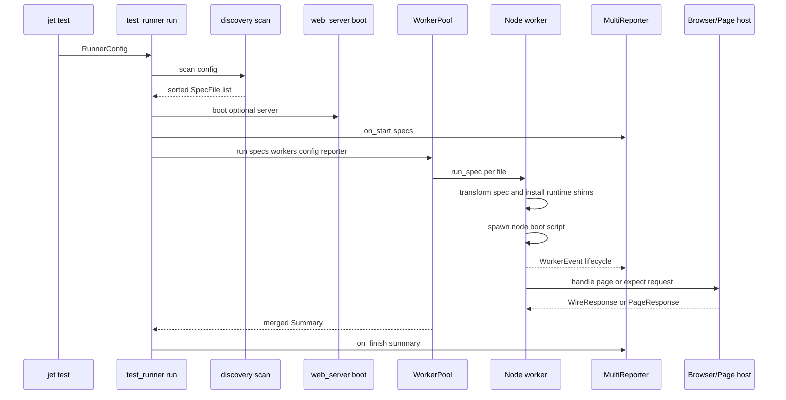
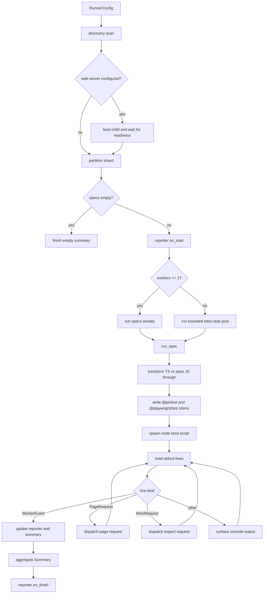
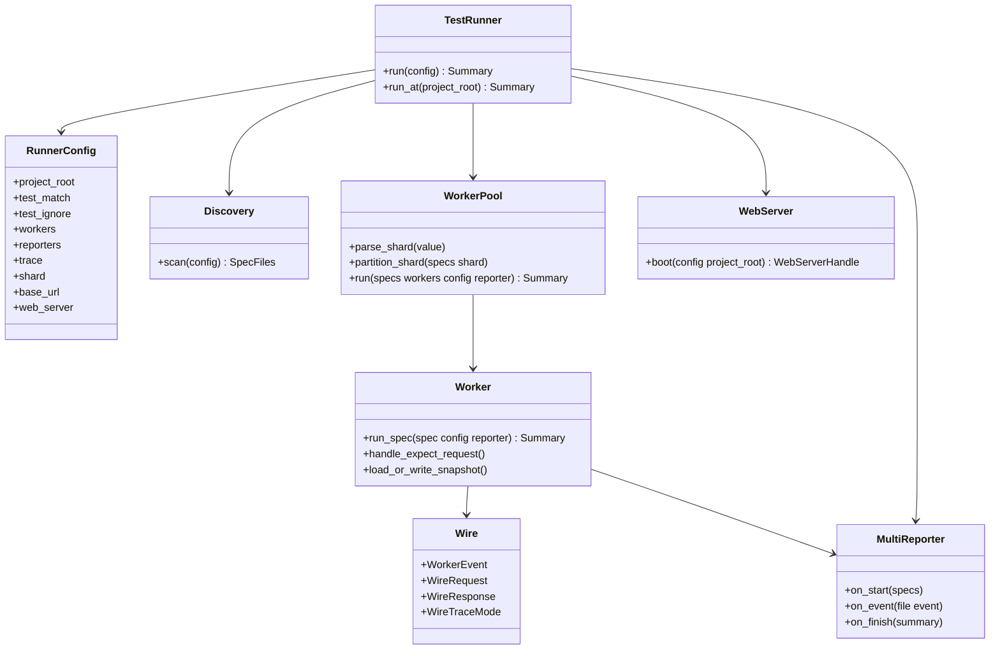

# Jet Test Runner

## Changes
<!-- type: changes lang: yaml -->

```yaml
changes:
  - path: ".aw/tech-design/projects/jet/logic/test-runner.md"
    action: modify
    section: doc
    impl_mode: hand-written
    description: |
      Legacy Jet TD content retained as notes during AW standardization.
      Rewrite this file into semantic TD sections before promoting source to CODEGEN.
```

## Legacy notes
<!-- type: doc lang: markdown -->

# Jet Test Runner

### Overview

This spec owns the current native `jet test` runner. The runner discovers
JavaScript and TypeScript spec files, transforms TypeScript through Jet's
existing transform pipeline, runs each spec in a Node.js worker with embedded
`@jet/test` runtime shims, receives lifecycle events over NDJSON, services
browser/page/expect RPC requests from Rust, and emits terminal plus JSON
reports. Parallel execution, sharding, HTML reporting, trace metadata, web
server bootstrapping, and failure artifact metadata are already wired into the
current implementation.

### Owned Surface

| Area | Source | Responsibility |
|------|--------|----------------|
| Entry point | `crates/jet/src/test_runner/mod.rs` | Discover, shard, boot web server, run worker pool, finish reporters |
| Config | `crates/jet/src/test_runner/config.rs` | Resolved runner config, reporters, workers, shard, base URL, browser flags |
| Discovery | `crates/jet/src/test_runner/discovery.rs` | Glob scan, ignore rules, explicit file list, deterministic ordering |
| Worker pool | `crates/jet/src/test_runner/worker_pool.rs` | Serial path, bounded parallel tasks, shard partitioning, crash aggregation |
| Worker | `crates/jet/src/test_runner/worker.rs` | Transform spec, install shims, spawn Node, handle worker events and RPC |
| Wire | `crates/jet/src/test_runner/wire.rs` | Worker events, expect requests, page-compatible response data, trace modes |
| Reporter | `crates/jet/src/test_runner/reporter.rs` | Terminal output, JSON summary, shared report state |
| Expect | `crates/jet/src/test_runner/expect.rs` | Matcher catalogue and diff formatting |
| Web server | `crates/jet/src/test_runner/web_server.rs` | Optional `[test.web_server]` child lifecycle |
| Runtime | `crates/jet/runtime/test/*.js` | JS-side `@jet/test` and Playwright-compatible worker shims |

### Requirements

```mermaid
---
id: jet-test-runner-requirements
entry: R1
---
requirementDiagram
    requirement R1 {
        id: R1
        text: Runner config resolves defaults for project root patterns reporters workers trace shard and artifacts
        risk: high
        verifymethod: test
    }
    requirement R2 {
        id: R2
        text: Discovery finds supported spec extensions and excludes hidden ignored build and dependency paths
        risk: high
        verifymethod: test
    }
    requirement R3 {
        id: R3
        text: Sharding partitions specs deterministically and worker pool preserves serial behavior when workers is one
        risk: high
        verifymethod: test
    }
    requirement R4 {
        id: R4
        text: Worker transforms specs installs runtime shims and runs Node with captured stdio
        risk: high
        verifymethod: test
    }
    requirement R5 {
        id: R5
        text: Wire protocol parses lifecycle events expect requests responses outcomes and trace modes
        risk: high
        verifymethod: test
    }
    requirement R6 {
        id: R6
        text: Reporter emits terminal summaries and JSON results with errors traces shards and artifacts
        risk: high
        verifymethod: test
    }
    requirement R7 {
        id: R7
        text: Expect matcher catalogue includes pure JS and DOM integrated matcher names
        risk: medium
        verifymethod: test
    }
    requirement R8 {
        id: R8
        text: Browser and page RPC paths support lazy browser launch page commands snapshots and artifact metadata
        risk: high
        verifymethod: test
    }
```



### Scenarios

```yaml
scenarios:
  - id: S1
    requirement: R1
    title: Default config includes supported spec patterns ignore rules reporters workers and timeout
  - id: S2
    requirement: R2
    title: Discovery scans a project tree and returns matching specs in deterministic order
  - id: S3
    requirement: R2
    title: Explicit file list bypasses glob matching
  - id: S4
    requirement: R3
    title: Shard parser rejects malformed or impossible shard values
  - id: S5
    requirement: R3
    title: Worker pool aggregates serial or parallel spec summaries without halting on a worker error
  - id: S6
    requirement: R4
    title: Worker boot script exposes embedded @jet/test and @playwright/test shims to the spec
  - id: S7
    requirement: R5
    title: WorkerEvent plan test_end console and fatal messages round trip through JSON
  - id: S8
    requirement: R6
    title: JSON reporter writes .jet/test-results.json only when enabled
  - id: S9
    requirement: R7
    title: Matcher catalogue lists all expected pure JS and DOM matchers
  - id: S10
    requirement: R8
    title: Snapshot helper writes a missing baseline and compares existing snapshot bytes
```

### Interaction



### Logic



### Dependency Model



### Data Schema

```yaml
types:
  RunnerConfig:
    fields:
      project_root: PathBuf
      test_dir: PathBuf
      test_match: Vec<String>
      test_ignore: Vec<String>
      timeout_ms: u64
      workers: usize
      reporters: Vec<Reporter>
      report_dir: PathBuf
      grep: Option<String>
      update_snapshots: bool
      only_files: Vec<PathBuf>
      trace: WireTraceMode
      shard: Option<Tuple<u32,u32>>
      base_url: Option<String>
      headless: bool
      web_server: Option<WebServerConfig>
      auto_artifacts: bool
      auto_artifacts_dir: PathBuf
  WorkerEvent:
    variants:
      Plan:
        fields: [file, tests]
      TestStart:
        fields: [id, suite, name]
      TestEnd:
        fields: [id, suite, name, outcome, duration_ms, error, shard_index, shard_total, artifacts]
      Console:
        fields: [stream, message]
      Fatal:
        fields: [message]
  WireRequest:
    variants:
      QueryText: [req_id, page_id, selector]
      IsVisible: [req_id, page_id, selector]
      Screenshot: [req_id, page_id]
      MatchSnapshot: [req_id, page_id, snapshot_name]
  Summary:
    fields:
      passed: u32
      failed: u32
      skipped: u32
      duration_ms: u64
      reports: Vec<TestReport>
```

### Test Plan

```mermaid
---
id: jet-test-runner-test-plan
entry: T1
---
requirementDiagram
    requirement R1 {
        id: R1
        text: config defaults and invalid roots
        risk: high
        verifymethod: test
    }
    requirement R2 {
        id: R2
        text: discovery include exclude and explicit files
        risk: high
        verifymethod: test
    }
    requirement R3 {
        id: R3
        text: shard parsing and partitioning
        risk: high
        verifymethod: test
    }
    requirement R5 {
        id: R5
        text: wire protocol round trips
        risk: high
        verifymethod: test
    }
    requirement R6 {
        id: R6
        text: reporter output
        risk: high
        verifymethod: test
    }
    element T1 {
        type: test
        docref: cargo test -p jet test_runner::config::tests
    }
    element T2 {
        type: test
        docref: cargo test -p jet test_runner::discovery::tests
    }
    element T3 {
        type: test
        docref: cargo test -p jet test_runner::worker_pool::tests
    }
    element T4 {
        type: test
        docref: cargo test -p jet test_runner::wire::tests
    }
    element T5 {
        type: test
        docref: cargo test -p jet test_runner::reporter::tests
    }
```

### Execution

```bash
cargo test -p jet test_runner::config::tests
cargo test -p jet test_runner::discovery::tests
cargo test -p jet test_runner::worker_pool::tests
cargo test -p jet test_runner::wire::tests
cargo test -p jet test_runner::reporter::tests
cargo test -p jet test_runner::expect::tests
cargo test -p jet test_runner::worker::tests
```

### Coverage Matrix

| Requirement | Test functions |
|-------------|----------------|
| R1 | `default_config_has_spec_patterns`, `invalid_root_errors` |
| R2 | `discovers_spec_files_at_root`, `skips_node_modules`, `skips_dist_and_target`, `explicit_files_bypass_glob`, `deterministic_ordering` |
| R3 | `parse_shard_valid`, `parse_shard_rejects_bad_format`, `partition_shard_is_deterministic`, `serial_worker_pool_matches_single_worker_behavior` |
| R4 | `transform_spec_handles_ts`, `build_boot_imports_spec`, `path_to_file_url_encodes_spaces` |
| R5 | `round_trip_plan`, `round_trip_test_end`, `trace_mode_parse`, `parse_request_query_text` |
| R6 | `json_reporter_writes_results_file`, `term_only_does_not_write_json` |
| R7 | `core_matchers_listed`, `format_diff_indents`, `format_diff_empty` |
| R8 | `load_or_write_snapshot_writes_missing`, `load_or_write_snapshot_compares_existing`, `spec_slug_sanitizes_path` |

### Changes

```yaml
files:
  - path: .aw/tech-design/crates/jet/logic/test-runner.md
    action: ADD
    section: doc
    impl_mode: hand-written
    desc: Re-home the native test runner TD as a checker-compliant current-state contract.

  - path: .aw/tech-design/crates/jet/testing/test-runner.md
    action: DELETE
    section: doc
    impl_mode: hand-written
    desc: Remove the unexpected top-level testing directory copy of this TD.

  - path: crates/jet/src/test_runner/mod.rs
    action: NONE
    section: doc
    impl_mode: hand-written
    desc: Existing runner entry point discovers specs, boots optional web server, partitions shards, runs worker pool, and finishes reporters.

  - path: crates/jet/src/test_runner/config.rs
    action: NONE
    section: doc
    impl_mode: hand-written
    desc: Existing resolved configuration model for spec matching, reporters, workers, trace, shard, browser, and artifact defaults.

  - path: crates/jet/src/test_runner/discovery.rs
    action: NONE
    section: doc
    impl_mode: hand-written
    desc: Existing glob and explicit-file discovery implementation.

  - path: crates/jet/src/test_runner/worker_pool.rs
    action: NONE
    section: doc
    impl_mode: hand-written
    desc: Existing serial, bounded parallel, and shard partition implementation.

  - path: crates/jet/src/test_runner/worker.rs
    action: NONE
    section: doc
    impl_mode: hand-written
    desc: Existing Node worker, runtime shim, page request, expect request, and snapshot implementation.

  - path: crates/jet/src/test_runner/wire.rs
    action: NONE
    section: doc
    impl_mode: hand-written
    desc: Existing NDJSON event, request, response, outcome, console, and trace wire types.

  - path: crates/jet/src/test_runner/reporter.rs
    action: NONE
    section: doc
    impl_mode: hand-written
    desc: Existing terminal and JSON reporting implementation.
```
