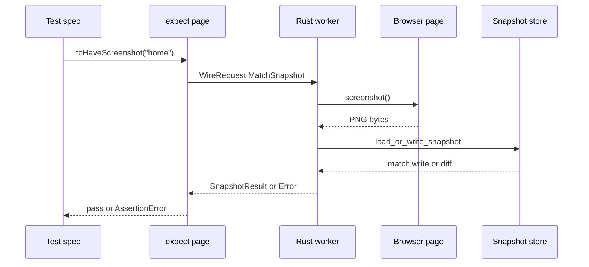
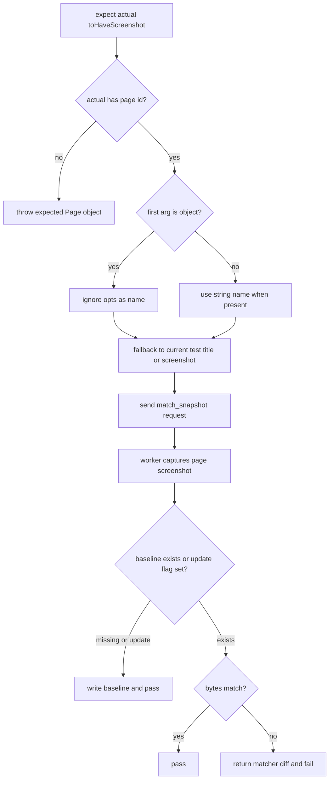
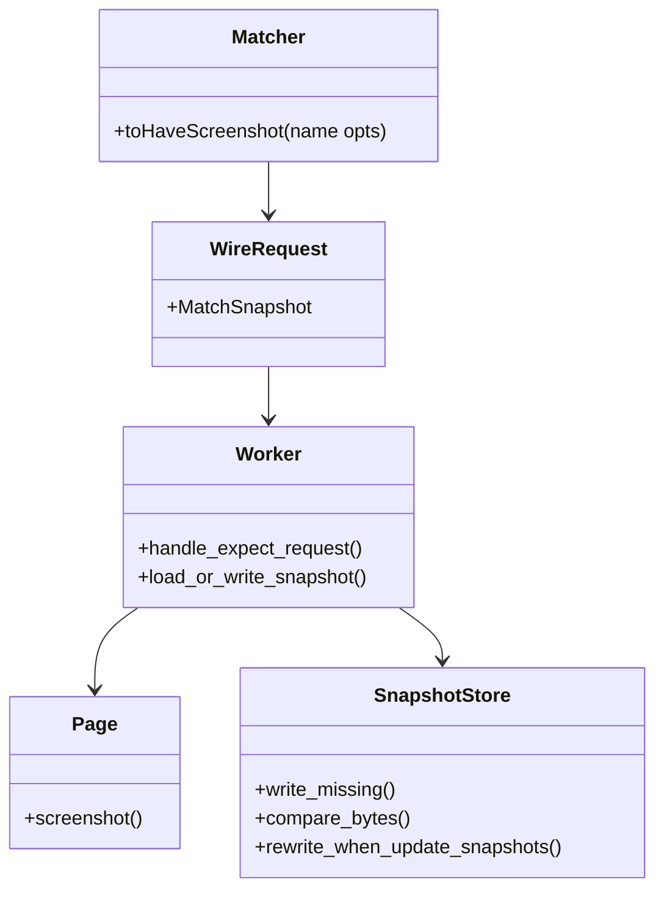

# Jet To Have Screenshot Matcher

## Changes
<!-- type: changes lang: yaml -->

```yaml
changes:
  - path: ".aw/tech-design/projects/jet/logic/to-have-screenshot.md"
    action: modify
    section: doc
    impl_mode: hand-written
    description: |
      Legacy Jet TD content retained as notes during AW standardization.
      Rewrite this file into semantic TD sections before promoting source to CODEGEN.
```

## Legacy notes
<!-- type: doc lang: markdown -->

# Jet To Have Screenshot Matcher

### Overview

This spec owns the current MVP `expect(page).toHaveScreenshot(name?, opts?)`
matcher. The matcher is a page-only alias over the existing `match_snapshot`
wire path: it captures a PNG screenshot, stores or compares it against
`__snapshots__/<spec-slug>/<name>.png`, and fails on byte mismatch. It does not
yet implement Playwright's pixel-diff tolerance options, and it intentionally
rejects locator targets.

### Owned Surface

| Area | Source | Responsibility |
|------|--------|----------------|
| Expect wiring | `crates/jet/runtime/test/index.js` | `toHaveScreenshot`, page target validation, name fallback, error formatting |
| Wire request | `crates/jet/src/test_runner/wire.rs` | `WireRequest::MatchSnapshot` and `WireResponse::SnapshotResult` |
| Snapshot storage | `crates/jet/src/test_runner/worker.rs` | Screenshot capture plus `load_or_write_snapshot` byte comparison |
| Page screenshot | `crates/jet/src/cdp_driver/page_binding.rs` | Page screenshot request and base64 PNG response |
| Integration tests | `crates/jet/tests/to_have_screenshot_tests.rs` | Baseline creation, named screenshot, and locator rejection |

### Requirements

```mermaid
---
id: jet-to-have-screenshot-requirements
entry: S1
---
requirementDiagram
    requirement S1 {
        id: S1
        text: toHaveScreenshot without a name uses current test title as snapshot name
        risk: high
        verifymethod: test
    }
    requirement S2 {
        id: S2
        text: toHaveScreenshot with a string name writes or compares that named PNG baseline
        risk: high
        verifymethod: test
    }
    requirement S3 {
        id: S3
        text: opts only first argument falls back to current test title
        risk: medium
        verifymethod: test
    }
    requirement S4 {
        id: S4
        text: locator targets are rejected with expected Page object message
        risk: medium
        verifymethod: test
    }
    requirement S5 {
        id: S5
        text: byte mismatch reports a toHaveScreenshot message with expected and actual byte counts
        risk: medium
        verifymethod: test
    }
    requirement S6 {
        id: S6
        text: update snapshots rewrites the baseline through the shared snapshot path
        risk: medium
        verifymethod: test
    }
```



### Scenarios

```yaml
scenarios:
  - id: TS1
    requirement: S1
    title: First run writes default baseline and second run matches
  - id: TS2
    requirement: S2
    title: Named baseline writes home.png
  - id: TS3
    requirement: S4
    title: Locator target throws expected Page object error
  - id: TS4
    requirement: S5
    title: Mismatch surfaces shared snapshot diff message
  - id: TS5
    requirement: S6
    title: Update snapshots refreshes existing baseline
```

### Interaction



### Logic



### Dependency Model



### Data Schema

```yaml
matcher_call:
  target: Page
  args:
    name:
      type: "string | object | undefined"
      object_meaning: opts only shorthand, ignored for name selection
    opts:
      type: object
      status: accepted but not interpreted by MVP
snapshot_name_resolution:
  order:
    - string name argument
    - current test title
    - screenshot
snapshot_path:
  pattern: "<spec-dir>/__snapshots__/<spec-slug>/<snapshot-name>.png"
comparison:
  mode: byte_exact
  diff:
    fields: [expected_byte_count, actual_byte_count]
```

### Test Plan

```mermaid
---
id: jet-to-have-screenshot-test-plan
entry: T1
---
requirementDiagram
    requirement S1 {
        id: S1
        text: default baseline
        risk: high
        verifymethod: test
    }
    requirement S2 {
        id: S2
        text: named baseline
        risk: high
        verifymethod: test
    }
    requirement S4 {
        id: S4
        text: locator rejected
        risk: medium
        verifymethod: test
    }
    element T1 {
        type: test
        docref: cargo test -p jet --test to_have_screenshot_tests
    }
```

### Execution

```bash
cargo test -p jet --test to_have_screenshot_tests
```

### Coverage Matrix

| Requirement | Test functions |
|-------------|----------------|
| S1 | `ts1_first_run_writes_second_matches` |
| S2 | `ts2_named_baseline` |
| S3 | Covered by matcher name resolution path in `index.js`; no dedicated test |
| S4 | `ts3_locator_rejected` |
| S5 | Shared with `toMatchSnapshot` mismatch behavior |
| S6 | Shared with `toMatchSnapshot` update snapshots behavior |

### Changes

```yaml
files:
  - path: .aw/tech-design/crates/jet/logic/to-have-screenshot.md
    action: ADD
    impl_mode: hand-written
    desc: Re-home the toHaveScreenshot TD as a checker-compliant current-state contract.

  - path: .aw/tech-design/crates/jet/testing/to-have-screenshot.md
    action: DELETE
    impl_mode: hand-written
    desc: Remove the unexpected top-level testing directory copy of this TD.

  - path: crates/jet/runtime/test/index.js
    action: NONE
    impl_mode: hand-written
    desc: Existing expect page toHaveScreenshot matcher.

  - path: crates/jet/src/test_runner/worker.rs
    action: NONE
    impl_mode: hand-written
    desc: Existing MatchSnapshot handling and snapshot storage logic.

  - path: crates/jet/tests/to_have_screenshot_tests.rs
    action: NONE
    impl_mode: hand-written
    desc: Existing integration tests for baseline write match named snapshot and locator rejection.
```
