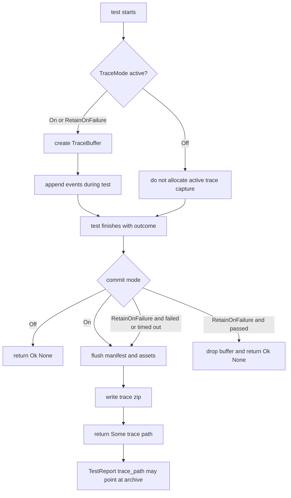
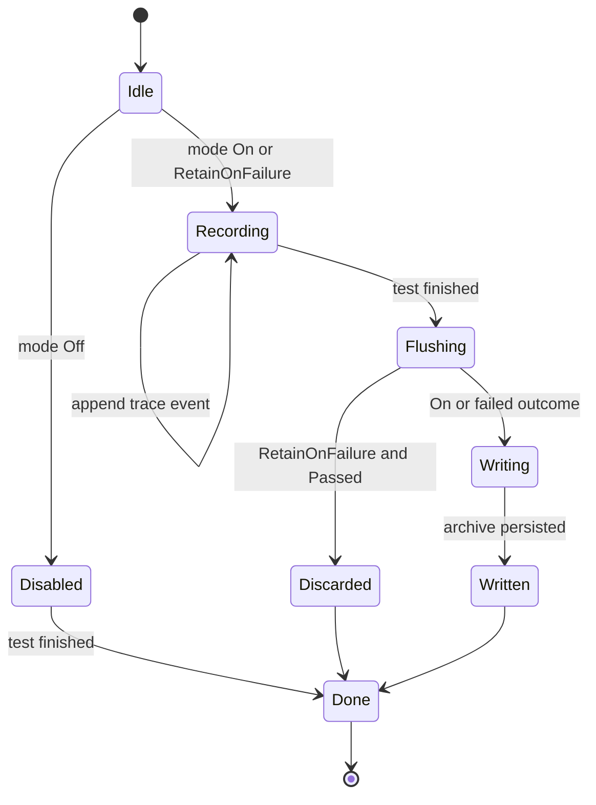
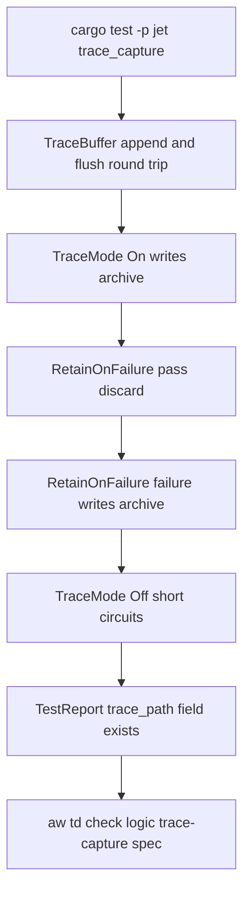

# Jet Trace Capture

## Changes
<!-- type: changes lang: yaml -->

```yaml
changes:
  - path: ".aw/tech-design/projects/jet/logic/trace-capture.md"
    action: modify
    section: doc
    impl_mode: hand-written
    description: |
      Legacy Jet TD content retained as notes during AW standardization.
      Rewrite this file into semantic TD sections before promoting source to CODEGEN.
```

## Legacy notes
<!-- type: doc lang: markdown -->

# Jet Trace Capture

### Overview

This spec owns Jet's trace capture buffer and commit gate. `TraceBuffer` is an
in-memory append-only per-test buffer created when trace mode is active. At test
end, `commit_trace` flushes the buffer to a trace archive or discards it based
on `TraceMode` and the test outcome.

| Area | Source | Responsibility |
|------|--------|----------------|
| Trace buffer | `crates/jet/src/trace/buffer.rs` | Append action, console, network, screenshot, and DOM snapshot events |
| Trace mode | `crates/jet/src/trace/buffer.rs` | Off, On, and RetainOnFailure capture policy |
| Wire trace mode | `crates/jet/src/test_runner/wire.rs` | CLI-facing trace mode parsing and runner config transport |
| Reporter link | `crates/jet/src/test_runner/reporter.rs` | Optional `trace_path` carried with each `TestReport` |
| CLI parsing | `crates/jet/src/cli.rs` | Parse `--trace=<mode>` into `WireTraceMode` |

The trace archive path convention is
`.jet/test-results/<spec-slug>/<test-slug>/trace.zip`. HTML reporting can use
the per-test `trace_path` value to render deep links to trace artifacts.

### Requirements

```mermaid
---
id: jet-trace-capture-requirements
entry: TC1
---
requirementDiagram
    requirement TC1 {
        id: TC1
        text: TraceMode Off allocates no active capture path and commit returns no archive
        risk: medium
        verifymethod: test
    }
    requirement TC2 {
        id: TC2
        text: TraceMode On writes a trace archive for every completed test
        risk: high
        verifymethod: test
    }
    requirement TC3 {
        id: TC3
        text: RetainOnFailure writes only failed or timed out test traces
        risk: high
        verifymethod: test
    }
    requirement TC4 {
        id: TC4
        text: TraceBuffer records action step console network screenshot and DOM snapshot events
        risk: high
        verifymethod: test
    }
    requirement TC5 {
        id: TC5
        text: TestReport can carry optional trace_path for reporter deep links
        risk: medium
        verifymethod: test
    }
    requirement TC6 {
        id: TC6
        text: WireTraceMode accepts off on and retain-on-failure strings
        risk: medium
        verifymethod: test
    }
```

### Scenarios

```yaml
scenarios:
  - id: S1
    requirement: TC1
    title: TraceMode Off short circuits commit without touching disk
  - id: S2
    requirement: TC2
    title: TraceMode On writes trace zip for a passing test
  - id: S3
    requirement: TC3
    title: RetainOnFailure discards passing test buffer
  - id: S4
    requirement: TC3
    title: RetainOnFailure writes failed test trace zip
  - id: S5
    requirement: TC4
    title: Buffer append and flush round trip preserves all event families
  - id: S6
    requirement: TC5
    title: TestReport exposes optional trace_path field for report consumers
  - id: S7
    requirement: TC6
    title: CLI trace mode parser maps supported strings to WireTraceMode values
```

### Logic



### State Machine



### Schema

```yaml
schemas:
  TraceMode:
    rust_type: TraceMode
    variants:
      - Off
      - On
      - RetainOnFailure
    parse_values:
      off: Off
      on: On
      retain-on-failure: RetainOnFailure
  WireTraceMode:
    rust_type: WireTraceMode
    variants:
      - Off
      - On
      - RetainOnFailure
  TraceBuffer:
    rust_type: TraceBuffer
    fields:
      test_id:
        type: string
      spec_path:
        type: string
      title:
        type: string
      events:
        type: array
        items: TraceEvent
  TestReportTraceLink:
    rust_type: TestReport.trace_path
    type: Option<PathBuf>
    serialization: omitted when none
```

### Test Plan



### Changes

```yaml
changes:
  - path: .aw/tech-design/crates/jet/logic/trace-capture.md
    action: create
    section: doc
    purpose: Re-home and normalize the trace capture TD as a logic spec.
    impl_mode: hand-written
  - path: .aw/tech-design/crates/jet/testing/trace-capture.md
    action: delete
    section: doc
    purpose: Remove the stale testing-directory note without section annotations.
    impl_mode: hand-written
  - path: crates/jet/src/trace/buffer.rs
    action: none
    section: doc
    purpose: Existing TraceBuffer and commit logic described by this spec.
    impl_mode: hand-written
  - path: crates/jet/src/test_runner/wire.rs
    action: none
    section: doc
    purpose: Existing WireTraceMode parsing described by this spec.
    impl_mode: hand-written
  - path: crates/jet/src/test_runner/reporter.rs
    action: none
    section: doc
    purpose: Existing TestReport trace_path field described by this spec.
    impl_mode: hand-written
```
