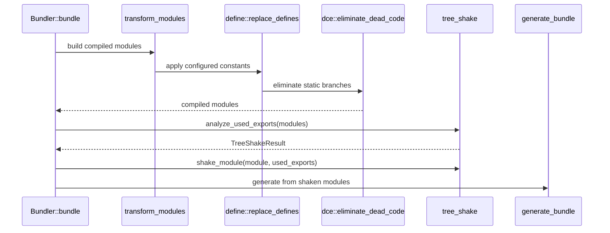
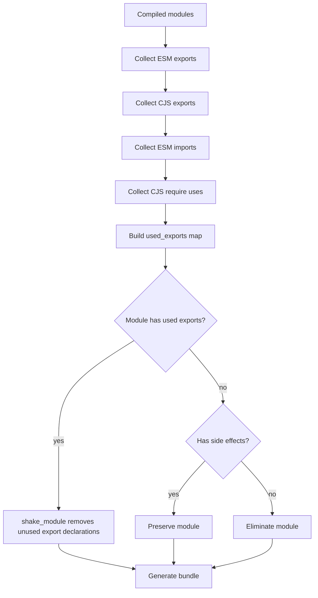
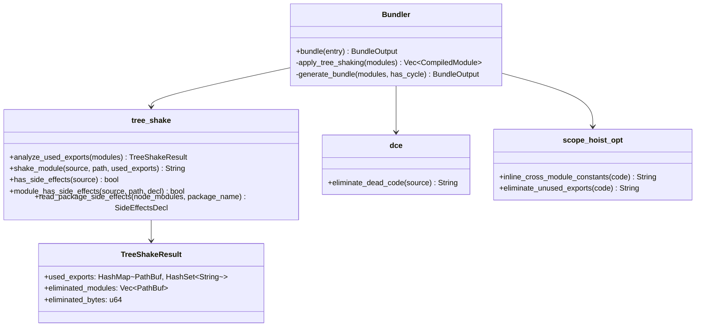

# Jet Tree Shaking

## Changes
<!-- type: changes lang: yaml -->

```yaml
changes:
  - path: ".aw/tech-design/projects/jet/logic/tree-shaking.md"
    action: modify
    section: doc
    impl_mode: hand-written
    description: |
      Legacy Jet TD content retained as notes during AW standardization.
      Rewrite this file into semantic TD sections before promoting source to CODEGEN.
```

## Legacy notes
<!-- type: doc lang: markdown -->

# Jet Tree Shaking

### Overview

Tree shaking removes unused JavaScript exports before bundle generation. The
current Jet pipeline treats tree shaking as a post-transform module pass:

1. `Bundler::transform_modules` emits compiled module code.
2. `define::replace_defines` applies compile-time constants when configured.
3. `dce::eliminate_dead_code` removes branches made static by define replacement.
4. `Bundler::apply_tree_shaking` calls `tree_shake::analyze_used_exports`.
5. `tree_shake::shake_module` removes unused export declarations.
6. `generate_bundle` selects runtime, Phase 1 scope hoisting, or Phase 2 flat
   scope generation.

This spec owns the per-module tree-shaking contract in
`crates/jet/src/bundler/tree_shake.rs`, the define-after-DCE precondition in
`crates/jet/src/bundler/dce.rs`, and the bundler pipeline handoff in
`crates/jet/src/bundler/mod.rs`. Cross-module optimization after flattening is
covered by `logic/scope-hoisting.md`.

### Current Source Contracts

| Contract | Source | Runtime role |
|----------|--------|--------------|
| Used-export analysis | `crates/jet/src/bundler/tree_shake.rs` | Collect ESM and CJS imports/exports into `TreeShakeResult` |
| Module shaking | `crates/jet/src/bundler/tree_shake.rs` | Drop unused `export` declarations or whole side-effect-free modules |
| Side-effect declaration | `crates/jet/src/bundler/tree_shake.rs` | Interpret npm `package.json` `sideEffects` declarations |
| Define DCE | `crates/jet/src/bundler/dce.rs` | Remove statically false `if` and ternary branches after constants are replaced |
| Pipeline integration | `crates/jet/src/bundler/mod.rs` | Run tree shaking before bundle format selection |
| Flat-scope follow-up | `crates/jet/src/bundler/scope_hoist_opt.rs` | Inline constants and eliminate unused prefixed exports after flattening |

### Requirements

```mermaid
---
id: jet-tree-shaking-requirements
entry: R1
---
requirementDiagram
    requirement R1 {
        id: R1
        text: Define replacement must enable branch DCE
        risk: high
        verifymethod: test
    }
    requirement R2 {
        id: R2
        text: ESM imports mark target exports as used
        risk: high
        verifymethod: test
    }
    requirement R3 {
        id: R3
        text: CJS require and exports patterns participate in used export analysis
        risk: high
        verifymethod: test
    }
    requirement R4 {
        id: R4
        text: Side-effectful modules are preserved
        risk: high
        verifymethod: test
    }
    requirement R5 {
        id: R5
        text: Bundler runs tree shaking before bundle format selection
        risk: high
        verifymethod: inspection
    }
    requirement R6 {
        id: R6
        text: Flat-scope optimization remains owned by scope hoisting
        risk: medium
        verifymethod: inspection
    }
```

### R1: Define-Driven Dead Code Elimination

```yaml
id: R1
priority: high
status: implemented
source:
  - crates/jet/src/bundler/dce.rs
```

After `define::replace_defines` substitutes static values such as
`process.env.NODE_ENV`, DCE must remove statically unreachable branches. It must
handle string and boolean equality checks, simple `if`/`else` blocks, and
ternary expressions without slicing UTF-8 source at invalid byte offsets.

### R2: ESM Used-Export Analysis

```yaml
id: R2
priority: high
status: implemented
source:
  - crates/jet/src/bundler/tree_shake.rs
```

The analyzer must collect exported ESM names from `export const`, `export let`,
`export var`, `export function`, `export class`, `export default`, and
`export { ... }` declarations. ESM imports must mark named, default, and
namespace imports as used on the resolved target module.

### R3: CommonJS Used-Export Analysis

```yaml
id: R3
priority: high
status: implemented
source:
  - crates/jet/src/bundler/tree_shake.rs
```

The analyzer must collect CJS exports from `exports.name = ...` and
`module.exports = { ... }`. It must mark destructured `require()` bindings and
direct property access (`require("pkg").name`, `require("pkg")["name"]`) as
used exports on the target module.

### R4: Side-Effect Preservation

```yaml
id: R4
priority: high
status: implemented
source:
  - crates/jet/src/bundler/tree_shake.rs
```

Tree shaking must not remove modules with side effects. The checker uses
conservative source analysis by default, honors npm `sideEffects: false`, and
honors glob arrays by treating only matching files as side-effectful.

### R5: Bundler Pipeline Integration

```yaml
id: R5
priority: high
status: implemented
source:
  - crates/jet/src/bundler/mod.rs
```

`Bundler::bundle` must run `apply_tree_shaking` after module transformation and
before `generate_bundle`. If analysis fails, the bundler must log the failure
and continue with the original modules rather than breaking the build.

### R6: Bundle Optimization Boundary

```yaml
id: R6
priority: medium
status: implemented
source:
  - crates/jet/src/bundler/scope_hoist_opt.rs
```

Per-module tree shaking stops at export/module elimination. Cross-module
constant inlining and flattened-scope export DCE run later inside the
scope-hoisting pipeline and remain specified by `logic/scope-hoisting.md`.

### Scenarios

```yaml
scenarios:
  - id: S1
    requirement: R1
    title: NODE_ENV branch is removed
  - id: S2
    requirement: R1
    title: React production branch wins
  - id: S3
    requirement: R2
    title: Named ESM import keeps only used export
  - id: S4
    requirement: R2
    title: Namespace import keeps all exports
  - id: S5
    requirement: R3
    title: CJS require property marks export used
  - id: S6
    requirement: R4
    title: Side-effect-free module can be eliminated
  - id: S7
    requirement: R4
    title: Side-effect module is preserved
```

### S1: NODE_ENV Branch Is Removed

1. Given transformed source contains `if ("production" !== "production") { dead(); }`.
2. When `dce::eliminate_dead_code` runs.
3. Then the dead block is removed.
4. Then surrounding live code remains in source order.

### S2: React Production Branch Wins

1. Given React's CJS index has a development and production branch.
2. Given define replacement has made the environment comparison static.
3. When DCE runs.
4. Then the production branch remains.
5. Then the development `require()` target is removed from the transformed source.

### S3: Named ESM Import Keeps Only Used Export

1. Given `a.js` exports `used` and `unused`.
2. Given `b.js` imports `{ used }` from `a.js`.
3. When used-export analysis and `shake_module` run.
4. Then `used` remains.
5. Then the `unused` export declaration is removed if the module has no required side effect.

### S4: Namespace Import Keeps All Exports

1. Given `b.js` imports `* as A` from `a.js`.
2. When `extract_imported_names` parses the import.
3. Then the wildcard marker records that all target exports are used.
4. Then tree shaking must not remove any export from `a.js` on that basis.

### S5: CJS Require Property Marks Export Used

1. Given `app.js` reads `require("react")["jsx"]`.
2. Given `react.js` assigns `exports.jsx`.
3. When CJS analysis runs.
4. Then `jsx` is marked as used for the React module.
5. Then unrelated exports such as `useEffect` may be removed if unused.

### S6: Side-Effect-Free Module Can Be Eliminated

1. Given a module has exports, no used imports, and no side effects.
2. When `analyze_used_exports` evaluates the module set.
3. Then the module path is included in `TreeShakeResult.eliminated_modules`.
4. Then `Bundler::apply_tree_shaking` filters it before bundle generation.

### S7: Side-Effect Module Is Preserved

1. Given a module writes top-level global state or is matched by a side-effect glob.
2. When tree shaking evaluates the module.
3. Then the module is preserved even when its exports are unused.

### Interaction



### Logic



### Dependency Model



### Schema

```yaml
$schema: "https://json-schema.org/draft/2020-12/schema"
$id: "jet://schemas/tree-shake-result"
title: TreeShakeResult
type: object
required:
  - used_exports
  - eliminated_modules
  - eliminated_bytes
properties:
  used_exports:
    type: object
    additionalProperties:
      type: array
      items:
        type: string
    description: Module path to used export names.
  eliminated_modules:
    type: array
    items:
      type: string
    description: Module paths removed because they have no used exports and no side effects.
  eliminated_bytes:
    type: integer
    minimum: 0
    description: Approximate removed source byte count.
definitions:
  SideEffectsDecl:
    oneOf:
      - type: string
        enum: [None, All]
      - type: object
        required: [Globs]
        properties:
          Globs:
            type: array
            items:
              type: string
```

### Test Plan

```mermaid
---
id: jet-tree-shaking-test-plan
entry: T1
---
requirementDiagram
    requirement R1 {
        id: R1
        text: Define DCE
        risk: high
        verifymethod: test
    }
    requirement R2 {
        id: R2
        text: ESM analysis
        risk: high
        verifymethod: test
    }
    requirement R3 {
        id: R3
        text: CJS analysis
        risk: high
        verifymethod: test
    }
    requirement R4 {
        id: R4
        text: Side-effect preservation
        risk: high
        verifymethod: test
    }
    element T1 {
        type: test
        docref: cargo test -p jet bundler::dce::tests
    }
    element T2 {
        type: test
        docref: cargo test -p jet bundler::tree_shake::tests
    }
    element T3 {
        type: test
        docref: cargo test -p jet bundler::tests::test_phase2_pipeline_with_cross_module_dce
    }
```

### Unit Commands

```bash
cargo test -p jet bundler::tree_shake::tests
cargo test -p jet bundler::dce::tests
cargo test -p jet bundler::tests::test_phase2_pipeline_with_cross_module_dce
```

### Coverage Matrix

| Requirement | Existing coverage |
|-------------|-------------------|
| R1 | `dce::tests::test_dce_if_false_removed`, `test_dce_if_else_keeps_true_branch`, `test_dce_ternary_false`, `test_dce_with_multibyte_utf8` |
| R2 | `tree_shake::tests::test_extract_export_names`, `test_extract_imported_names`, `test_namespace_import`, `test_shake_removes_unused` |
| R3 | `tree_shake::tests::test_cjs_export_names_exports_dot`, `test_cjs_export_names_module_exports_object`, `test_cjs_destructured_require`, `test_cjs_full_analysis` |
| R4 | `tree_shake::tests::test_has_side_effects`, `test_side_effects_decl_false`, `test_module_has_side_effects_globs_matching` |
| R5 | `bundler::tests` around bundle generation and Phase 2 pipeline behavior |
| R6 | `scope_hoist_opt` unit tests and `logic/scope-hoisting.md` |

### Pass Criteria

- Tree-shaking tests pass without ignored cases.
- DCE tests pass and include UTF-8 source coverage.
- Phase 2 bundle pipeline tests still pass after tree-shaken module lists are generated.

### Changes

```yaml
files:
  - path: .aw/tech-design/crates/jet/tree-shaking.md
    action: DELETE
    impl_mode: hand-written
    desc: Remove loose crate-root spec file. Crate root may contain README.md only.

  - path: .aw/tech-design/crates/jet/logic/tree-shaking.md
    action: ADD
    impl_mode: hand-written
    desc: Re-home tree-shaking contract under logic/ and replace old placeholder sections with checkable sections.

  - path: crates/jet/src/bundler/tree_shake.rs
    action: NONE
    impl_mode: hand-written
    desc: Existing implementation owns ESM and CJS used-export analysis, side-effect declarations, and module shaking.

  - path: crates/jet/src/bundler/dce.rs
    action: NONE
    impl_mode: hand-written
    desc: Existing implementation owns define-driven branch and ternary elimination before tree shaking.

  - path: crates/jet/src/bundler/mod.rs
    action: NONE
    impl_mode: hand-written
    desc: Existing implementation invokes apply_tree_shaking before bundle format selection.
```
