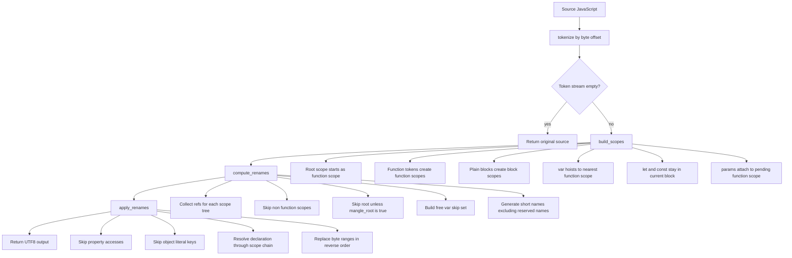
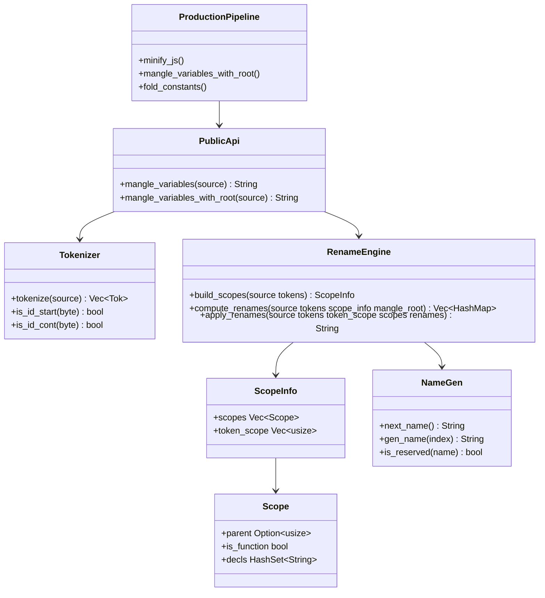

# Jet Variable Mangling

## Changes
<!-- type: changes lang: yaml -->

```yaml
changes:
  - path: ".aw/tech-design/projects/jet/logic/variable-mangling.md"
    action: modify
    section: doc
    impl_mode: hand-written
    description: |
      Legacy Jet TD content retained as notes during AW standardization.
      Rewrite this file into semantic TD sections before promoting source to CODEGEN.
```

## Legacy notes
<!-- type: doc lang: markdown -->

# Jet Variable Mangling

### Overview

This spec owns Jet's current variable-mangling pass. The pass is a
token-driven JavaScript identifier compressor used after bundle minification.
It does not attempt to be a full JavaScript parser; it builds enough lexical
and scope structure to rename local bindings while preserving property names,
string contents, regex literals, comments, globals, and module-level bindings
unless the caller explicitly marks root scope as safe.

### Owned Surface

| Area | Source | Responsibility |
|------|--------|----------------|
| Public API | `crates/jet/src/bundler/mangle.rs` | `mangle_variables` and `mangle_variables_with_root` |
| Tokenizer | `crates/jet/src/bundler/mangle.rs` | Byte-offset token stream for identifiers, strings, numbers, regexes, and punctuation |
| Scope analysis | `crates/jet/src/bundler/mangle.rs` | Root, function, block, `var`, `let`, `const`, parameter, and function-name declarations |
| Rename computation | `crates/jet/src/bundler/mangle.rs` | Per-function short-name maps that avoid free vars and reserved names |
| Rename application | `crates/jet/src/bundler/mangle.rs` | Reverse byte-range replacement for resolved identifier tokens |
| Production pipeline | `crates/jet/src/cli.rs`, `crates/jet/src/bundler/mod.rs` | Calls root-scope mangling after minify for safe scope-hoisted bundles |

### Requirements

```mermaid
---
id: jet-variable-mangling-requirements
entry: R1
---
requirementDiagram
    requirement R1 {
        id: R1
        text: Tokenization records byte ranges for identifiers strings numbers regexes and punctuation
        risk: high
        verifymethod: test
    }
    requirement R2 {
        id: R2
        text: Scope analysis tracks root function block params function names and declaration kinds
        risk: high
        verifymethod: test
    }
    requirement R3 {
        id: R3
        text: Normal mangling preserves module level bindings and renames shorter local bindings
        risk: high
        verifymethod: test
    }
    requirement R4 {
        id: R4
        text: Root mangling compresses safe scope hoisted bundle names inside an IIFE
        risk: high
        verifymethod: test
    }
    requirement R5 {
        id: R5
        text: Property accesses and object literal keys are never renamed
        risk: high
        verifymethod: test
    }
    requirement R6 {
        id: R6
        text: Rename generation skips reserved keywords globals free vars and non shorter names
        risk: high
        verifymethod: test
    }
    requirement R7 {
        id: R7
        text: UTF8 string contents remain byte safe after replacement
        risk: high
        verifymethod: test
    }
    requirement R8 {
        id: R8
        text: The production pipeline runs mangling after minify and before constant folding cleanup
        risk: medium
        verifymethod: test
    }
```



### Scenarios

```yaml
scenarios:
  - id: S1
    requirement: R3
    title: Function local variable receives a shorter name
  - id: S2
    requirement: R3
    title: Function parameters are renamed consistently
  - id: S3
    requirement: R5
    title: Property access and object literal keys survive unchanged
  - id: S4
    requirement: R3
    title: Module level variable remains stable with normal mangling
  - id: S5
    requirement: R4
    title: Root scope names are compressed when caller opts in
  - id: S6
    requirement: R2
    title: Nested functions and multi variable declarations keep correct scope state
  - id: S7
    requirement: R6
    title: Reserved and global names are not generated or renamed
  - id: S8
    requirement: R7
    title: UTF8 strings remain unchanged while adjacent identifiers are mangled
  - id: S9
    requirement: R8
    title: Flattened production bundle loses prefixed long names after the full pipeline
```

### Logic



### Dependency Model



### Data Schema

```yaml
types:
  Tok:
    fields:
      kind:
        enum: [Ident, Str, Num, Regex, Punct]
      start:
        type: usize
        meaning: byte offset inclusive
      end:
        type: usize
        meaning: byte offset exclusive
  Scope:
    fields:
      parent:
        type: Option<usize>
      is_function:
        type: bool
      decls:
        type: HashSet<String>
  ScopeInfo:
    fields:
      scopes:
        type: Vec<Scope>
      token_scope:
        type: Vec<usize>
  RenameMap:
    type: Vec<HashMap<String, String>>
    invariant: index matches ScopeInfo.scopes index
```

### Test Plan

```mermaid
---
id: jet-variable-mangling-test-plan
entry: T1
---
requirementDiagram
    requirement R3 {
        id: R3
        text: local mangling and module preservation
        risk: high
        verifymethod: test
    }
    requirement R4 {
        id: R4
        text: root mangling for scope hoisted bundles
        risk: high
        verifymethod: test
    }
    requirement R5 {
        id: R5
        text: property and object key preservation
        risk: high
        verifymethod: test
    }
    requirement R7 {
        id: R7
        text: UTF8 byte safety
        risk: high
        verifymethod: test
    }
    element T1 {
        type: test
        docref: cargo test -p jet bundler::mangle::tests
    }
    element T2 {
        type: test
        docref: cargo test -p jet bundler::tests::test_phase2_pipeline_compresses_prefixed_names
    }
    element T3 {
        type: test
        docref: cargo test -p jet bundler::tests::test_phase2_pipeline_two_modules_no_collision
    }
```

### Execution

```bash
cargo test -p jet bundler::mangle::tests
cargo test -p jet bundler::tests::test_phase2_pipeline_compresses_prefixed_names
cargo test -p jet bundler::tests::test_phase2_pipeline_two_modules_no_collision
cargo test -p jet bundler::tests::test_phase2_pipeline_size_smaller_than_phase1
```

### Coverage Matrix

| Requirement | Test functions |
|-------------|----------------|
| R1 | `test_string_content_preserved`, `test_utf8_string_content_unchanged`, `test_utf8_mixed_code_and_strings` |
| R2 | `test_nested_function_mangling`, `test_multi_var_with_object_literal`, `test_multi_var_with_object_containing_functions` |
| R3 | `test_simple_var_mangling`, `test_param_mangling`, `test_module_level_not_mangled` |
| R4 | `test_outer_iife_vars_mangled_with_root`, `test_iife_vars_mangled_with_root`, `test_phase2_pipeline_compresses_prefixed_names` |
| R5 | `test_property_access_preserved` |
| R6 | `test_globals_preserved`, `test_reserved_skipped`, `test_keywords_not_generated`, `test_wrapper_function_mangling` |
| R7 | `test_utf8_string_content_unchanged`, `test_utf8_emoji_in_string_preserved`, `test_utf8_cjk_in_string_preserved`, `test_utf8_mixed_code_and_strings` |
| R8 | `test_phase2_pipeline_compresses_prefixed_names`, `test_phase2_pipeline_two_modules_no_collision`, `test_phase2_pipeline_size_smaller_than_phase1` |

### Changes

```yaml
files:
  - path: .aw/tech-design/crates/jet/logic/variable-mangling.md
    action: ADD
    impl_mode: hand-written
    desc: Re-home the loose root variable mangling spec as a checker-compliant current-state contract.

  - path: .aw/tech-design/crates/jet/variable-mangling.md
    action: DELETE
    impl_mode: hand-written
    desc: Remove the crate-root loose spec file because only README.md is allowed at that level.

  - path: crates/jet/src/bundler/mangle.rs
    action: NONE
    impl_mode: hand-written
    desc: Existing token-driven scope analysis and rename application implementation.

  - path: crates/jet/src/cli.rs
    action: NONE
    impl_mode: hand-written
    desc: Existing production post-processing pipeline calls mangle_variables_with_root after minify.

  - path: crates/jet/src/bundler/mod.rs
    action: NONE
    impl_mode: hand-written
    desc: Existing flattened bundle tests cover prefixed-name compression and collision safety.
```
