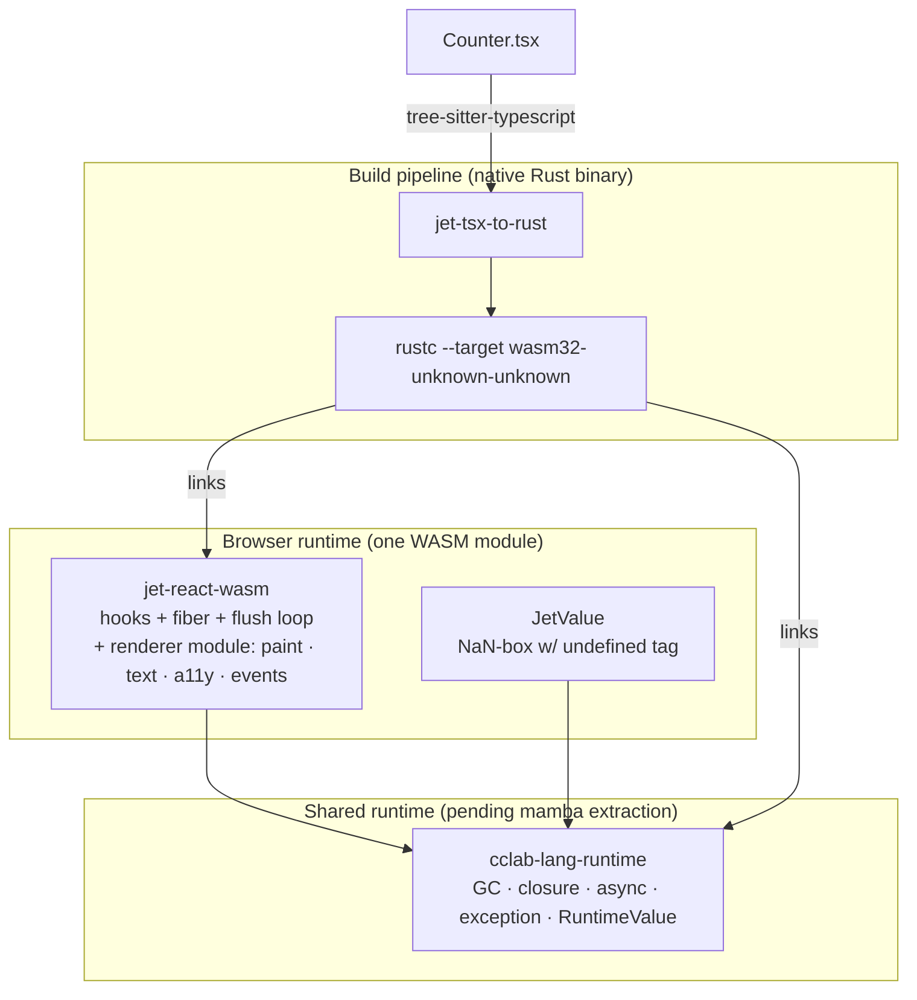
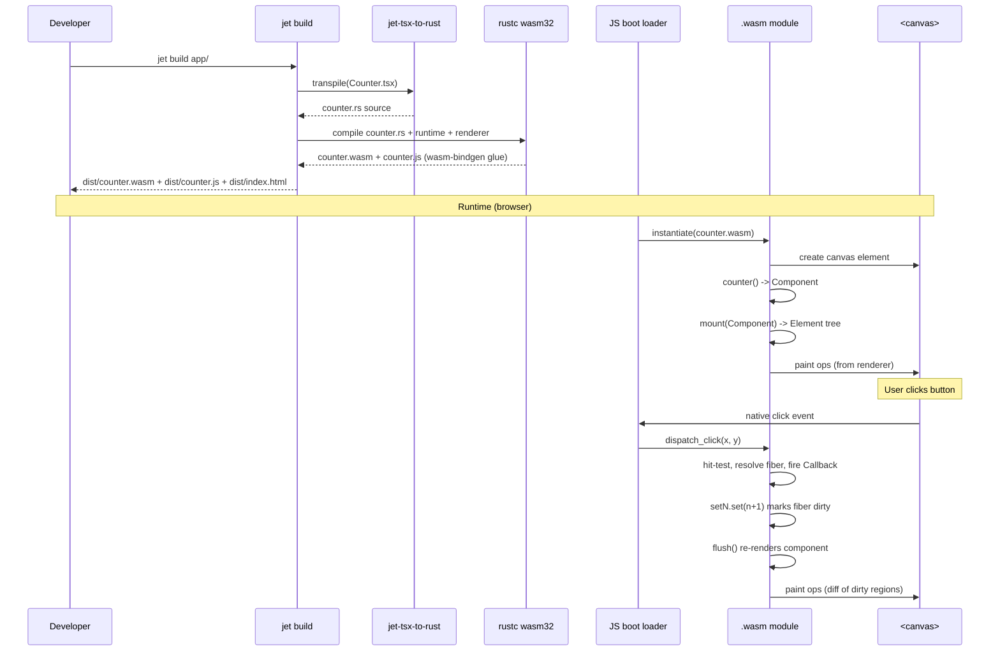
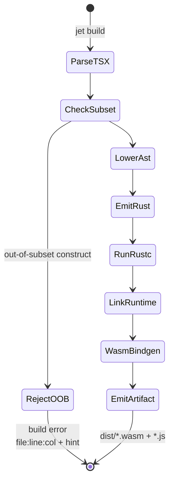
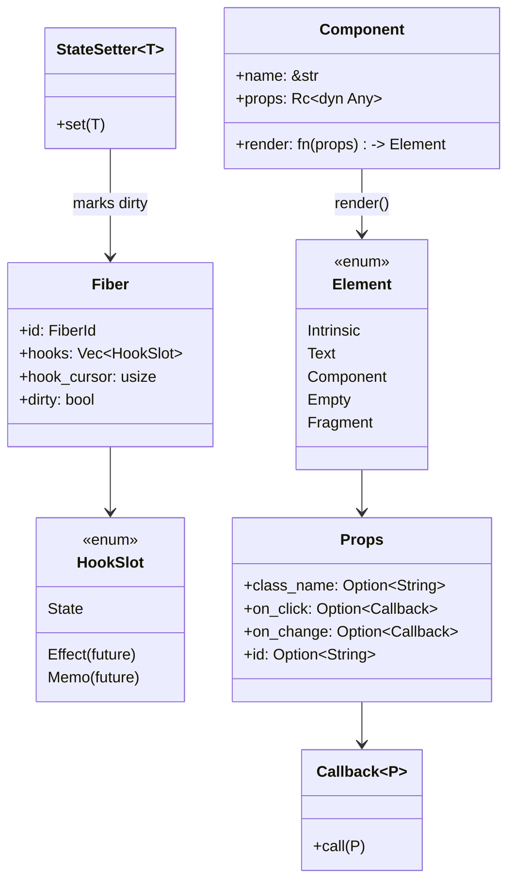
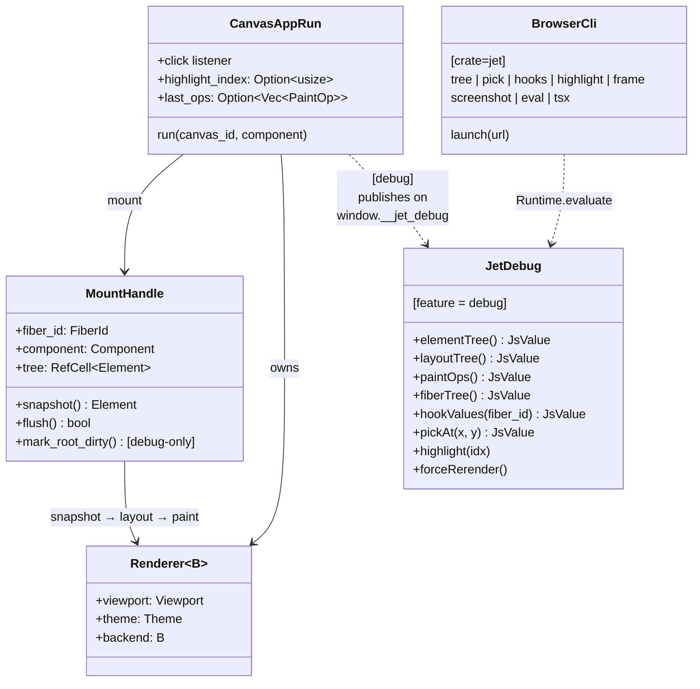

# jet WASM renderer — architecture

## Changes
<!-- type: changes lang: yaml -->

```yaml
changes:
  - path: ".aw/tech-design/projects/jet/logic/wasm-renderer-architecture.md"
    action: modify
    section: doc
    impl_mode: hand-written
    description: |
      Legacy Jet TD content retained as notes during AW standardization.
      Rewrite this file into semantic TD sections before promoting source to CODEGEN.
```

## Legacy notes
<!-- type: doc lang: markdown -->

# jet WASM renderer — architecture

### Overview

Umbrella architecture doc for the TSX → WASM pipeline. This doc is
the entry point; every WASM renderer sub-spec refers back to the
module boundaries defined here.

What the pipeline delivers end-to-end:

```
   Developer writes              Build (jet)                  Browser runtime
┌──────────────────┐       ┌──────────────────────┐        ┌────────────────────┐
│   Counter.tsx    │       │ 1. tree-sitter parse │        │   <canvas>         │
│                  │       │    .tsx → AST        │        │       ▲            │
│  function        │       │                      │        │       │ paint ops  │
│  Counter({start}│ ───▶  │ 2. AST → Rust source │ ───▶   │  ┌────┴────────┐   │
│  ) {             │       │    (jet-tsx-to-rust) │        │  │ jet-react-   │  │
│    useState...   │       │                      │        │  │   wasm-      │  │
│    return <...>; │       │ 3. rustc             │        │  │   runtime    │  │
│  }               │       │    --target wasm32   │        │  │ (hooks +     │  │
└──────────────────┘       │                      │        │  │  fiber +     │  │
                           │ 4. emit .wasm bundle │        │  │  commit loop)│  │
                           └──────────────────────┘        │  └──────┬───────┘  │
                                                           │         │          │
                                                           │   Element tree     │
                                                           │         │          │
                                                           │  ┌──────▼───────┐  │
                                                           │  │ renderer     │  │
                                                           │  │ (paint,      │  │
                                                           │  │  text, a11y) │  │
                                                           │  └──────────────┘  │
                                                           └────────────────────┘
```

All three boxes in the "Browser runtime" column are Rust compiled to
the same WASM binary. No JS React runtime ships. The only JS is the
boot loader (≤ 5 KB) that instantiates the WASM module and provides
the wasm-bindgen bridge to browser APIs.

### Crate map



### Module boundaries

### Crates

| Crate | Role | Depends on | Ships to |
|---|---|---|---|
| `jet-tsx-to-rust` | TSX → Rust source transpiler. Runs at build time on the developer's machine. | tree-sitter-typescript | dev host |
| `jet-react-wasm` | Single browser-runtime crate: **runtime** (fiber + hooks + flush loop, `src/lib.rs`) + **renderer** (`src/renderer/`, layout + paint + backends). Feature-gated `canvas` backend for web-sys. | `cclab-lang-runtime` (future) | WASM module |
| `jet-wasm-renderer-poc` | Throwaway spike — measures the paint-pipeline floor on real Chromium. Not on the release path. | self-contained | — |
| `cclab-lang-runtime` (pending) | GC, closure, async executor, exception model, `RuntimeValue` NaN-box. Extracted from `mamba/src/runtime/` in ~6 weeks. | — | WASM module (+ native for mamba) |

Previously this doc split the browser-runtime work across two
crates (`jet-react-wasm-runtime` + `jet-react-wasm-renderer`). They
merged into one crate once it became clear the split was speculative:
a single consumer relationship (renderer depends on runtime), always
compiled into the same WASM artifact, tightly coupled at the
`Element` type. The feature flag still gates the web-sys dependency
so the pure-Rust test path stays fast.

### Current status per crate

| Crate | State | Tests | Ready to ship? |
|---|---|---|---|
| `jet-tsx-to-rust` | Counter + Toggle round-trip | 14/14 | **No** — narrow subset only |
| `jet-react-wasm` | Runtime v1 hooks + renderer v0 layout/paint | 33/33 | **No** — no useEffect, no reconciliation diffing, fixed-stack layout |
| `jet-wasm-renderer-poc` | Bench-validated | 9/9 | **N/A** — spike, not release path |
| `cclab-lang-runtime` | Not created | — | **Blocked** on mamba's CPython 3.12 conformance (~6 weeks) |

### Data flow — Counter example



### Design axioms

These invariants are load-bearing across every sub-spec. Any sub-spec
that appears to violate one must either relax the axiom here (with
ADR) or redesign itself.

- **A1 — TSX is the source of truth.** The transpiler's contract is
  that its output behaves identically to React+DOM for the subset it
  accepts. If the generated WASM diverges from what React would do,
  it's a transpiler bug, not a language "feature".
- **A2 — No JS React runtime ships.** The final bundle contains one
  WASM module + wasm-bindgen glue + a thin boot loader (≤ 5 KB).
  React, reconciler, hooks library are all Rust code inside the
  WASM.
- **A3 — Generic runtime primitives live in `cclab-lang-runtime`**
  (GC, closure, async executor, exception, RuntimeValue). Language-
  specific layers (mamba for Python, jet for TSX) wrap them.
- **A4 — Rust source is the transpiler's output format.** Not a
  bespoke IR, not WASM bytecode directly. This is both reviewable
  and lets rustc own optimisation. Mamba team confirmed this is
  the right choice (see `decisions/2026-04-23-mamba-runtime-extraction.md`).
- **A5 — The React-compat subset is enforced at build time.** Any
  TSX construct outside the subset fails the transpile step with
  `file:line:col` + the offending construct + a suggested rewrite.
  See `subset.md`.
- **A6 — Enterprise-first bundle strategy.** Day-1 load ≤ 2 s, day-2+
  cold start ≤ 200 ms via Chromium WASM code cache. Runtime-only
  slice ≤ 2 MB gzip. No lazy-loading on critical paths. See
  `bundle-strategy.md` (future).

### Build pipeline



The build is **single-pass per TSX file** (incremental comes with
HMR later — see `hmr-devtools.md`). Cross-file resolution happens
at the `rustc` / linker layer, not the transpiler layer.

### Runtime data structures



### Element::Fragment — transparent container

The `Element` enum carries a `Fragment(Vec<Element>)` variant in
addition to `Intrinsic` / `Text` / `Component` / `Empty`. A
Fragment has no layout box of its own — layout, paint, and hit-
testing walk *through* it as if its children were inlined into the
parent's child list. Produced today only by the transpiler's
`{[...Array(n)].map(...)}` lowering (see `transpiler.md`); future
sources include static array literals in JSX and `React.Fragment`
syntax (`<>…</>`) once the transpiler learns them.

The debug mirror (`DebugElement::Fragment`) surfaces Fragment as a
distinct node kind rather than flattening in the serialized form —
lying about the tree shape would make debug-bridge consumers
double-count children or miscount. See `debug-bridge.md`.

### Debug feature + event loop



The click event loop is installed by `canvas_app::run()` as part of
mount: a single `click` listener on the `<canvas>`, converting
viewport-space coords to canvas-space, hit-testing the cached
`LayoutTree`, firing the matched `on_click` callback, then if
`MountHandle::flush()` returns true, re-laying out and re-painting.
See `paint-runtime.md` for the detailed flow.

When the `debug` feature is active, `canvas_app::run()` additionally
constructs a `JetDebug` handle (sharing `Rc` clones of the handle,
layout tree, last-ops cache, and highlight-index cell) and publishes
it on `window.__jet_debug`. Disabled in release builds — the debug
module is feature-gated to keep bundle size + runtime overhead at
zero in production.

### Phased delivery map

| Phase | Covers | Tech design | Status |
|---|---|---|---|
| 1 | TSX→Rust transpiler (Counter-scope) | `transpiler.md` | **shipped** (8/8 unit + 3 scenario tests) |
| 2 | Rust React runtime (fiber + basic hooks) | `hooks-runtime.md`, `fiber-reconciler.md` (future) | **skeleton shipped** (`jet-react-wasm` 5/5) |
| 3 | React-compat subset | `subset.md` | **initial set verified** (8 features via Level-1 tests) |
| 4 | Canvas painter + layout | `paint-runtime.md` | **v0 shipped** — flat vertical stack, Fragment transparent walk |
| 5 | Event loop + SyntheticEvent | `event-pipeline.md` (dispatcher, `SyntheticMouseEvent`, bubble + `stop_propagation` + `prevent_default`); `paint-runtime.md` §click-event-loop (canvas-side wiring) | **v0 click shipped (deepest-only, no `e`); v1 synthetic-event pipeline in spec** — see `event-pipeline.md` |
| 5a | Debug bridge (`window.__jet_debug`) | `debug-bridge.md` | **shipped** (feature-gated `debug`) |
| 5b | `jet browser` CLI | `browser-cli.md` | **shipped** (launch / tree / pick / hooks / highlight / frame / screenshot / eval / tsx) |
| 5c | `jet dev --wasm` | `wasm-dev-server.md` | **shipped** (axum + notify + auto-rebuild) |
| 6 | Production text + IME | `text-pipeline.md` (future) | pending |
| 7 | A11y shadow tree | `a11y-shadow.md` (future) | pending |
| 8 | Async + Suspense + error boundaries | `suspense-async.md` (future) | pending |
| 9 | HMR over WebSocket + full DevTools | `hmr-devtools.md` (future) | pending — builds on `wasm-dev-server.md` |
| 10 | Jet test-runner integration | `test-integration.md` (future) | in-flight (11 Level-1 tests exist) |
| 11 | Bundle budget certification | `bundle-strategy.md` (future) | pending |
| 12 | Showcase + cut-over | linked enhancement issue for cclab-grid migration | pending |

### Cross-references

- Epic: `.aw/issues/open/epic-jet-wasm-canvas-renderer-react-compat.md`
- Mamba runtime extraction decision:
  `.aw/decisions/2026-04-23-mamba-runtime-extraction.md`
- POC bench numbers:
  `crates/jet-wasm-renderer-poc/README.md`
- Grid migration tracking:
  `.aw/issues/open/enhancement-grid-render-layer-migrate-to-wasm-view.md`
