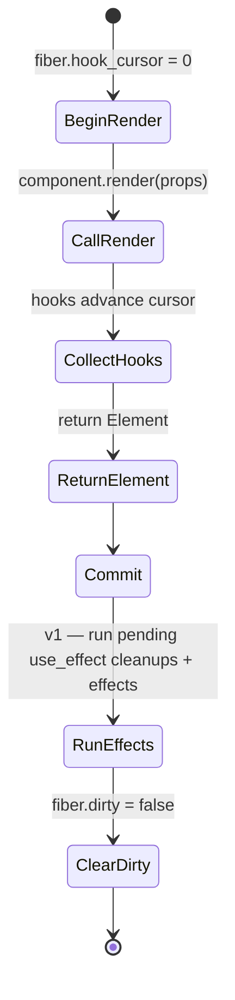

# jet React hooks runtime

## Changes
<!-- type: changes lang: yaml -->

```yaml
changes:
  - path: ".aw/tech-design/projects/jet/logic/wasm-renderer-hooks-runtime.md"
    action: modify
    section: doc
    impl_mode: hand-written
    description: |
      Legacy Jet TD content retained as notes during AW standardization.
      Rewrite this file into semantic TD sections before promoting source to CODEGEN.
```

## Legacy notes
<!-- type: doc lang: markdown -->

# jet React hooks runtime

### Overview

Rust implementation of React 18's hooks surface, compiled to WASM
and linked against transpiled component code. Concretely: when
`jet-tsx-to-rust` lowers a TSX file that calls `useState`,
`useEffect`, `useRef`, etc., the generated Rust code calls the
functions defined in this crate.

This crate is the **target API contract** the transpiler emits
code against. Transpiler output changes when this crate changes,
so the API surface is versioned with extreme care.

Parent: `logic/wasm-renderer-architecture.md`.

Current crate: `crates/jet-react-wasm`.

### Design Contract

```mermaid
---
id: jet-wasm-renderer-hooks-requirements
entry: H1
---
requirementDiagram
    requirement H1 { id: H1 text: use_state returns current state and setter marks fiber dirty risk: high verifymethod: test }
    requirement H2 { id: H2 text: hooks are positional and must be called in the same order every render risk: high verifymethod: test }
    requirement H3 { id: H3 text: StateSetter is Clone for event-handler capture risk: medium verifymethod: test }
    requirement H4 { id: H4 text: mount runs initial render and flush rerenders only dirty fibers risk: high verifymethod: test }
    requirement H5 { id: H5 text: Element tree is inspectable data with no construction side effects risk: medium verifymethod: test }
    requirement H6 { id: H6 text: hook state lives in per-fiber HookSlot vector indexed by hook_cursor risk: high verifymethod: test }
    requirement H7 { id: H7 text: runtime is single-threaded and thread local risk: medium verifymethod: inspection }
    requirement H8 { id: H8 text: public API names are semver stable after crate 0.1 risk: medium verifymethod: checklist }
```

| id | Requirement | Verifies |
|----|-------------|----------|
| H1 | `use_state<T: Clone + 'static>(initial: T) -> (T, StateSetter<T>)` — React's useState, typed. First render returns initial, subsequent renders return the current cell value; setter marks fiber dirty. | Integration test `multiple_clicks_accumulate`. |
| H2 | Positional hook contract — hooks must be called in the same order every render. Violations panic with "rules-of-hooks violation OR transpiler bug" at runtime. | `hook_cursor_resets_between_renders`. |
| H3 | `StateSetter<T>: Clone` — setters move freely into event-handler closures without borrow-checker friction. | Counter's `on_click` closure path compiles. |
| H4 | `mount(Component) -> MountHandle` runs the initial render; `handle.flush()` re-runs the component iff any fiber is dirty, returning whether a re-render happened. | `flush_without_dirty_is_noop`. |
| H5 | **Element tree is data** — `Element` is an `enum` that callers inspect / walk. No side-effects tied to construction. This is what makes `find_on_click` + `text_content` possible for tests. | `initial_render_matches_props`. |
| H6 | All hook state lives in a **per-fiber `Vec<HookSlot>`**, indexed by `hook_cursor` reset at each render. This maps 1:1 to React's fibre model. | Internal invariant, tested transitively via H1 + H2. |
| H7 | The runtime is **single-threaded**. All state is `thread_local!`. Web Workers get their own isolated runtime. | Type `Fiber` is not `Send`. |
| H8 | **Public API names are semver-stable** once this crate reaches 0.1. Adding hooks is minor; changing a function signature is major. The transpiler's output must compile against any semver-compatible version. | (enforced by release checklist) |

### Hook surface — v0 (shipped)

```rust
// Shipped in jet-react-wasm v0.
pub fn use_state<T: Clone + 'static>(initial: T) -> (T, StateSetter<T>);

pub struct StateSetter<T: Clone + 'static> {
    // Clone, Send-bound-free. Captures fiber id + hook slot index.
}
impl<T: Clone + 'static> StateSetter<T> {
    pub fn set(&self, new_value: T);
}
```

All the other hooks are shown in the **v1 surface** section below,
not yet implemented.

### Hook surface — v1 (scoped next)

```rust
// use_effect — async executor hook.
// Runs `effect` after commit; return value is the cleanup closure
// that runs before the next effect invocation OR on unmount.
// deps: None = every render; Some(...) = shallow-compare on change.
pub fn use_effect(
    effect: impl FnOnce() -> Option<Box<dyn FnOnce()>> + 'static,
    deps: Option<Vec<RuntimeValue>>,
);

// use_memo — memoised computation. Recomputes iff deps change.
pub fn use_memo<T: Clone + 'static>(
    compute: impl FnOnce() -> T,
    deps: Vec<RuntimeValue>,
) -> T;

// use_callback — stable-identity callback that rebinds iff deps change.
// Transpiler emits this when TSX calls `useCallback`.
pub fn use_callback<P: Clone + 'static, F: Fn(P) + 'static>(
    f: F,
    deps: Vec<RuntimeValue>,
) -> Callback<P>;

// use_ref — mutable container preserved across renders. The transpiler
// lowers `useRef<HTMLElement>(null)` to `use_ref::<NodeHandle>(NodeHandle::None)`.
pub fn use_ref<T: Clone + 'static>(initial: T) -> RefHandle<T>;

// use_reducer — functional state updater. Directly builds on use_state
// plus `setter.update(|s| reducer(s, action))`.
pub fn use_reducer<S: Clone + 'static, A: 'static>(
    reducer: impl Fn(&S, A) -> S + 'static,
    initial: S,
) -> (S, DispatchHandle<A>);

// use_context — consumer side of the context API.
pub fn use_context<T: Clone + 'static>(ctx: ContextHandle<T>) -> T;
```

Plus the companion create helpers:

```rust
pub fn create_context<T: Clone + 'static>(default: T) -> ContextHandle<T>;
```

Suspense / error-boundary hooks land in `suspense-async.md` (future).

### Hook slot model

```
Fiber
├── hooks: Vec<HookSlot>
│   ├── [0] HookSlot::State(Box<dyn Any>)   ← useState(initial)
│   ├── [1] HookSlot::Effect { deps, cleanup, pending: bool }
│   ├── [2] HookSlot::Memo { deps, value }
│   ├── [3] HookSlot::Ref(Rc<RefCell<Box<dyn Any>>>)
│   ├── [4] HookSlot::Context { ctx_id, last_seen_value }
│   └── ...
└── hook_cursor: usize (reset to 0 at render start)
```

Each render walks the cursor through the vec; `hooks.len() <= cursor`
on first render allocates a fresh slot. A violation of the rules
of hooks (conditional hook call) trips either a type-tag mismatch
(e.g. cursor points at a State slot but the hook call is useEffect)
OR an unused-slot detector — both panic with the same error shape:

```
rules-of-hooks violation at slot 3: expected Effect, got State call.
This is either a TSX source bug (conditional hook) or a transpiler
bug. Check <component name>.
```

### Commit phase (synchronous, v0)



v0 skips RunEffects (no effect hook yet) — the fiber just clears its
dirty flag and returns control. Tests still pass because the Counter
example uses only state.

v1 adds a post-commit phase that:

1. Runs `cleanup` callbacks for effects whose deps have changed OR
   whose host subtree is unmounting.
2. Runs `effect` for newly-added effects and effects whose deps
   have changed.
3. All effect execution is synchronous inside `flush()` for v1.
   Concurrent scheduling (priority lanes, `useTransition`) lands in
   `suspense-async.md`.

### Reconciliation (v1 → v2)

**v0 (shipped)**: `flush()` re-runs the root component and
replaces the entire tree. Correct, but O(n) every commit — not
perf-acceptable for a production runtime with nested components.

**v1 (next)**: per-fiber re-render. Only dirty fibers re-run their
component function; their output replaces their subtree in place.
Children not touched by the dirty fiber keep their old element
nodes.

**v2 (eventual)**: full fiber-diff reconciliation, equivalent to
React 18. Old tree + new tree → minimal set of paint ops. This is
what the canvas renderer consumes.

The v0 → v1 step is a small change (add per-fiber tree slot on
`Fiber`, track children by key). v1 → v2 is larger and slots into
`fiber-reconciler.md` (future spec).

### Element tree

```rust
pub enum Element {
    Intrinsic { tag: &'static str, props: Props, children: Vec<Element> },
    Text(String),
    Component(Component),   // unresolved — runtime expands via render()
    Empty,
}
```

`Intrinsic` tags map directly to HTML-shaped primitives. The
**renderer** crate (to be created) translates them into canvas
paint ops:

| Intrinsic tag | Canvas mapping (v1) |
|---|---|
| `div`, `section`, `article`, `main`, ... | `fillRect(layout.box)` + children |
| `button` | same + hover/focus ring paint |
| `input`, `textarea` | overlay `<input>` on canvas for IME + keyboard |
| `span`, `p`, `strong`, `em`, `h1`..`h6` | text shape + draw |
| `img` | decoded pixels + `drawImage` |
| `a` | same as span + underline + pointer cursor |

`Props` is a small fixed set today (`class_name`, `style`, `id`,
`on_click`, `on_change`). This grows in lockstep with the renderer;
each new event type (onMouseMove, onKeyDown, ...) appears here first
and the renderer learns to dispatch it.

### Error shape

Runtime failures take one of three forms:

| Source | Panic message | Recovery |
|---|---|---|
| Hook called outside render | `"hook called outside a render — rules-of-hooks violation"` | None. This is a generated-code bug. |
| Hook slot type mismatch | `"hook slot type mismatch — rules-of-hooks violation OR transpiler bug"` | None. Indicates a conditional hook or transpiler defect. |
| Component panic | propagates through the runtime | Caught by the nearest `ErrorBoundary` in v2; v1 unwinds the whole mount. |

Every panic surfaces through wasm-bindgen to JS as a JS `Error`
with the Rust message preserved. The boot loader's `onerror`
handler reports to whatever telemetry is configured.

### Test strategy

Two layers:

1. **Pure-Rust unit tests** — `cargo test` — validate hook
   semantics without a browser. Every hook gets a dedicated test
   file. Today: `tests/counter_integration.rs` (5 tests).
2. **WASM in-browser tests** — once the renderer crate exists —
   load the compiled WASM in a real Chromium via jet's existing
   test runner, assert rendered output + event dispatch.

The jet test runner (shipped; see
`.aw/tech-design/crates/jet/testing/test-runner.md`) already
handles Playwright-compat scenarios. Reusing that harness for
WASM-rendered apps is the subject of `test-integration.md`
(future).

### Cross-references

- Umbrella: `logic/wasm-renderer-architecture.md`
- Transpiler: `logic/wasm-renderer-transpiler.md`
- Subset policy: `logic/wasm-renderer-subset.md`
- Fiber reconciliation: `fiber-reconciler.md` (future)
- Suspense / async: `suspense-async.md` (future)
- Runtime primitive extraction: `.aw/decisions/2026-04-23-mamba-runtime-extraction.md`

### Changes

```yaml
_sdd:
  id: jet-react-wasm-v0
  refs:
    - $ref: "architecture#axioms"
changes:
  - path: crates/jet-react-wasm/src/lib.rs
    action: modify
    section: doc
    impl_mode: hand-written
    purpose: |
      Extend v0 skeleton towards v1 surface. Add:
      - HookSlot::Effect with deps + cleanup slot
      - use_effect(effect, deps) running synchronously in flush()
      - HookSlot::Memo + use_memo
      - use_reducer on top of use_state
      - use_ref returning a clonable handle
      - use_callback returning a Callback<P> with stable identity
        across renders when deps are unchanged
      - create_context / use_context
  - path: crates/jet-react-wasm/tests/
    action: create
    section: doc
    impl_mode: hand-written
    purpose: |
      Per-hook integration tests. Each hook gets a dedicated file:
      - use_effect_integration.rs (setup / cleanup ordering, deps)
      - use_memo_integration.rs (recompute gated by deps)
      - use_reducer_integration.rs
      - use_ref_integration.rs (ref value survives re-renders)
      - use_callback_integration.rs (identity stability)
      - use_context_integration.rs
  - path: .aw/tech-design/crates/jet/logic/wasm-renderer-hooks-runtime.md
    action: create
    section: doc
    impl_mode: hand-written
    purpose: "This spec."
```
